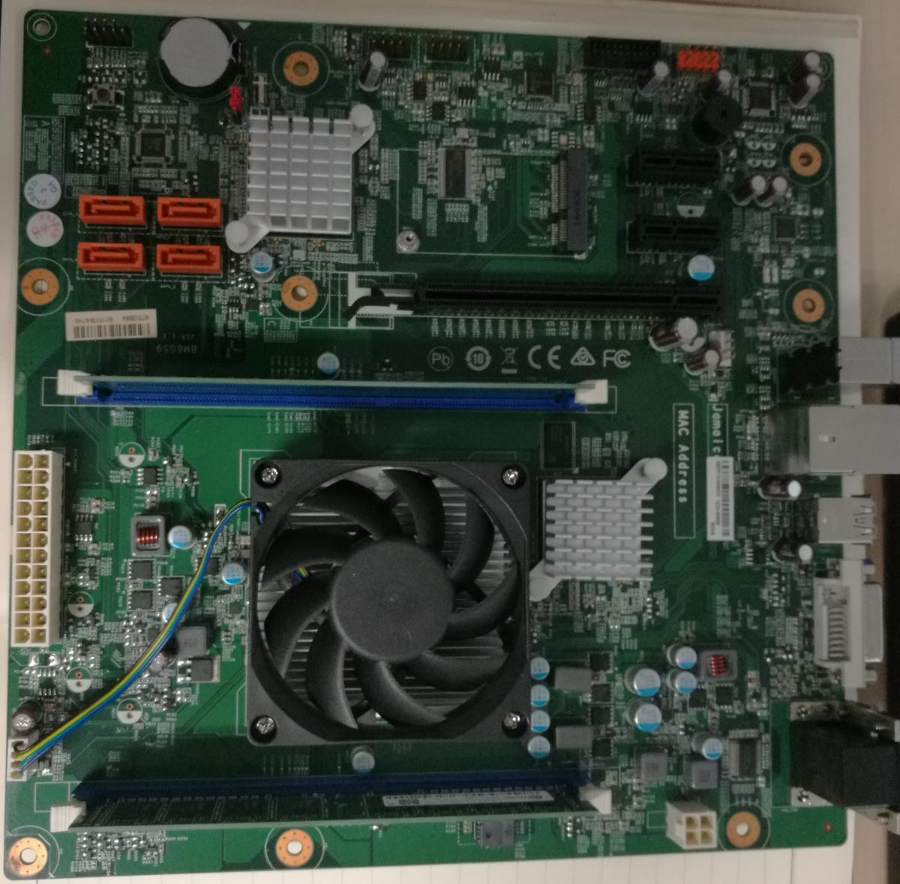
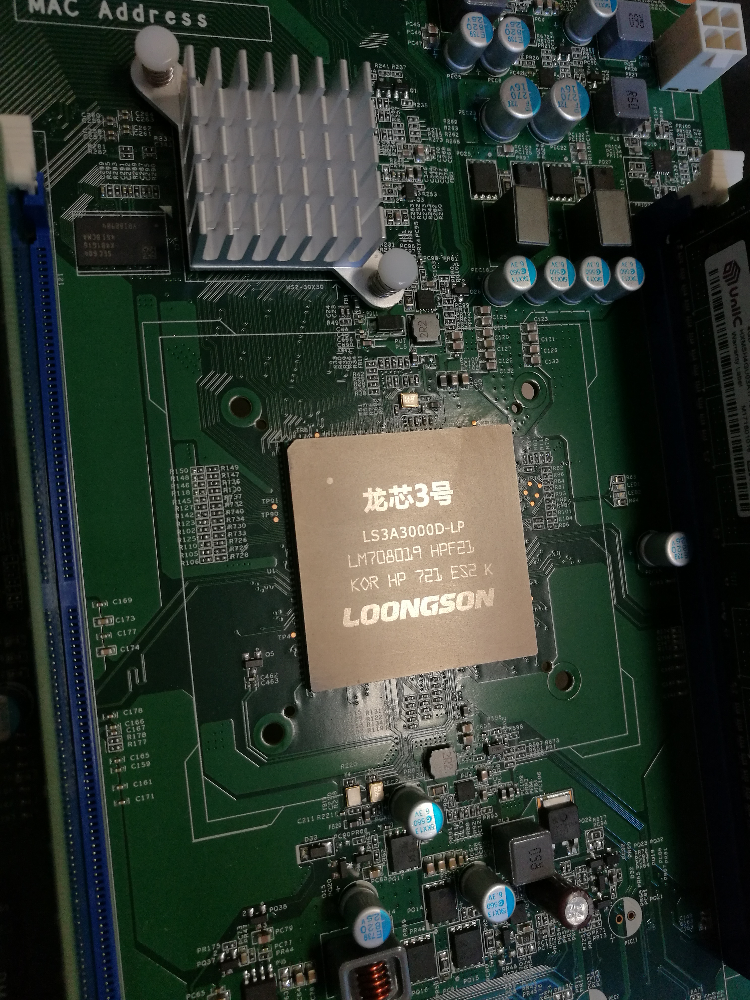
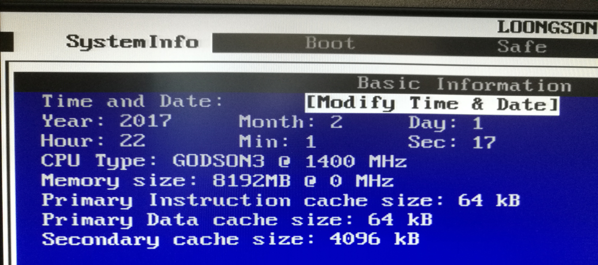
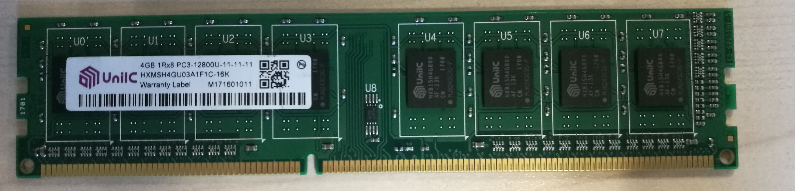

# 龙芯3A3000处理器性能评测

2017年九月份龙芯俱乐部办了一个龙芯3A主板的团购。作为多年关注龙芯的爱好者，我参加了这次团购，购买了一个龙芯3A3000的主板。

实际上，我拿到的这块龙芯3A3000处理器不是性能最高的1.5GHz主频版本，而是性能略低的1.4GHz版本。因此，在估算龙芯3A3000
的最高性能时，应该将我的测试结果乘以1.07。此外，需要说明的是龙芯3A3000笔记本里带的龙芯3A3000的主频被限制在了1.2GHZ。

龙芯3A3000主板照片。风扇下面是龙芯的CPU。

龙芯3A3000CPU近照,其中的LS3A3000D-LP意思是说这是一个低功耗版本的龙芯3A3000CPU。

开机后BIOS中的信息，可以看到CPU的主频是1400MHZ，一级指令缓存64KB，一级数据缓存64KB，二级缓存4MB。

主板上的国产Unilc（西安紫光国芯半导体）内存条。

Debian系统下的firefox播放flash还是有些问题。Loongnix系统中的浏览器已经配置好了flashplayer。不过，使用龙芯看视频的话，还是有不少支持html5的视频网站，比如bilibili，腾讯视频以及优酷土豆。爱奇艺也支持html5，但要修改浏览器的user
agent，冒充Chrome或者Safari浏览器。

Loogson 3A3000的性能和Loongson
2F相比还是有了非常大的进步。从个人的体验上，使用龙芯2F的8089D笔记本的图形界面只能说是“能用”，但真正使用起来还是太慢；与之相比，龙芯3A3000的界面就可以称得上是真正的流畅了。不管是用Loognix还是Debian，使用Firefox进行网页浏览，观看高清视频都都十分流畅。可以说，Loongson
3A3000已经完全可以满足办公、上网、听音乐、看视频这样的普通需求了。

3\. 龙芯3A3000主板性能测评

龙芯3A3000的性能究竟如何？和龙芯2F、龙芯3A1000相比，有了多大的进步？和主流CPU相比究竟有多大差距呢？和Intel、AMD相比，龙芯3A3000相当于哪一款CPU？为了回答这些问题，我准备对龙芯3A3000的性能进行测试。

作为最优秀的国产处理器之一，龙芯3A3000的性能在运行应用程序的时候与主流的Intel处理器有多大差距？如何去通过编译器的优化去弥补这些差距？为了解释以上的问题，我利用手头上的X270笔记本上i5-7200U处理器和龙芯3A3000处理器进行了详尽的对比;此外，我在openbenchmarking网站上发现飞腾处理器的部分评测结果，在本次测试中也将对利用这些数据进行对比。

对比方案：使用phoronix test
suite中提供的有关CPU性能的benchmark程序进行测试。为了比较两块CPU在相同主频下的性能差距，在测试中将Intel
i5-7200U处理器的睿频模式关掉，去掉自动降频的电源管理，将频率锁定在2.5GHz。

<table>
<colgroup>
<col style="width: 100%" />
</colgroup>
<tbody>
<tr class="odd">
<td>
echo performance | tee
/sys/devices/system/cpu/cpu*/cpufreq/scaling_governor

wrmsr -p0 0x1a0 0x850089

wrmsr -p1 0x1a0 0x850089

wrmsr -p2 0x1a0 0x850089

wrmsr -p3 0x1a0 0x850089
</td>
</tr>
</tbody>
</table>

下面是龙芯3A3000处理器和Intel i5-7200U 处理器的基本情况对比。

Intel i5-7200U

https://ark.intel.com/products/95443/Intel-Core-i5-7200U-Processor-3M-Cache-up-to-3\_10-GHz

龙芯3A 3000

http://www.loongson.cn/product/cpu/3/3A3000.html

<table>
<colgroup>
<col style="width: 20%" />
<col style="width: 20%" />
<col style="width: 20%" />
<col style="width: 20%" />
<col style="width: 20%" />
</colgroup>
<tbody>
<tr class="odd">
<td></td>
<td>龙芯3A3000</td>
<td>Intel i5-7200U</td>
<td>FT1500A/4</td>
<td>FT2000+</td>
</tr>
<tr class="even">
<td>厂商</td>
<td>龙芯</td>
<td>Intel</td>
<td>飞腾</td>
<td>飞腾</td>
</tr>
<tr class="odd">
<td>主频（GHz）</td>
<td>1.35 -1.5（商业级）</td>
<td>2.5(可睿频至3.1GHz)</td>
<td>1.5~2.0</td>
<td>2.2～2.4</td>
</tr>
<tr class="even">
<td>工艺（nm）</td>
<td>28</td>
<td>14</td>
<td>28</td>
<td>16</td>
</tr>
<tr class="odd">
<td>封装大小</td>
<td>40mm*40mm</td>
<td>42mm*24mm</td>
<td></td>
<td></td>
</tr>
<tr class="even">
<td>架构</td>
<td>MIPS</td>
<td>X86</td>
<td>ARMV8</td>
<td>ARMV8</td>
</tr>
<tr class="odd">
<td>功耗（W）</td>
<td>30</td>
<td>15</td>
<td>15</td>
<td>90W</td>
</tr>
<tr class="even">
<td>核心数目</td>
<td>4</td>
<td>2</td>
<td>4</td>
<td>64</td>
</tr>
<tr class="odd">
<td>线程数目</td>
<td>4</td>
<td>4</td>
<td>4</td>
<td>64</td>
</tr>
<tr class="even">
<td>bogomips</td>
<td>2799.97</td>
<td>5424</td>
<td>3590.55</td>
<td></td>
</tr>
</tbody>
</table>

3.1 使用phoronix test suite对龙芯3A3000性能进行测试

phoronix test
suite是www.phoronix.com提供的一套开源的测试套件。在openbenchmarking网站上提供了很多性能测试的结果，可以供人们更客观的评测系统的性能。

测试使用的是7.8.0版本的phronix-test-suite。

<http://www.phoronix-test-suite.com/?k=downloads>

测试分别在配备了Intel i5-7200U
处理器的X270笔记本电脑以及自行组装的龙芯3A3000电脑上进行，其中对龙芯3A3000的测试在Debian
testing 系统上进行。测试环境如表所示：

<table>
<colgroup>
<col style="width: 33%" />
<col style="width: 33%" />
<col style="width: 33%" />
</colgroup>
<tbody>
<tr class="odd">
<td></td>
<td>I5-7200U X270</td>
<td>龙芯3A3000</td>
</tr>
<tr class="even">
<td>操作系统</td>
<td>Debian buster</td>
<td>Debian buster</td>
</tr>
<tr class="odd">
<td>内核</td>
<td>4.16.0-2-amd64</td>
<td>4.14.0</td>
</tr>
<tr class="even">
<td>C/C++编译器</td>
<td>GCC 7.3.0</td>
<td>GCC 7.3.0</td>
</tr>
<tr class="odd">
<td>C/C++编译器参数</td>
<td>-march=native -O3 -s -ffast-math -funroll-all-loops
-floop-optimize</td>
<td>-march=loongson3a -O3 -s -ffast-math -funroll-all-loops
-floop-optimize</td>
</tr>
</tbody>
</table>

在测试过程中，我发现了龙芯实验室使用一个1.5GHz的龙芯3A
3000处理器在Loognix
系统上进行的部分测试结果。因此，我就不再单独使用Loongnix系统对该处理器的性能进行测试了。

对龙芯3A3000所使用的编译器选项，可以参考

<http://ftp.loongnix.org/doc/08Performance%20Optimization/Loongson3A%20Performance%20Optimization.pdf>

对部分应用，在编译时采用了n32的abi，即增加参数 -mabi=n32。

由于CPU性能是我最想了解的东西，因此在测试过程中主要关心能反应CPU性能的测试，而不考虑对磁盘、显卡、内存等硬件的性能测试。

分别在Loognix 系统以及Debian下测试龙芯3A3000的性能，在安装Debian
testing的X270笔记本上测试Intel i5-7200U CPU的性能。

问题来了，龙芯3A3000 的性能究竟相当于Intel的那个CPU？我们来看看数据

<table>
<colgroup>
<col style="width: 57%" />
<col style="width: 14%" />
<col style="width: 28%" />
</colgroup>
<tbody>
<tr class="odd">
<td>CPU</td>
<td>核心数目</td>
<td>压缩性能（MIPS）</td>
</tr>
<tr class="even">
<td>Loongson 2F</td>
<td>1</td>
<td>440</td>
</tr>
<tr class="odd">
<td>Ingenic JZ4780</td>
<td>2</td>
<td>657</td>
</tr>
<tr class="even">
<td>Intel Atom N270</td>
<td>1</td>
<td>906</td>
</tr>
<tr class="odd">
<td>Loongson 3A 1000</td>
<td>4</td>
<td>1400</td>
</tr>
<tr class="even">
<td>Intell Pentium 4 Celeron 2200</td>
<td>2</td>
<td>1500</td>
</tr>
<tr class="odd">
<td>Intel Atom 330</td>
<td>2</td>
<td>1784</td>
</tr>
<tr class="even">
<td>AMD Athlon 64 X2 3800+</td>
<td>2</td>
<td>3400</td>
</tr>
<tr class="odd">
<td>VIA L4700E</td>
<td>4</td>
<td>3400</td>
</tr>
<tr class="even">
<td>Intel Core Duo 2 T7500</td>
<td>2</td>
<td>3449</td>
</tr>
<tr class="odd">
<td>Loongson 3A 3000</td>
<td>4</td>
<td>3525</td>
</tr>
<tr class="even">
<td>Intel Core Duo 2 T7600</td>
<td>2</td>
<td>3798</td>
</tr>
<tr class="odd">
<td>Intel Atom Z3740</td>
<td>4</td>
<td>3900</td>
</tr>
<tr class="even">
<td>AMD Ryzen 1700X</td>
<td>8</td>
<td>35200</td>
</tr>
<tr class="odd">
<td>Intel i7-7820X</td>
<td>8</td>
<td>499000</td>
</tr>
</tbody>
</table>

Intel Core 2 T7500
<https://openbenchmarking.org/result/1202149-JONA-DELL78345>

Intel Core Duo 2 T7600
<https://openbenchmarking.org/result/1710122-KH-T76004GIB64>

Atom N270 CPU
http://openbenchmarking.org/result/1012207-IV-SAMSUNGNE30  
Atom 330 CPU http://openbenchmarking.org/result/1012227-IV-ATOMIONNE35

总结

测试程序介绍及测试结果分析

**科学计算**

1\. scimark2

这个测试运行了SimiMark 2.0 的ANSI
C版本，它是由国家标准与技术研究所的程序员开发的科学和数值计算的基准。该测试由快速傅利叶变换、雅可比逐次超松弛、蒙特卡洛、稀疏矩阵乘法和密集LU矩阵分解基准构成。单核性能测试。

[<u>https://openbenchmarking.org/result/1806074-FO-LS3ASCIMA03</u>](https://openbenchmarking.org/result/1806074-FO-LS3ASCIMA03)

<https://openbenchmarking.org/result/1806183-FO-LS3ASCIMA63>

2\. hpcg

高性能共轭梯度算法，由桑地亚国家实验室开发的面向超算的科学基准程序。多线程测试。

<https://openbenchmarking.org/result/1806094-FO-LS3AHPCGD08>

3\. npb

NPB，NAS并行基准，是美国国家航空航天局为高端计算机系统开发的基准。此测试配置文件目前使用MPI版本的NPB。
多线程测试。

<https://openbenchmarking.org/result/1806097-FO-LS3ANPBDE97>

4\. ffte

FFTE是Daisuke Takahashi写的计算1、2和3维的序列长度为（2 ^ p）\*（3 ^
q）＊（5 ^ r）的离散傅立叶变换的一个包。

<https://openbenchmarking.org/result/1806090-FO-LS3AFFTED49>

5\. fhourstones

解Connect-4游戏，测试处理器的整数性能。

<https://openbenchmarking.org/result/1806071-FO-LS3AFHOUR46>

6\. glibc-bench

测试CPU在运行glibc提供的库函数时的性能。 x86 only 无法运行。

7\. gmpbench

用GMP 6.1.2数学库进行的性能测试。测试结果可以在其网站上查到。
注意，gmpbench只考虑程序的整数性能，不是浮点性能。

<https://gmplib.org/gmpbench.html>

结果：

<https://openbenchmarking.org/result/1806079-FO-LS3AGMPBE54>

8\. m-queens

使用openmp实现的N-皇后问题多线程解法器。

9\. n-queens

OpenMP版本的N-皇后问题解法器。问题大小是18。

[<u>https://openbenchmarking.org/result/1806109-FO-LS3ANQUEE29</u>](https://openbenchmarking.org/result/1806109-FO-LS3ANQUEE29)

10\. mafft

100个丙酮酸脱羧酶序列的比对

<https://openbenchmarking.org/result/1806108-FO-LS3AMAFFT56>

11\. minion

Minion is an open-source constraint solver that is designed to be very
scalable. <https://constraintmodelling.org/minion/>

测试结果：

[<u>https://openbenchmarking.org/result/1806115-FO-LS3AMINIO86</u>](https://openbenchmarking.org/result/1806115-FO-LS3AMINIO86)

12\. mpcbench

GNU MPC是复数算术的C库。

<https://openbenchmarking.org/result/1806164-FO-LOONGSON301>

1.  Mrbayes

    该测试对一组灵长类基因组序列进行贝叶斯分析，以估计它们的种系发生。

    [<u>https://openbenchmarking.org/result/1806117-FO-LS3AMRBAY15</u>](https://openbenchmarking.org/result/1806117-FO-LS3AMRBAY15)

    14\. multichase

This is a benchmark of Google's multichase pointer chaser program

[<u>https://openbenchmarking.org/result/1806120-FO-LS3AMULTI28</u>](https://openbenchmarking.org/result/1806120-FO-LS3AMULTI28)

Gcc options: -O2 -static -pthread -lrt

16\. Bullet

Bullet物理引擎.
Bullet是一个开源的物理模拟计算引擎，世界三大物理模拟引擎之一

[<u>https://openbenchmarking.org/result/1806126-FO-LS3ABULLE82</u>](https://openbenchmarking.org/result/1806126-FO-LS3ABULLE82)

17\. Dolfyn

Dolfyn是使用了现代数值模拟技术的计算流体力学（CFD）代码。统计运行Dolfyn中自带算例需要的时间。

未能正确运行。

18\. primesieve

Primesieve使用高度优化的Eratosthenes筛法实现来产生素数。Primesieve对CPU
L1/L2 缓存性能进行基准测试。

[<u>https://openbenchmarking.org/result/1806103-FO-LS3APRIME23</u>](https://openbenchmarking.org/result/1806103-FO-LS3APRIME23)

19\. himeno

The Himeno benchmark is a linear solver of pressure Poisson using a
point-Jacobi method.

[<u>https://openbenchmarking.org/result/1806127-FO-LS3A3000H21</u>](https://openbenchmarking.org/result/1806127-FO-LS3A3000H21)

20\. tscp

这是TSCP，Tom
Kerrigan的简单国际象棋程序的性能测试，它有一个内置的性能基准。

[<u>https://openbenchmarking.org/result/1806104-FO-LS3ATSCPD75</u>](https://openbenchmarking.org/result/1806104-FO-LS3ATSCPD75)

1.  **Sample-program**

    用莱布尼茨公式计算圆周率。源码很简单，主要考查的是pow函数的性能。注意，编译程序的时候不应该加循环展开优化。

    **[<u>https://openbenchmarking.org/result/1806108-FO-LS3ASAMPL98</u>](https://openbenchmarking.org/result/1806108-FO-LS3ASAMPL98)**

2.  **Hmmer**

    **This test searches through the Pfam database of profile hidden
    markov models. The search finds the domain structure of Drosophila
    Sevenless protein**

    **高性能计算**

    1.parboil

    伊利诺伊大学IMPACT研究小组的Parboil基准是一组用于计算架构和编译器的吞吐量计算应用程序。Parboil测试用例支持OpenMP、OpenCL和CUDA多处理环境。然而，此时测试配置文件只是利用OpenMP和OpenCL测试工作负载。

    [<u>https://openbenchmarking.org/result/1806129-FO-LS3APARBO77</u>](https://openbenchmarking.org/result/1806129-FO-LS3APARBO77)

    2\. rodinia

    Rodinia is a suite focused upon accelerating compute-intensive
    applications with accelerators. CUDA, OpenMP, and OpenCL parallel
    models are supported by the included applications. This profile
    utilizes the OpenCL and OpenMP test binaries at the moment.

    3.polybench-c

    Polybench-c是俄亥俄州立大学开发的C语言多面体基准套件。

    [<u>https://openbenchmarking.org/result/1806165-FO-LS3APOLYB24</u>](https://openbenchmarking.org/result/1806165-FO-LS3APOLYB24)

    4\. CLOMP

CLOMP是LVEMORE
OpenMP基准的C版本，评测CPU使用OPENMP运行并行程序时的多核性能。
**未正常运行。**

5\. BYTE

Byte Unix Benchmark程序 **未正常运行。**

**加密算法**

1\. Blake2

用blake2s程序进行的基准测试。Blake2是一个替代MD5和SHA-2/3的高效加密方案。

**需要SSE2 支持，无法在龙芯处理器上编译。**

2\. Bork

Bork是一个小型的跨平台文件加密工具。**用java语言编写**，对需要长期储存文件进行加密。此测试测量加密样本文件所需的时间。

3\. Botan

Botan是一个跨平台的C++的开源加密库，支持大多数的所有公开的加密算法。(单线程测试)

[<u>https://openbenchmarking.org/result/1806093-FO-LS3ABOTAN50</u>](https://openbenchmarking.org/result/1806093-FO-LS3ABOTAN50)

4\. gcrypt

用libgcrypt进行的基准测试。 **未正常运行。**

5\. gnupg

用GnuPG加密文件，统计耗时。

[<u>https://openbenchmarking.org/result/1806105-FO-LS3AGNUPG86</u>](https://openbenchmarking.org/result/1806105-FO-LS3AGNUPG86)

6\. openssl

OpenSSL是一个开源的工具包，它实现SSL（安全套接字层）和TLS（传输层安全）协议。这个测试测量了OpenSSL的RSA
4096位性能。

[<u>https://openbenchmarking.org/result/1806098-FO-LS3AOPENS85</u>](https://openbenchmarking.org/result/1806098-FO-LS3AOPENS85)

1.  John-The-Ripper

    John-The-Ripper密码破解程序

    **多媒体编码**

    1\. encode-flac, encode-mp3, encode-ogg, encode-opus, encode-wavpack

    将音频文件转码为flac，mp3,ogg，opus和wavpack，统计所需时间。

    运行结果：

    [<u>https://openbenchmarking.org/result/1806043-FO-LS3A3000A60</u>](https://openbenchmarking.org/result/1806043-FO-LS3A3000A60)

    2\. espeak

    这个测试需要花费多长时间的用espeak语音合成引擎读取古腾堡项目的The
    Outline of Science，并输出到WAV文件。

    <https://openbenchmarking.org/result/1806148-FO-LS3AESPEA06>

    3\. AOM-AV1

运行在CPU上的AOMedia AV1编码程序。

4\. ffmpeg

该测试使用FFMPEG测试系统的音频/视频编码性能。 **未正常运行。**

5\. dcraw

用DCRAW转换多个高分辨率RAW NEF图像文件到PPM图像格式,统计所需要的时间。

<https://openbenchmarking.org/result/1806140-FO-LS3ADCRAW96>

6\. mencoder

这个测试使用mplayer的mencoder编码器程序和LIVAVCODEC系列来测试系统的音频/视频编码性。

<https://openbenchmarking.org/result/1806145-FO-LS3AMENCO12>

7\. graphics-magick

这是一个用OpenMP实现的GraphicsMagick测试，它执行各种图像测试来测试系统的CPU。

[<u>https://openbenchmarking.org/result/1806143-FO-LS3AGRAPH18</u>](https://openbenchmarking.org/result/1806143-FO-LS3AGRAPH18)

1.  Vpxenc

    这是一个标准的视频编码性能测试,使用谷歌的libvpx库和vpxenc命令实现VP8/WebM格式的编码。单核性能测试。

    <https://openbenchmarking.org/result/1806148-FO-LS3AVPXEN59>

    9\. pts/x264

    测试X264编码器在CPU的运行。

    **编译不正确。**

    **压缩算法**

    1\. Compress-7zip

    用7zip程序自带的benchmark功能测试程序的多线程性能。

    [<u>https://openbenchmarking.org/result/1806036-FO-LOONGSON337</u>](https://openbenchmarking.org/result/1806036-FO-LOONGSON337)

    2\. Compress-gzip

    用tar程序压缩Linux源码包，检验系统自带的gzip程序的单线程性能。

    [<u>https://openbenchmarking.org/result/1806039-FO-LS3A3000G15</u>](https://openbenchmarking.org/result/1806039-FO-LS3A3000G15)

    优化以后的gzip程序

    [<u>https://openbenchmarking.org/result/1806056-FO-LS3A3000G52</u>](https://openbenchmarking.org/result/1806056-FO-LS3A3000G52)

    3\. Compress-lzma

    用LZMA算法压缩一个文件所需的时间。

    4\. Compress-pbzip2

    用并行的bzip2算法压缩Linux内核源码包，统计所需时间。多线程程序。

    [<u>https://openbenchmarking.org/result/1806109-FO-LS3APBZIP29</u>](https://openbenchmarking.org/result/1806109-FO-LS3APBZIP29)

    **网络应用**

    1\. Apache

    Apache基准程序，评价标准是发出100万的请求，100个并发，看系统每秒能够处理多少

    <https://openbenchmarking.org/result/1806159-FO-LS3AAPACH45>

    2\. ebizzy

    Ebizzy测试。Ebizzy可以生成类似Web服务器的工作负载。

    <https://openbenchmarking.org/result/1806152-FO-LS3AEBIZZ72>

    3\. pgbench

    这是使用PGbench实现的PostgreSQL的简单基准测试。

    4\. postmark

    这是一个测试NETAPP的POSTMARK基准测试，旨在模拟类似于Web和邮件服务器所承受的任务的小文件测试。此测试配置文件将设置POSTMARK以同时执行500个文件的25000个事务，文件大小介于5到512千字节之间。

    <https://openbenchmarking.org/result/1806151-FO-LS3APOSTM75>

    5\. hackbench

    Linux内核调度器基准测试。

    [<u>https://openbenchmarking.org/result/1806104-FO-LS3AHACKB43</u>](https://openbenchmarking.org/result/1806104-FO-LS3AHACKB43)

    **光线追踪**

    1\. AOBench

用C语言写的轻量级环境光遮蔽渲染（ambient occlusion）程序，渲染2048 x
2048大小的图像。(单线程性能)

测试结果：

[<u>https://openbenchmarking.org/result/1806035-FO-LOONGSON377</u>](https://openbenchmarking.org/result/1806035-FO-LOONGSON377)

2\. C-ray

光线追踪程序，用于测试CPU的浮点性能。多线程程序。

[<u>https://openbenchmarking.org/result/1806108-FO-LS3ACRAYD73</u>](https://openbenchmarking.org/result/1806108-FO-LS3ACRAYD73)

3\. povray

用光线追踪程序pov-ray进行3D图像的渲染。多线程程序。

[<u>https://openbenchmarking.org/result/1806101-FO-LS3APOVRA81</u>](https://openbenchmarking.org/result/1806101-FO-LS3APOVRA81)

4\. smallpt

smallpt是C++写的全局光照渲染程序，不到1百行代码。全局照明是通过无偏蒙特卡洛路径跟踪完成的，并且通过OpenMP库实现多线程支持。

[<u>https://openbenchmarking.org/result/1806092-FO-LS3ASMALL93</u>](https://openbenchmarking.org/result/1806092-FO-LS3ASMALL93)

5\. tachyon

并行光线追踪系统tachyon。**未正常运行。**

6\. ttsiod-renderer

一种支持OpenMP和英特尔线程的可移植GPL三维软件渲染器，具有许多不同的渲染模式。这个版本不使用OpenGL，而是完全基于CPU
/软件。多线程程序。

<https://openbenchmarking.org/result/1806160-FO-LS3ATTSIO09>

**编译**

1\. Build-apache, build-imagemagick, build-mplayer, build-php

编译apache， imagimagick， mplayer和php程序需要的时间

2\. llvm-test-suite

测试系统运行LLVM test suite需要的时间。

**解释语言**

1\. numpy

测试处理器运行Numpy程序时的速度。

2\. Cython-bench

运行一段cython代码，统计运算需要的时间。

3\. perl-benchmark

Perl基准套件，可以用来比较Perl的不同版本的相对速度。

4\. rbenchmark  
测试系统中R程序的性能。

5\. sudokut

这是对Sudokutt的一个测试，它是一个用TCL编写的数独谜题求解器。统计解决100个数独游戏需要多长时间。

6\. java-gradle-perf

这个测试使用Gradle构建系统运行java软件项目构建。

7\. java-scimark2

这个测试运行scimark 2
的java版，面向科学和数值计算的基准测试，由美国国家标准与技术研究所开发。该基准由快速傅立叶变换、雅可比逐次超松弛、蒙特卡洛、稀疏矩阵乘法和密集LU矩阵分解基准构成。

测试结果：

**[<u>https://openbenchmarking.org/result/1806065-FO-LS3AJAVAP88</u>](https://openbenchmarking.org/result/1806065-FO-LS3AJAVAP88)**

**内存测试**

1\. Cachebench

这是Calebench的性能测试，它是LLCBench的一部分。Cachebench是用来测试内存和缓存带宽性能的。

[<u>https://openbenchmarking.org/result/1806034-FO-LS3A3000C27</u>](https://openbenchmarking.org/result/1806034-FO-LS3A3000C27)

2\. stream

系统内存（RAM）性能基准测试。

测试结果：

[<u>https://openbenchmarking.org/result/1806044-FO-LS3A3000S37</u>](https://openbenchmarking.org/result/1806044-FO-LS3A3000S37)

Intel Atom X5-Z8350
性能与龙芯3A类似。但Atom是给平板用的，14nm工艺，低到2W的功耗。差距还是巨大的。

对龙芯3A 4000/5000性能的期望：

Loongnix 上的Loongson-3A 3000 测试结果：

[https://openbenchmarking.org/result/1806113-TR-LSLABSLS380](http://openbenchmarking.org/result/1806113-TR-LSLABSLS380)

<https://openbenchmarking.org/result/1709288-TR-LOONGSON390>

FT1500A :

[<u>https://openbenchmarking.org/result/1705187-KH-CPUSCIMAR08</u>](http://openbenchmarking.org/result/1705187-KH-CPUSCIMAR08)

FT2000+:

I5-7200u

[<u>https://openbenchmarking.org/result/1806175-FO-I57200UDE18</u>](https://openbenchmarking.org/result/1806175-FO-I57200UDE18)

[<u>https://openbenchmarking.org/result/1806174-FO-I57200UMU24</u>](https://openbenchmarking.org/result/1806174-FO-I57200UMU24)

[<u>https://openbenchmarking.org/result/1806175-FO-I57200URA38</u>](https://openbenchmarking.org/result/1806175-FO-I57200URA38)

[<u>https://openbenchmarking.org/result/1806176-FO-I57200UCO93</u>](https://openbenchmarking.org/result/1806176-FO-I57200UCO93)

[<u>https://openbenchmarking.org/result/1806179-FO-I57200UCR30</u>](https://openbenchmarking.org/result/1806179-FO-I57200UCR30)

从纵向上看龙芯的发展，相比龙芯2F，龙芯3A3000的性能有了很大的进步。工艺上，从龙芯2F的90nm，提高到了龙芯3A3000处理器的28nm；主频从龙芯2F的800MHZ提高到了1.4GHz。

从横向的对比看，龙芯3A3000性能已经提升到了Intel Core 2 Duo处理器的水平。

当然，龙芯和Intel、AMD的最高性能CPU差距还是非常巨大，龙芯要走的路还很长。期待龙芯在未来采用更好的制作工艺，更优化的微架构，也期待龙芯能够在编译器、数学库、操作系统等软件支持上有更好的表现，构建更好的生态系统，期待着龙芯3A/B
4000、 龙芯3A/B 5000早日流片成功。
