# 二代龙芯派VS树莓派3B+：谁的性能更强悍？

2018年10月，二代龙芯派正式发布。经历了长达接近半年的跳票以后，在2019年4月终于开始对龙芯俱乐部的爱好者发货了。拿到派以后，我就准备对它做一个详细的测评。

龙芯派是龙芯公司用龙芯2K1000处理器做的一个开发板。第一代龙芯派在很多地方模仿了树莓派，但有很多不足，诸如读卡器速度太慢等；二代龙芯派在一代派的基础上做了很多改进，体积变大，接口更加丰富。

## 二代龙芯派外观

你见过二代龙芯派吗？如果没有，现在你见过了。

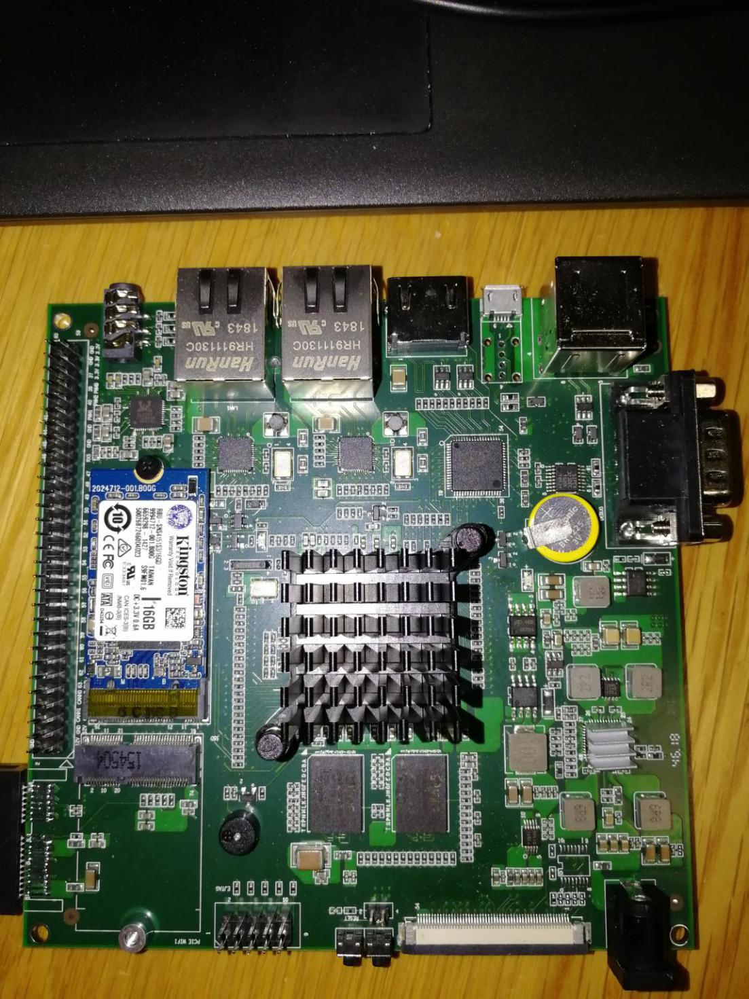

图1-1 二代龙芯真机图

图1-2 二代龙芯派接口（来自龙芯开发者商城）

中间散热片下面安装的，就是龙芯2K1000处理器。拆下散热片，擦掉导热硅胶，终于露出了龙芯2K1000处理器。

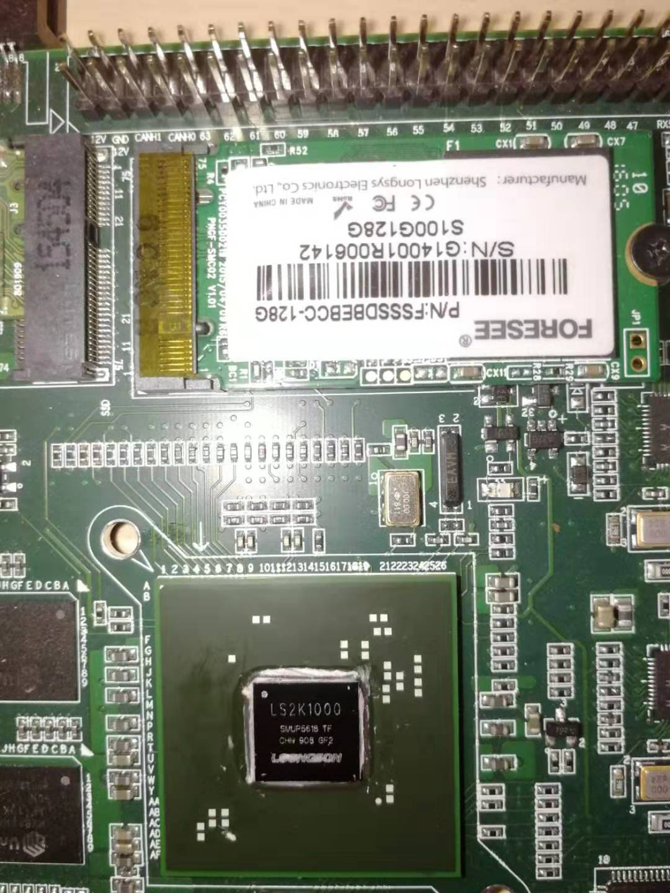

图2 龙芯2K1000处理器

龙芯派的尺寸是nano-ITX
12cmx12cm，但设计的时候没有考虑到接口的摆放，导致所有的四个面都有接口，而且接口的设计也不合理。

组装好的龙芯派，四面都有接口。

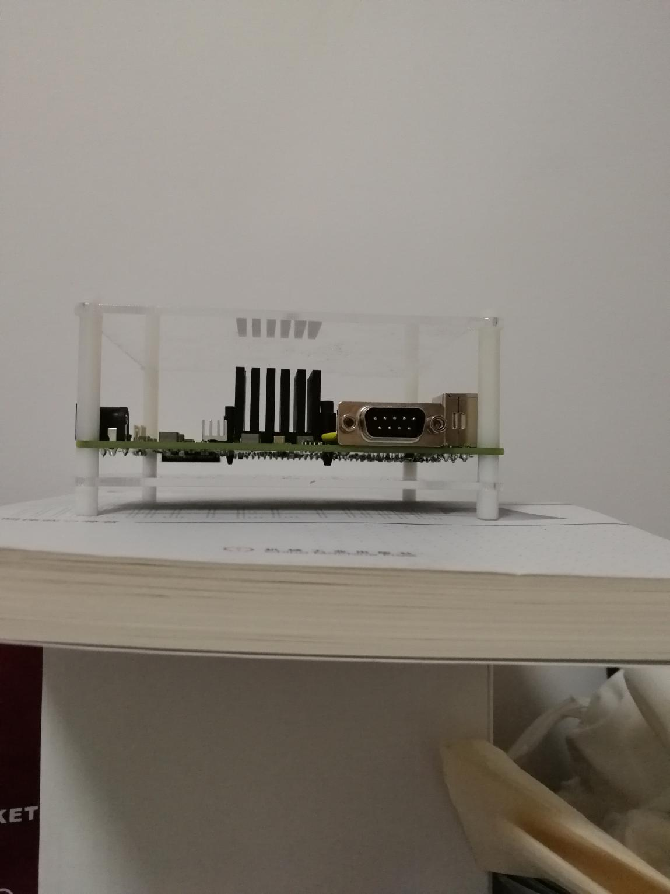

图3-1 第一面：DB9串口

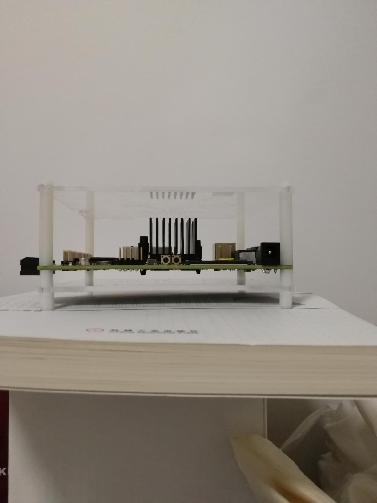

图3-2 第2面：Ejtag接口，reset按键和start按键，显示屏接口，电源接口

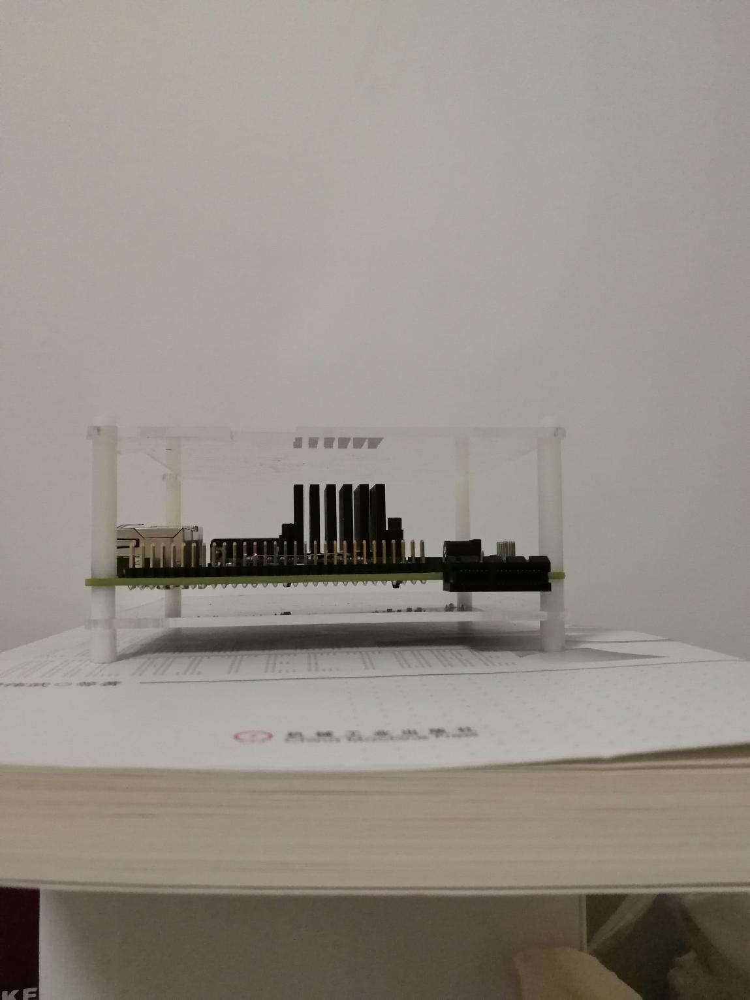

图3-3 第3面：GPIO插针以及PCIE 接口

图3-4
第四面：从左往右，分别是两个USB口，一个OTG口，一个HDMI口以及两个自适应千兆网口

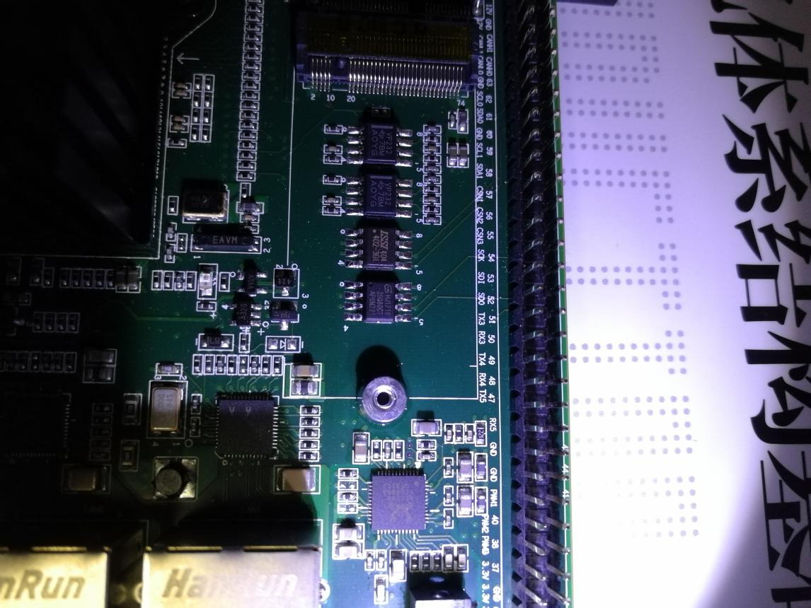

图4-1局部细节1

SSD下面的四个芯片，两个VP232是CAN收发器，ISSI的是存MAC的EEPROM。最右边的GD是bios;
如果需要用编程器手动刷新pmon，需要刷的就是这颗芯片。

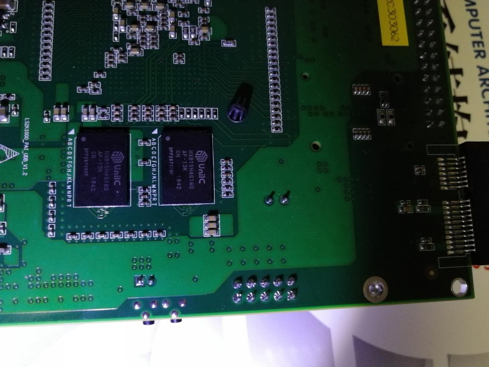

图4-2 局部细节2

两颗紫光内存

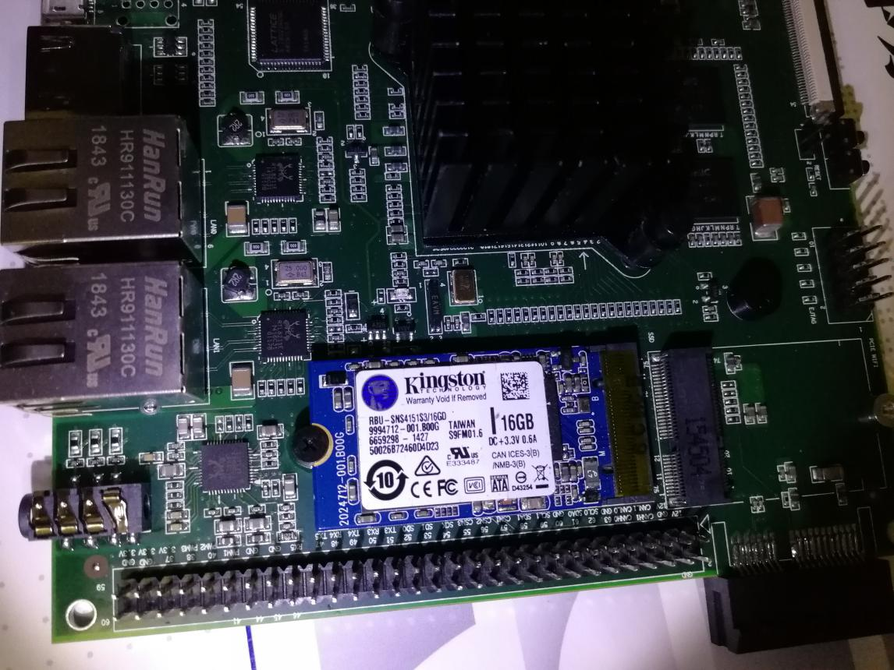

图4 - 3局部细节3

16GB的金士顿固态硬盘

图4-4 局部细节4

两个RTL8211E的千兆以太网芯片

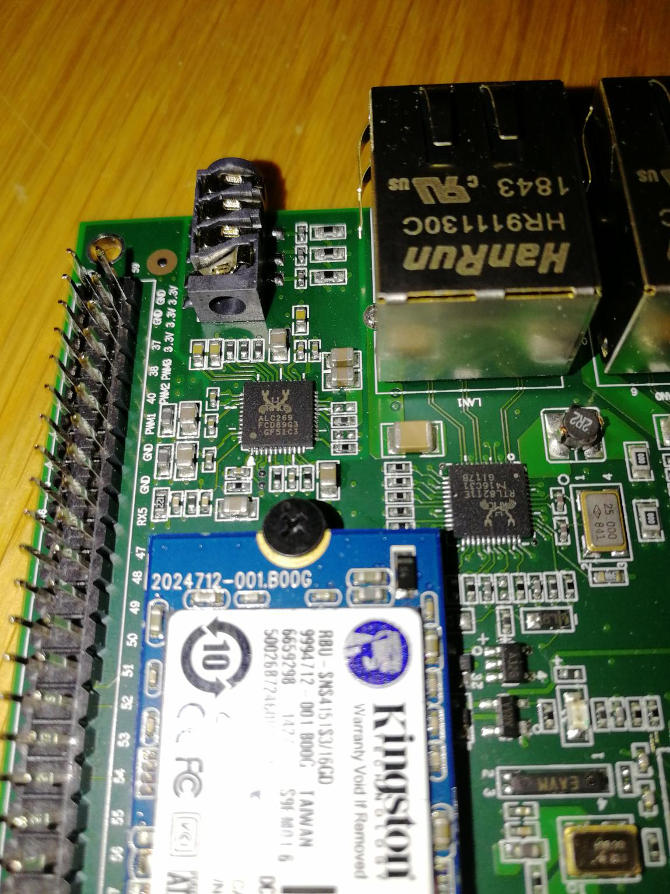

图4-5 局部细节5

ALC269声卡芯片，保证龙芯派能出声

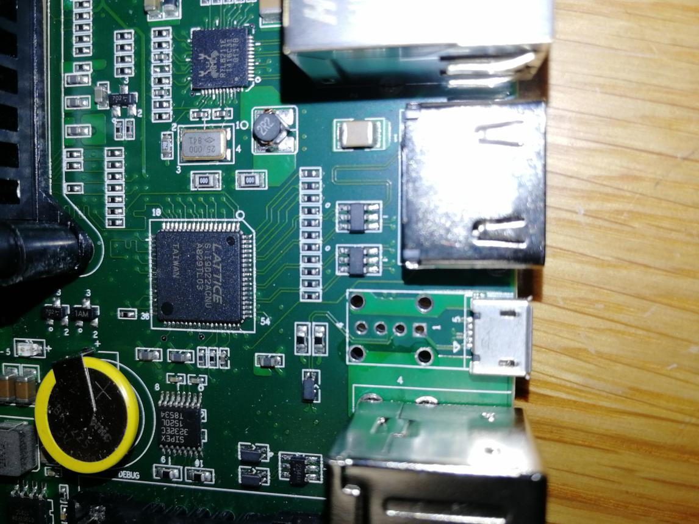

图4-6 局部细节6

Sii9022 RGB转HDMI芯片

如果仅仅满足于开箱晒图，然后问一句“你怎么看”，那和某些自媒体有什么区别？作为硬核爱好者，当然要拿出基准程序，好好的测测二代龙芯派的性能了。

二代龙芯派使用的处理器是龙芯2K1000,采用40纳米工艺生产，双核，主频1.0GHz。很明显，这样的处理器不是拿来和主流的x86
处理器去竞争市场的。官方的宣传海报宣称，龙芯2K1000的性能相当于A53。恰好，树莓派3的处理器是采用了4个A53核心的ARM处理器，因此我们决定将树莓派和2K1000的性能做一个详尽的对比。

我们采用的测试的方案用phoronix test
suite作为基准程序，对比树莓派3B+和二代龙芯派的性能。之前，我们用同样的方法测试了龙芯3A3000的性能。详情请看IT之家的投稿

# 《IT之家网友投稿：全面深扒国产龙芯3A3000处理器性能细节》

<https://www.ithome.com/0/395/791.htm>

新发布的树莓派4采用的BCM2711处理器拥有4个A72核心，1.5GHz的主频，用28纳米的工艺制造，性能太强，龙芯派肯定比不过。

表-1 二代龙芯派和树莓派3B+参数对比

<table>
<colgroup>
<col style="width: 17%" />
<col style="width: 43%" />
<col style="width: 39%" />
</colgroup>
<tbody>
<tr class="odd">
<td></td>
<td>二代龙芯派</td>
<td>树莓派 3B+</td>
</tr>
<tr class="even">
<td>处理器</td>
<td>龙芯2K1000</td>
<td>BCM2837B0</td>
</tr>
<tr class="odd">
<td>指令集</td>
<td>MIPS R5+Loogson ISA</td>
<td>ARMV8</td>
</tr>
<tr class="even">
<td>处理器核</td>
<td>GS264</td>
<td>Cortex-A53</td>
</tr>
<tr class="odd">
<td>处理器位数</td>
<td>64</td>
<td>64</td>
</tr>
<tr class="even">
<td>处理器核数</td>
<td>2</td>
<td>4</td>
</tr>
<tr class="odd">
<td>缓存</td>
<td>
L1：32KB指令+32KB数据

L2：共享1MB
</td>
<td>
L1：16KB指令+16KB数据

L2：共享512KB
</td>
</tr>
<tr class="even">
<td>主频</td>
<td>1.0 GHz</td>
<td>1.4 GHz</td>
</tr>
<tr class="odd">
<td>工艺</td>
<td>40纳米</td>
<td>40纳米</td>
</tr>
<tr class="even">
<td>内存</td>
<td>2 GB DDR3（紫光内存）</td>
<td>1 GB LPDDR2</td>
</tr>
<tr class="odd">
<td>图形处理器</td>
<td>Vivante GC1000</td>
<td>Videocore-IV GPU</td>
</tr>
<tr class="even">
<td>存储</td>
<td>
1个M2 SSD硬盘接口

自带16GB SSD硬盘
</td>
<td>Micro-SD</td>
</tr>
<tr class="odd">
<td>有线网络</td>
<td>2个千兆自协商网口</td>
<td>1个千兆自协商网口</td>
</tr>
<tr class="even">
<td>无线网络和蓝牙</td>
<td>1个M2 WIFI接口（需自配）</td>
<td>
2.4GHz和5GHz 双频Wi-Fi

蓝牙4.2&amp;低功耗蓝牙（BLE）
</td>
</tr>
<tr class="odd">
<td>USB</td>
<td>3 x USB 2.0 （两个TYPE A，1个Micro USB） OTG</td>
<td>4 x USB 2.0</td>
</tr>
<tr class="even">
<td>视频接口</td>
<td>
标准HDMI

DVO接口触摸屏

I2C
</td>
<td>
标准HDMI

CSI（摄像头接口）、DSI（触摸屏接口）
</td>
</tr>
<tr class="odd">
<td>音频接口</td>
<td>4针3.5mm模拟音频视频插孔</td>
<td>3.5mm模拟音频视频插孔</td>
</tr>
<tr class="even">
<td>GPIO</td>
<td>2.54mm间距27个GPIO插针整排</td>
<td>40-pin</td>
</tr>
<tr class="odd">
<td>串口</td>
<td>TTL*3, RS232*1</td>
<td>
硬件串口PL011 UART

迷你串口mini-uart
</td>
</tr>
<tr class="even">
<td>PCIE</td>
<td>一路X1夹板PCIE</td>
<td>无</td>
</tr>
<tr class="odd">
<td>片上调试接口</td>
<td>1 个 EJTAG 调试接口</td>
<td>无</td>
</tr>
<tr class="even">
<td>CAN</td>
<td>两路CAN</td>
<td>无</td>
</tr>
<tr class="odd">
<td>其他接口</td>
<td>SPI、PWM</td>
<td>SPI</td>
</tr>
<tr class="even">
<td>操作系统</td>
<td>
Linux（龙芯Loognix、龙梦Fedora 28、Debian）

RTOS
</td>
<td>
Linux（Rapbian，Armbian，ubuntu）

Windows 10
</td>
</tr>
<tr class="odd">
<td>电源</td>
<td>12V 3A圆柱电源</td>
<td>5V 2.5A （Micro USB）</td>
</tr>
<tr class="even">
<td>尺寸</td>
<td>120 × 120 mm 标准nano-ITX</td>
<td>85 x 56mm</td>
</tr>
<tr class="odd">
<td>价格</td>
<td>1399元</td>
<td>约220元 (35美元)</td>
</tr>
</tbody>
</table>

和树莓派相比，龙芯派自带16GB的SSD硬盘、散热片、亚克力支架，并且带有高速的PCIE接口，有更丰富的接口，从设计上更接近开发板。从价格上，二代龙芯派仍然是树莓派的6倍多。龙芯派这么贵，值得吗？除了高额的情怀税，它在性能上和树莓派相比有优势吗？

我们用phoronix test
suite对龙芯派的性能进行了测试，并且和openbenchmarking网站中查询到的树莓派3B+的数据进行了对比。顺便也重复利用了一下龙芯3A3000处理器的数据，和树莓派、龙芯派进行了对比。我们将数据大致分为单核性能、多核性能两部分，然后每一部分再大致分为整数性能和浮点性能。有一些不好归类的，单独进行介绍。下面，我们将分别介绍我们的测试结果。

## 单核整数性能

### 1.1 TSCP 

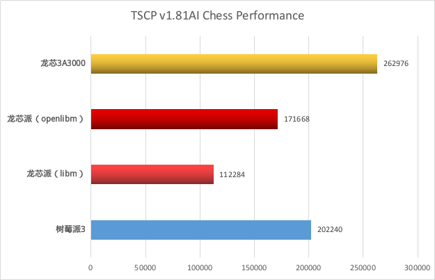

TSCP是一个象棋性能测试的程序。可以认为这是一个以单核整数性能为主的测试。从测试结果来看，在使用了优化的数学库（openlibm）的前提下，龙芯派的性能达到了树莓派的85%;如果使用默认的libm，龙芯派的性能只有树莓派的55%。使用openlibm，性能提高了53%。这是非常大的性能提升。使用libm的龙芯3A3000的性能是树莓派的1.3倍，假如采用openlibm的话，性能大概是树莓派的两倍。

在都使用libm的情况下，龙芯派中的2K1000处理器性能是龙芯3A3000的43%。考虑到龙芯2K1000主频只有3A3000的2/3,
而且只有双发射（3A3000是四发射），这个性能还算正常。

### 1.2 压缩算法

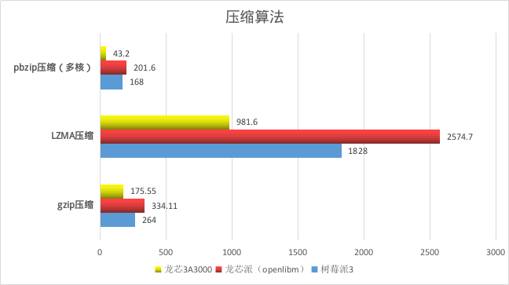

采用三种压缩算法，分别统计了压缩文件的耗时。从数据可以看出，龙芯派的性能比树莓派差。在Pbzip、LZMA和GZIP三种算法上，龙芯3A3000和龙芯派与树莓派相比，性能分别是3.89、1.86、1.50倍和
83%，71%和79%。在压缩算法上，龙芯派表现欠佳。

运行Pbzip、LZMA和GZIP这三个程序，龙芯派的性能分别为龙芯3A3000的21%、38%、和52%。需要注意的是，pbzip2考察的是程序的多核性能。

## 单核浮点性能

### Scimark2

Scimark2是一个单核性能测试程序。测试的内容包括一系列算法，包括雅克比逐次超松弛法、稠密LU矩阵分解、稀疏矩阵乘、快速傅利叶变换、蒙特卡罗。

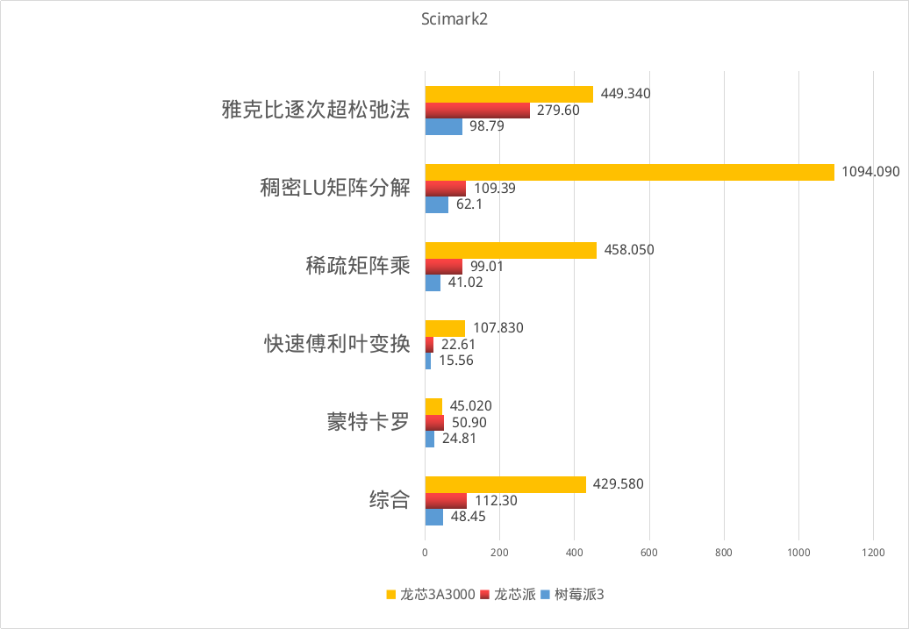

从Scimark2数据来看，即使龙芯2K1000处理器的主频只有1.0GHz，其性能也远远超过主频1.4GHz的BCM2837B0处理器，浮点运算模块功能很强大。不过，在龙芯3A3000面前就露馅了，综合性能只有3A3000的1/4。最让人意外的是蒙特卡罗性能，龙芯3A3000居然比龙芯派还要糟糕，猜测是在libm部分性能没有优化。

从Scimark2的综合性能看，龙芯派的性能是树莓派的2.13倍，然而只有龙芯3A3000的26%。

### 2.2 Aobench 

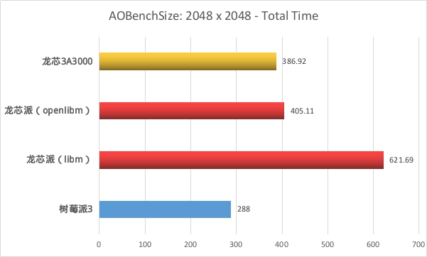

在龙芯派上，分别用libm和openlibm进行了编译，我们发现用openlibm的时候性能比libm快50%以上。龙芯派的速度只有树莓派的70%。值得注意的是，我们发现使用libm的龙芯3A3000速度居然比树莓派还要慢。可见龙芯用的libm数学库性能有多么的糟糕。

在使用libm的情况下，龙芯派的性能是龙芯3A3000的62%。

### 2.3 Himeno 

Himeno基准是一个使用点Jacobi方法的压力泊松线性解算器，数值越大性能越好。测试表明，龙芯3A3000和龙芯派性能都超过树莓派，性能分别是后者的2.65倍和2.05倍。我们还发现，和使用libm相比，使用openlibm龙芯派的性能提高了42%。

使用libm时，龙芯派单核性能是龙芯3A3000的54%。

## 多核整数性能

### 3.1 7zip

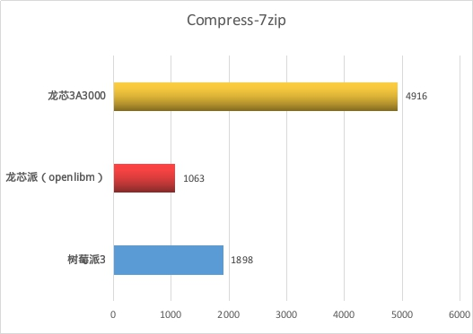

7zip是一个常用的benchmark程序，反映的是处理器的多核、整数性能。同样是4核处理器，同样是1.4GHz的主频，龙芯3A3000的性能是树莓派的2.6倍。龙芯派核数只有树莓派的一半，7z性能是树莓派的56%，看起来表现还可以。和单核龙芯2F相比，龙芯派的7z性能是前者的2.4倍。龙芯派多核性能只有3A3000的22%。

### 3.2 多重序列对比

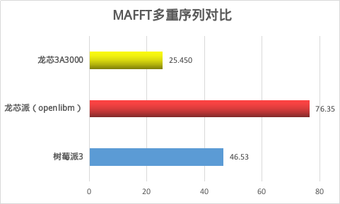

MAFFT（多重序列对比）是一个多线程程序，统计程序运行的时间，数值越短越好。根据测试，龙芯3A3000和龙芯派的性能分别是树莓派的1.83倍和0.61倍。龙芯派性能是3A3000的33%。

### 3.3 Primesieve

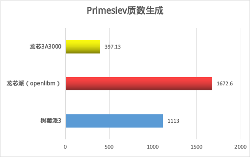

Primesieve是多线程的质数生成程序，根据计算用的时间考察处理器的整数性能。从测试结果来看，龙芯3A3000的性能是树莓派的2.8倍。龙芯派的多核性能只有树莓派的66%，3A3000的24%。

## 多核浮点性能

###  4.1 TTSIOD 3D Renderer

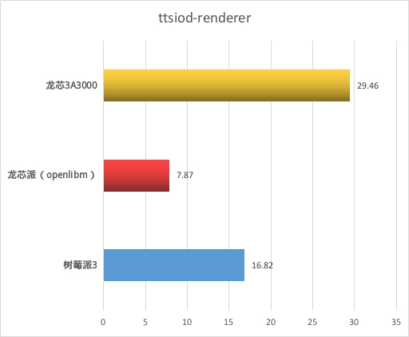

TTSIOD
渲染测试是多核性能测试，测试结果为渲染的速度。从测试结果来看，龙芯3A3000的多核性能是树莓派的1.75倍；龙芯派的多核性能是树莓派的47，3A3000的27%。

### 4.2 Smallpt

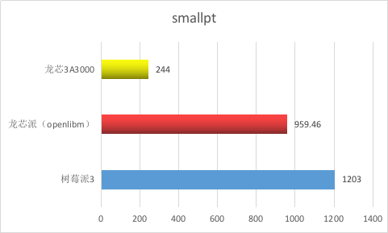

Smallpt是多线程光线渲染测试程序，数值越低，性能越好。从以上的数值可以看到，3A3000的性能是达到了树莓派的4.9倍；龙芯派的性能是树莓派的1.25倍，3A3000的23%。

双核的龙芯派，多核性能超过了4核的树莓派！

4.3 高性能共轭梯度

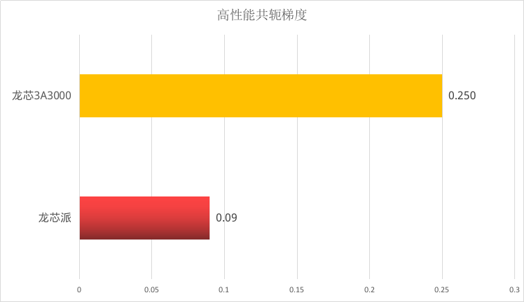

从高性能共轭梯度看，龙芯派的性能只有龙芯3A3000的1/3。我没有找到树莓派3B+的测试数据。

## 其他

### 音频编码

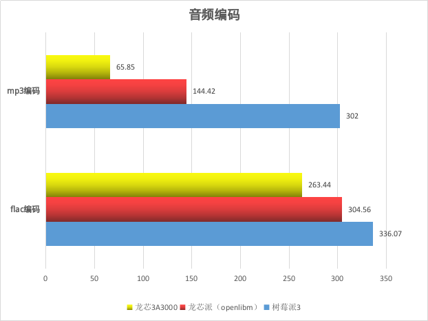

对于音频编码，我们做了两组测试，分别将WAV音频用MP3和FLAC进行编码，耗时越短越好。从测试的结果来看，在MP3编码表现上，龙芯3A3000和龙芯派均快于树莓派，速度分别是树莓派的4.6倍和2.1倍；在FLACi编码上，差距没有那么大，速度分别是树莓派的1.27倍和1.10倍。究其原因，MP3编码是一种有损压缩算法，而FLAC是一种无损压缩算法。推测前者需要进行较多的浮点运算，而后者主要是整数运算。

1.  缓存性能测试

    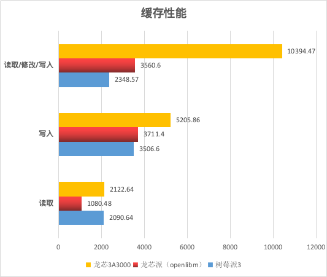

    从缓存性能看，龙芯3A3000性能超过同主频的树莓派，在读取/修改/写入的性能测试中，龙芯3A3000的性能是树莓派的4.4以上,
    写入速度速度是树莓派的1.5倍。但在第三项读取速度测试中，和树莓派相比优势不明显。而龙芯派，前两个测试性能明显优于树莓派，而读取速度只有树莓派的一半。

2.  内存性能测试

    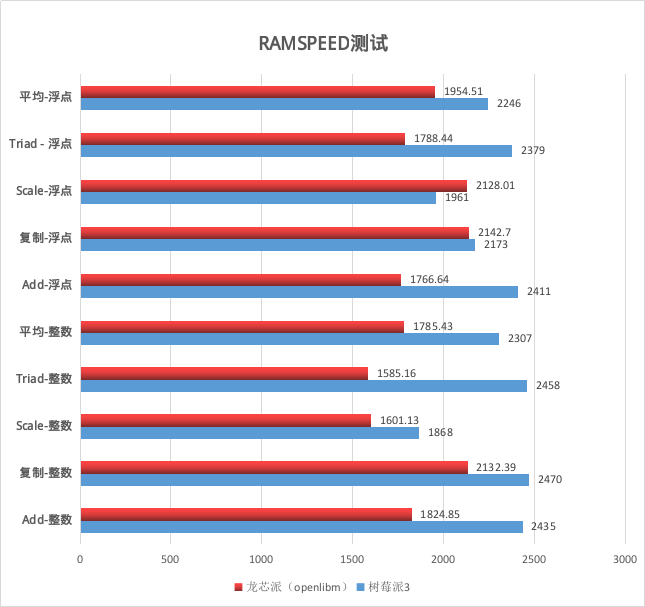

内存性能测试，简单一句话，龙芯派落后于树莓派。龙芯派内存频率默认为400MHz，树莓派内存频率默认为450MHz，估算一下龙芯派内存性能只有树莓派的89%。根据龙芯2K1000处理器手册，内存接口最高频率为533MHz。很明显，龙芯派的设计没有发挥出内存的速度。

5.4 网络服务性能测试

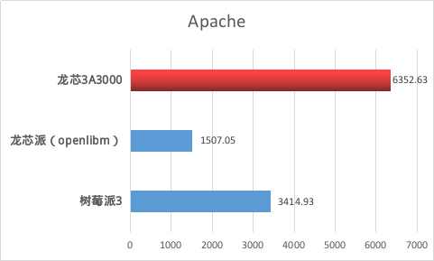

Apache测试反映了系统在运行网络服务时的多核性能。根据我们的测试，龙芯3A3000表现良好，运行Apache性能是树莓派的1.86倍。龙芯派的表现不佳，性能分别只有树莓派的44%，龙芯3A3000的24%。

5.5 解释性语言

我们对比了龙芯派和树莓派运行两种脚本语言的性能。龙芯派的性能悲剧了。运行PHP性能和python的性能分别只有树莓派的36%和93%。如果要拿龙芯派跑PHP程序，还得三思而后行。

从Perl语言的性能来看，龙芯派的性能只有树莓派的46%左右。从Python、Perl、PHP三种解释性语言的运行效果来看，性能都不是很好。原因可能有两个：一个是这些测试主要反映程序的整数性能而非浮点性能，一个是龙芯派上Python、Perl、PHP的解释器都没有进行优化。

5.6 SQLite

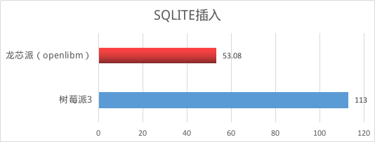

SQLite测试，耗时越短越好。从测试结果来看，龙芯派速度是树莓派的2.13倍。

## 总结

上面的测评实在是太罗嗦了，能不能告诉我谁更强一些？一图胜千言，先放一张图。

<table>
<colgroup>
<col style="width: 33%" />
<col style="width: 33%" />
<col style="width: 33%" />
</colgroup>
<tbody>
<tr class="odd">
<td>测试项目</td>
<td>二代龙芯派</td>
<td>树莓派3B+</td>
</tr>
<tr class="even">
<td>TSCP</td>
<td></td>
<td></td>
</tr>
<tr class="odd">
<td>pbzip2</td>
<td></td>
<td></td>
</tr>
<tr class="even">
<td>gzip</td>
<td></td>
<td></td>
</tr>
<tr class="odd">
<td>lzma</td>
<td></td>
<td></td>
</tr>
<tr class="even">
<td>scimark2</td>
<td></td>
<td></td>
</tr>
<tr class="odd">
<td>AOBench</td>
<td></td>
<td></td>
</tr>
<tr class="even">
<td>Himeno</td>
<td></td>
<td></td>
</tr>
<tr class="odd">
<td>7zip</td>
<td></td>
<td></td>
</tr>
<tr class="even">
<td>MAFFT</td>
<td></td>
<td></td>
</tr>
<tr class="odd">
<td>Primesieve</td>
<td></td>
<td></td>
</tr>
<tr class="even">
<td>TTSIOD 3D</td>
<td></td>
<td></td>
</tr>
<tr class="odd">
<td>smallpt</td>
<td></td>
<td></td>
</tr>
<tr class="even">
<td>MP3编码</td>
<td></td>
<td></td>
</tr>
<tr class="odd">
<td>FLAC编码</td>
<td></td>
<td></td>
</tr>
<tr class="even">
<td>缓存性能</td>
<td></td>
<td></td>
</tr>
<tr class="odd">
<td>内存性能</td>
<td></td>
<td></td>
</tr>
<tr class="even">
<td>Apache</td>
<td></td>
<td></td>
</tr>
<tr class="odd">
<td>PHP</td>
<td></td>
<td></td>
</tr>
<tr class="even">
<td>Python</td>
<td></td>
<td></td>
</tr>
<tr class="odd">
<td>Perl</td>
<td></td>
<td></td>
</tr>
<tr class="even">
<td>sqlite</td>
<td></td>
<td></td>
</tr>
<tr class="odd">
<td></td>
<td></td>
<td></td>
</tr>
<tr class="even">
<td>合计</td>
<td>7</td>
<td>14</td>
</tr>
</tbody>
</table>

在21项测试中，龙芯派赢了7个，树莓派赢了其中14个。作为一个只有1GHz主频的双核处理器，和1.4GHz主频的4核处理器做比较，能够赢7个，还是有些让人意外的。我们来尝试分析一下龙芯派和树莓派相比的优势和劣势：

首先说劣势：

1.  价格太高。1399元的价格，和树莓派220元的价格相比实在是太！高！了！不过，据小道消息龙芯正在做<s>乞丐版</s>教育版的龙芯派，价格会有大幅下降。

2.  主频太低。同样是40纳米工艺的处理器，龙芯2K1000主频只有1.0GHz，而树莓派3B+的处理器主频高了40%。IPC再好，主频不够高也白搭。好比一个技能全面的蝇量级拳王，碰到重量级拳手的话就会被一拳撂倒。

3.  软件生态不够好。在测试中可以明显看到，操作系统自带的libm性能非常糟糕，没有进行充分的优化，导致龙芯派在很多测试项目上成绩非常差。用libm的龙芯3A3000性能甚至会不如用openlibm的龙芯派。这个情况已经存在很久了，但我没有看到一点改善的迹象。也许是我用龙芯的姿势不太对吧！:(

    再<s>强行</s>说一下龙芯派的优势：

<!-- -->

1.  纯国产的CPU，自主可控。没有买国外的CPU核，也不用给ARM公司交昂贵的指令集授权费用，也不需要担心美国制裁。对于普通用户来说，这个优势聊胜于无吧！对于特殊行业的用户来说，可能是非常重要的。

2.  软件全开源。从BIOS到操作系统，统统开源。

3.  GS264处理器核很优秀。1GHz的龙芯2K1000能够在某些项目上打败1.4GHz的A53处理器，足以说明GS264处理器核的优秀。如果看同主频的性能，龙芯还会在更多项目上领先（假如不考虑功耗问题的话……）

    总之，二代龙芯派在部分性能上接近了树莓派上的4核A53处理器，提供了丰富的接口，可以在工业控制、计算机教育等领域发挥重要的作用。和龙芯3A3000处理器相比，龙芯2K1000单核性能大约是前者的40%～50%，多核性能是前者的20%～25%。期待龙芯派能在性能、价格、软件生态上有更多的进步，让它能够更加亲民、易用。

## 致谢

感谢龙芯某个不能提他名字的销售对此文章的支持！感谢龙芯派群老鼠老师和flygoat两位对文中部分错误的修正。

## 参考链接

1.  Scimark2

    <https://openbenchmarking.org/result/1803229-FO-MODEL3BPL15>

[<u>https://openbenchmarking.org/result/1905251-HV-PI2SCIMAR45</u>](https://openbenchmarking.org/result/1905251-HV-PI2SCIMAR45)

<https://openbenchmarking.org/result/1905295-HV-PI2SCIMAR92>

1.  TSCP

<https://openbenchmarking.org/result/1809295-RA-SYSTEMTES32>
<https://openbenchmarking.org/result/1905258-HV-PI2TSCPLO01>

<https://openbenchmarking.org/result/1905299-HV-PI2TSCPGC92>

1.  Gzip

    <https://openbenchmarking.org/result/1803310-FO-RPI3BPLUS84>

    <https://openbenchmarking.org/result/1906019-HV-PI2GZIPGC39>

2.  LZMA

    <https://openbenchmarking.org/result/1803315-FO-RPI3BPLUS89>

    <https://openbenchmarking.org/result/1905301-HV-PI2LZMAGC90>

3.  Parallel bzip2

    <https://openbenchmarking.org/result/1809295-RA-SYSTEMTES32>
    <https://openbenchmarking.org/result/1906011-HV-PI2PBZIP210>

4.  AOBench

<https://openbenchmarking.org/result/1804049-FO-AOBENCH1442>

<https://openbenchmarking.org/result/1905248-HV-LSPI2AOBE13>

<https://openbenchmarking.org/result/1905279-HV-PIAOBENCH50>

<https://openbenchmarking.org/result/1905282-HV-PI2AOBENC51>

1.  Himeno

    <https://openbenchmarking.org/result/1804094-FO-201804SBC31>

    <https://openbenchmarking.org/result/1905265-HV-PI2HIMENO52>

    <https://openbenchmarking.org/result/1905298-HV-PI2HIMENO81>

2.  7zip

<https://openbenchmarking.org/result/1804094-FO-201804SBC31>

<https://openbenchmarking.org/result/1905249-HV-PI27ZIPLO35>

<https://openbenchmarking.org/result/1905288-HV-PI27ZIPGC53>

1.  MAFFT

    <https://openbenchmarking.org/result/1804094-FO-201804SBC31>

    <https://openbenchmarking.org/result/1905265-HV-PI2MAFFTL61>

2.  Primesieve

    <https://openbenchmarking.org/result/1810150-RA-1809111RA35>

    <https://openbenchmarking.org/result/1906018-HV-PI2PRIMES13>

3.  TTSIOD 3D render

<https://openbenchmarking.org/result/1810150-RA-1809111RA35>

<https://openbenchmarking.org/result/1905245-HV-PI2TTSIOD93>

<https://openbenchmarking.org/result/1905309-HV-PI2TTSIOD73>

1.  smallpt

    <https://openbenchmarking.org/result/1804116-FO-201804SBC27>

    <https://openbenchmarking.org/result/1905253-HV-PI2SMALLP91>

2.  Hpcg

    <https://openbenchmarking.org/result/1906019-HV-PI2HPCGGC72>

3.  Encode-mp3

    <https://openbenchmarking.org/result/1905250-HV-PI2ENCODE72>

    Flac audio encoding

4.  Encode-flac

    <https://openbenchmarking.org/result/1810150-RA-1809111RA35>

    <https://openbenchmarking.org/result/1905294-HV-PI2ENCODE87>

5.  Cachebench

    [<u>https://openbenchmarking.org/result/1803229-FO-MODEL3BPL15</u>](https://openbenchmarking.org/result/1803229-FO-MODEL3BPL15)

    <https://openbenchmarking.org/result/1804041-FO-CAC40815822>

    <https://openbenchmarking.org/result/1905262-HV-PI2CACHEB39>

6.  Ramspeed

    <https://openbenchmarking.org/result/1803229-FO-TEST3RAM975>

    <https://openbenchmarking.org/result/1905265-HV-PI2RAMSPE15>

7.  Apache

    <https://openbenchmarking.org/result/1804094-FO-201804SBC31>

    <https://openbenchmarking.org/result/1906016-HV-PI2APACHE16>

8.  Pybench

    <https://openbenchmarking.org/result/1803229-FO-MODEL3BPL15>

    <https://openbenchmarking.org/result/1905265-HV-PIPYBENCH19>

9.  Phpbench 单核性能测试

<https://openbenchmarking.org/result/1803222-FO-MODEL3BPL99>

<https://openbenchmarking.org/result/1804043-FO-RPI3BPHPB88>

<https://openbenchmarking.org/result/1905299-HV-PI2PHPBEN43>

1.  Perlbenchmark

<https://openbenchmarking.org/result/1803222-FO-MODEL3BPL99>

<https://openbenchmarking.org/result/1905296-HV-PI2PERLBE77>

1.  Sqlite

    [<u>https://openbenchmarking.org/result/1804014-FO-RPI3BPLUS75</u>](https://openbenchmarking.org/result/1804014-FO-RPI3BPLUS75)

    <https://openbenchmarking.org/result/1906019-HV-PI2SQLITE54>

2.  《IT之家网友投稿：全面深扒国产龙芯3A3000处理器性能细节》

<https://www.ithome.com/0/395/791.htm>
