# 采用国产龙芯3A4000处理器的航天龙梦福珑2.0迷你主机开箱评测

最近，航天龙梦发布了一款新的福珑2.0主机。

[<u>https://mp.weixin.qq.com/s?\_\_biz=MzAxMjk4NzQyNg==&mid=2247486813&idx=1&sn=d41ca3556ce181ad43d98b7619122ad9</u>](https://mp.weixin.qq.com/s?__biz=MzAxMjk4NzQyNg==&mid=2247486813&idx=1&sn=d41ca3556ce181ad43d98b7619122ad9)

当看到照片的时候，我仿佛看到了十几年以前龙芯的第一个商业化产品，也就是福珑1.0。这也是我用过的第一款龙芯产品。福珑1.0采用的是单核龙芯2F处理器，主频800MHz；福珑2.0采用的是4核龙芯3A4000处理器。从福珑1.0到福珑2.0，龙芯以及龙梦都付出了非常多的努力。在这十几年间，龙芯课题组变成了龙芯中科公司，中科龙梦变成了航天龙梦
。

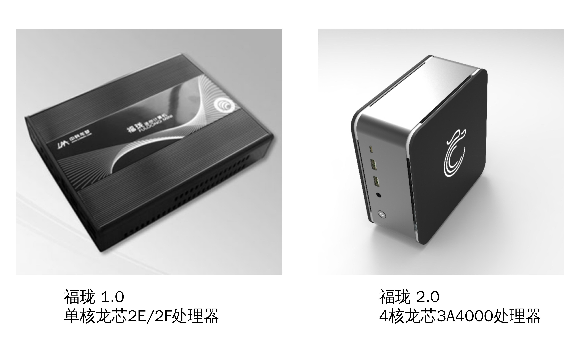

我有幸从航天龙梦拿到了新福珑的的**第一台**工程样机，对它进行了测试。

## 开箱

拿到快递以后，打开包装。在重重保护下，是一个白色的盒子。

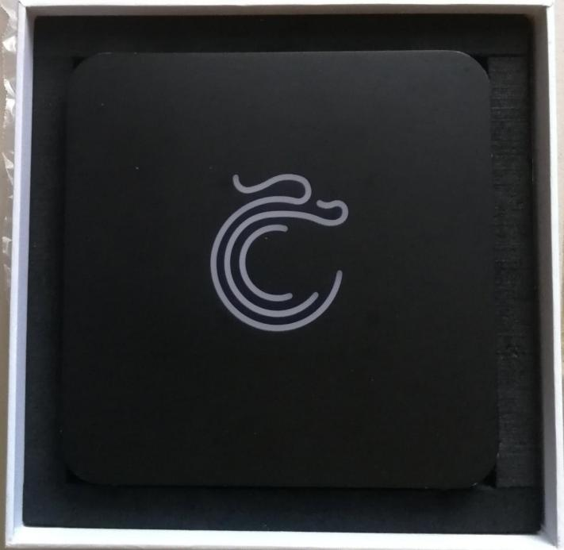

打开盖子，里面是福珑的主机和电源。主机非常小，方形的小盒子，长宽15
厘米，厚度7.1厘米。

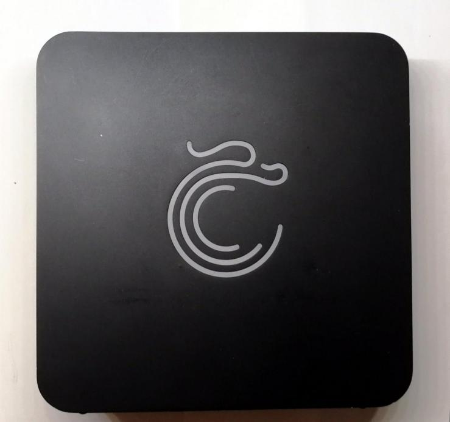

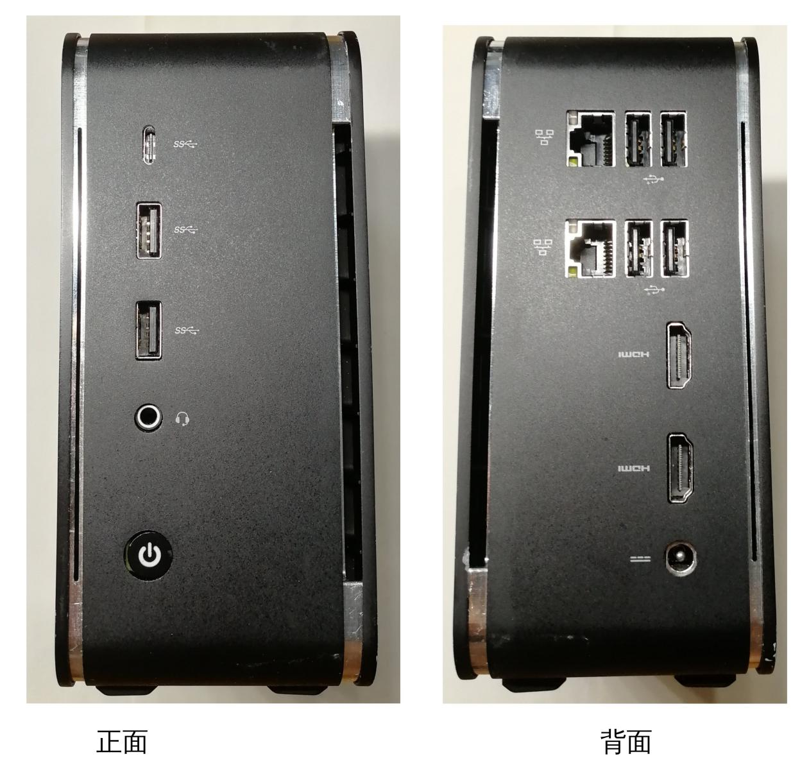

正面除了一个电源按钮以外，还有两个USB 3.0接口，一个USB
type-c接口，一个自适应音频接口；背面有两个网口，四个USB
2.0接口，两个HDMI接口，还有一个19V电源接口。

包装箱里除了主机，就只有电源。电源是长城的，19V
4.73A。最多能够提供89.87W的电力供应。事实上，福珑的功率并没有90W那么高，完全可以用更小功率的电源来供电。

主机两侧各有一个带有龙梦logo的发光盖板，在主板通电以后会发光。

## 拆解

随后，我对福珑进行了彻底的拆解。用一字螺丝刀小心的撬开福珑主机右侧的塑料盖板，露出了金属盖板。随后，拆下螺钉，打开金属盖板，就露出了福珑的主板。整个主板的样子是这样的。

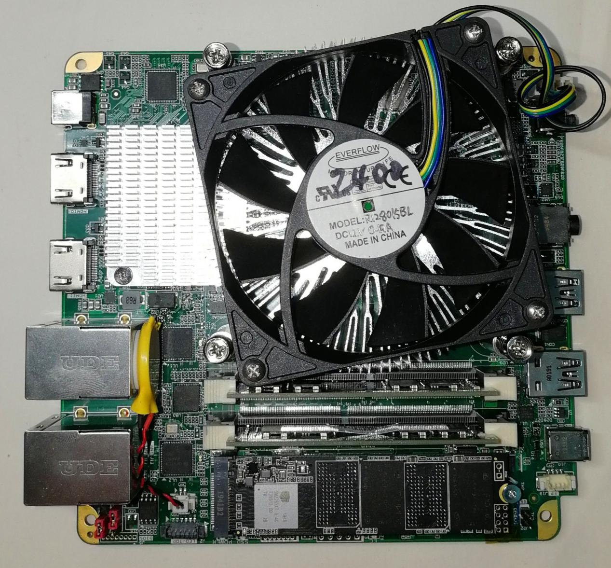

巨大的风扇底下是龙芯3A4000处理器，风扇左边的铝制散热器底下是龙芯7A1000桥片，其中内置了集成显卡。图片的下半部分是内存条、固态硬盘和无线网卡（在固态硬盘底下）。板载两根8GB紫光2666MHz笔记本内存条。紫光内存已经成为了龙芯处理器的御用内存条了。

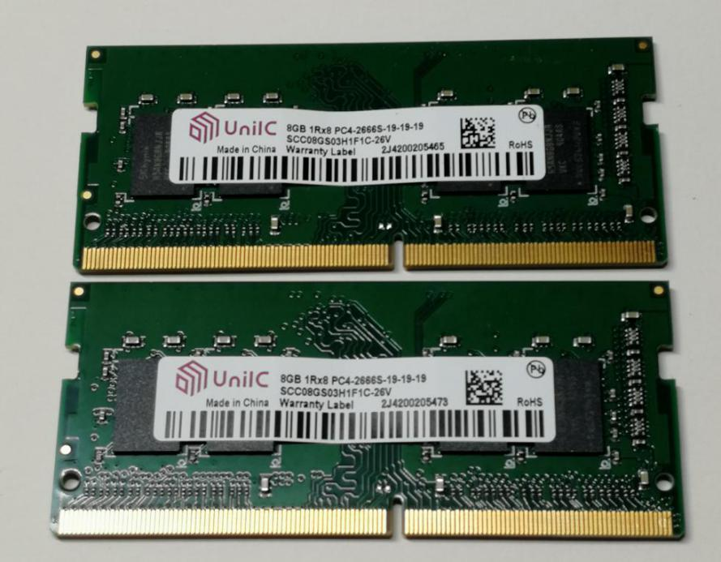

工程样机配的固态硬盘的品牌是神可。固态硬盘的型号是M2 2280,容量256
GB。从背面可以看到，固态硬盘采用了慧荣SM2263XT的主控芯片。正式发布的福珑2.0配的固态硬盘需要等到产品正式预售之日才能揭晓吧。

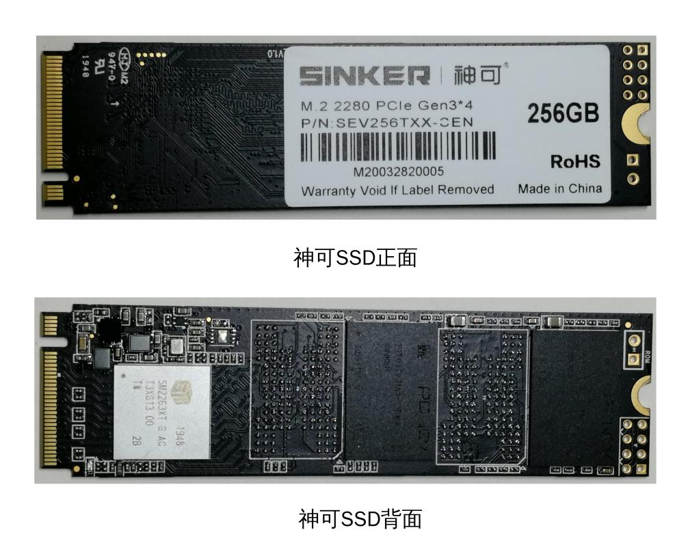

固态硬盘下面，是一个Intel
3165NGW的无线网卡。这个工程样机并没有配无线网卡的天线。

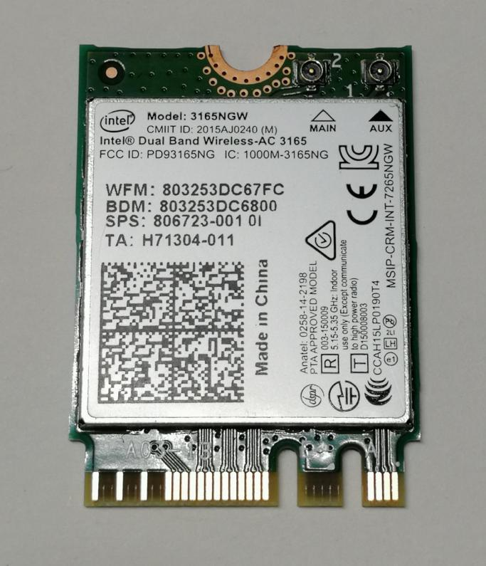

小心的拆下散热风扇和散热片，就露出了主板最核心的部件：龙芯3A4000处理器和龙芯7A1000桥片。

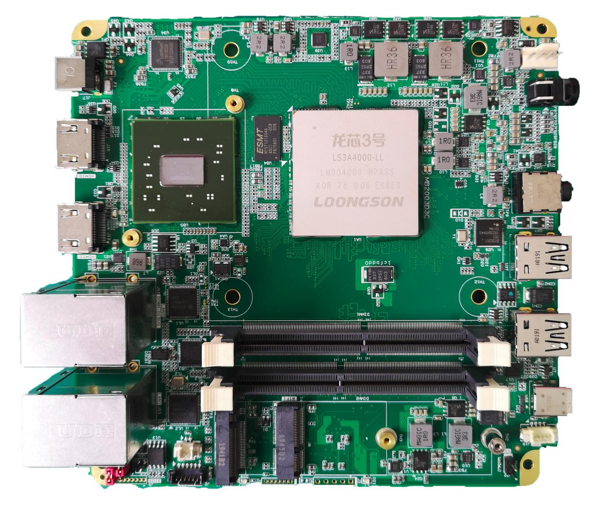

我尽量对主板上的芯片进行了识别，作了标记。

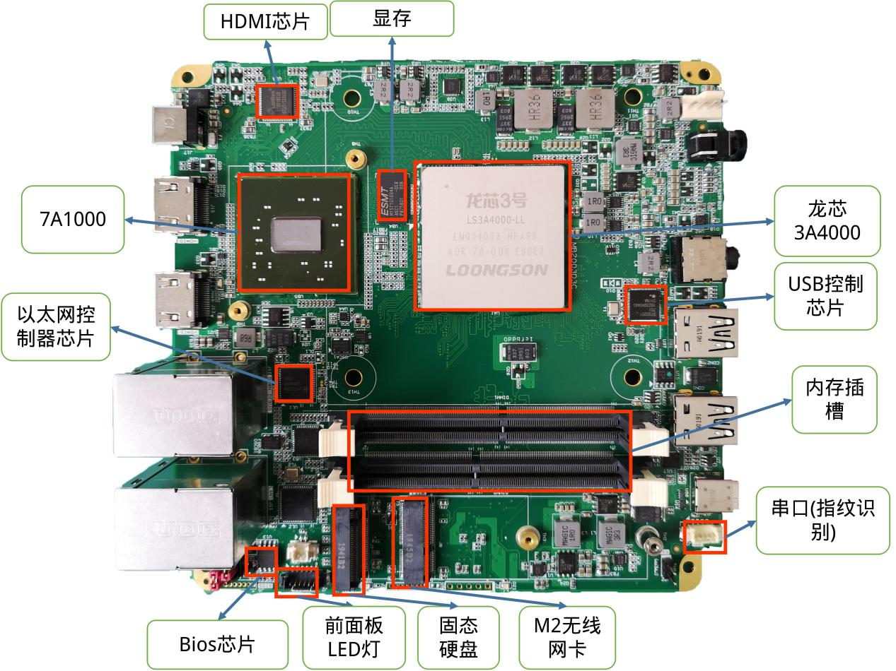

这块主板搭载的是龙芯3A4000-LL处理器，这是一款“低”功耗的处理器，主频1.5GHz，典型功耗&lt;
40W，TDP最大功耗50W。由于龙芯处理器还是用意法半导体
28nm工艺进行流片，在功耗上远远大于飞腾、兆芯、鲲鹏等采用更先进制程的国产处理器。据龙梦的工作人员透露，还有一款主频1.8GHz福珑2.0，在性能上可以与台式机打平。

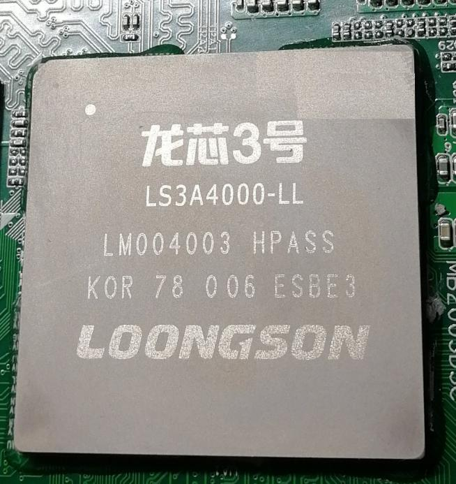

在龙芯3A4000处理器旁边是龙芯7A1000桥片。这款桥片的问世，让龙芯处理器可以摆脱对AMD桥片的依赖，增强了产品的自主可控性，同时也降低了主板的功耗。7A1000处理器中还集成了显卡，所以福珑2.0中并没有使用独立显卡。在量产版的福珑2.0中，还会采用最新的7A1000桥片，增强了GPU的稳定芯。

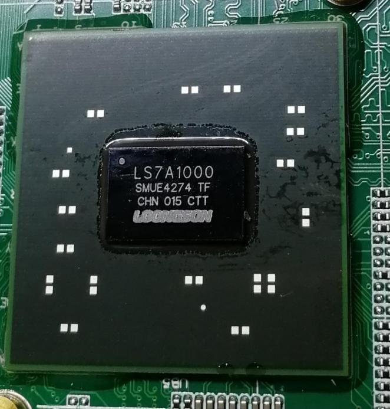

和宁美主机中的龙梦主板类似，福珑2.0的主板也有双BIOS设置。这是一个对用户以及开发者比较友好的设计。假如开发者为了追求更高的性能，刷了一个实验版的固件，出现了无法开机或者不稳定的问题，还可以备份BIOS回退倒安全的Bios版本。

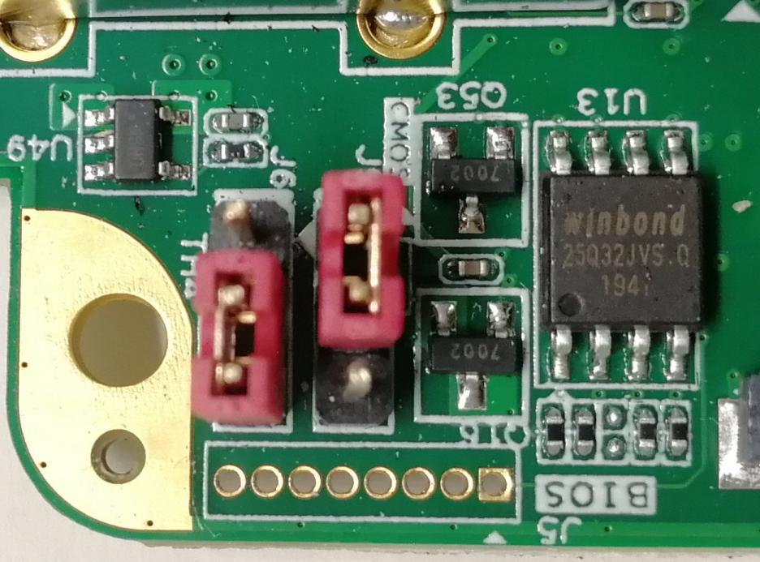

主板正面的Winbond（华邦电子）芯片。旁边是用来选择bios芯片的跳线。在主板背面还有一颗Winbond的bios芯片，应该是备份BIOS芯片。在CPU和桥片之间，有一个晶豪科技（ESMT）的显存芯片，容量128M
Byte。

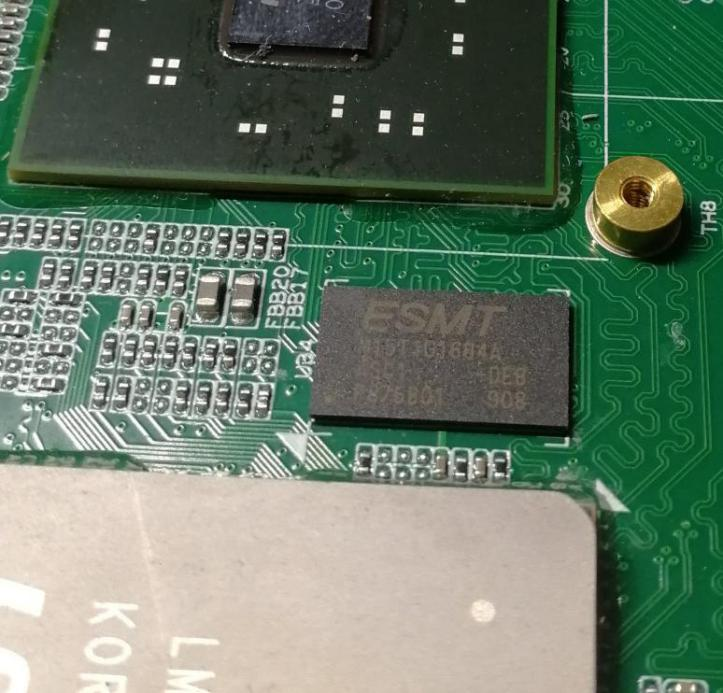

RGB转HDMI芯片为合肥龙讯半导体Lontium。

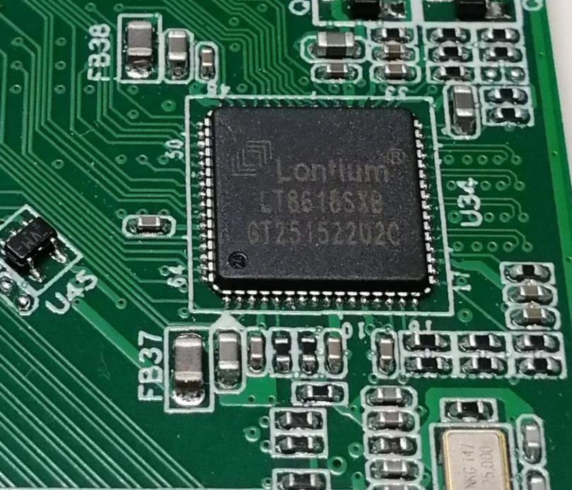

USB控制芯片采用的是日本瑞萨电子的uPD720201芯片。

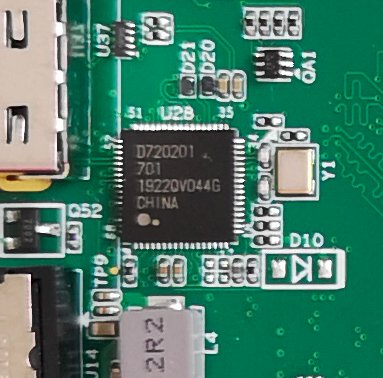

以太网控制芯片采用的是Intel WGI211AT。

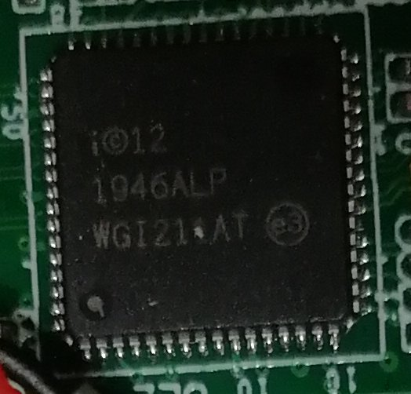

在主板的背面，有一个集成声卡，采用的是Reltek ALC662芯片。

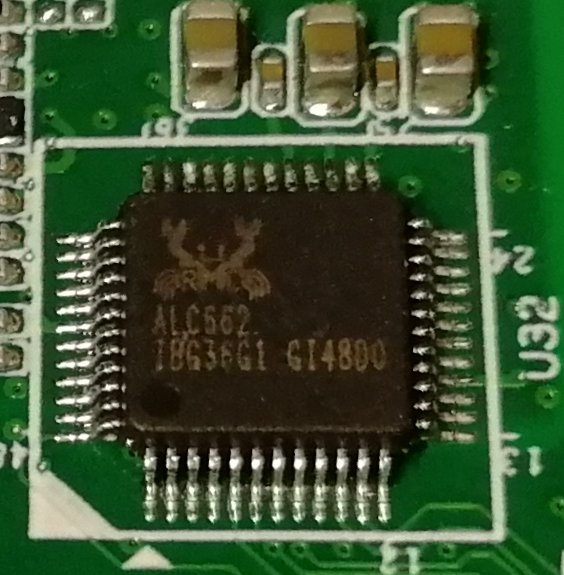

在主板背面，有一个新唐的单片机芯片，用来作电源管理。

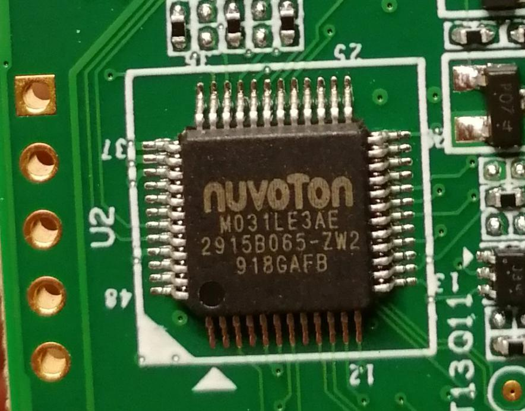

从以上这些的芯片产地来看，龙梦在设计这款主板的时候还没有达到100%高国产化率。下面，我列出了福珑2.0主板上所采用的部分芯片

<table>
<colgroup>
<col style="width: 33%" />
<col style="width: 33%" />
<col style="width: 33%" />
</colgroup>
<tbody>
<tr class="odd">
<td>芯片</td>
<td>厂商</td>
<td>产地</td>
</tr>
<tr class="even">
<td>龙芯3A4000-LL</td>
<td>龙芯中科</td>
<td>中国设计，韩国流片</td>
</tr>
<tr class="odd">
<td>龙芯7A1000</td>
<td>龙芯中科</td>
<td>中国</td>
</tr>
<tr class="even">
<td>显存</td>
<td>晶豪科技</td>
<td>中国台湾</td>
</tr>
<tr class="odd">
<td>USB控制器</td>
<td>瑞萨电子</td>
<td>日本</td>
</tr>
<tr class="even">
<td>RGB转HDMI</td>
<td>龙讯半导体</td>
<td>中国合肥</td>
</tr>
<tr class="odd">
<td>BIOS芯片</td>
<td>华邦电子</td>
<td>中国台湾</td>
</tr>
<tr class="even">
<td>电源控制芯片</td>
<td>新唐科技</td>
<td>中国台湾</td>
</tr>
<tr class="odd">
<td>以太网控制器</td>
<td>Intel</td>
<td>美国</td>
</tr>
<tr class="even">
<td>无线网卡</td>
<td>Intel</td>
<td>美国</td>
</tr>
<tr class="odd">
<td>声卡</td>
<td>瑞昱半导体</td>
<td>中国台湾</td>
</tr>
</tbody>
</table>

因此，我们可以推测这款福珑2.0主机的目标用户，可能不是对国产化率要求很高的特殊领域。另外我们也可以推测这款主机会有不错的性价比，值得爱好者关注。

## 使用体验

拆解完毕以后，打开主机，看看它的实际表现如何。

开机以后，先进入BIOS界面，看看它的硬件设置如何。

<table>
<colgroup>
<col style="width: 50%" />
<col style="width: 50%" />
</colgroup>
<tbody>
<tr class="odd">
<td>主板信息</td>
<td></td>
</tr>
<tr class="even">
<td>主板型号</td>
<td>LEMOTE-LS3A4000-7A1000-1W-V01-pc</td>
</tr>
<tr class="odd">
<td></td>
<td></td>
</tr>
<tr class="even">
<td>处理器信息</td>
<td></td>
</tr>
<tr class="odd">
<td>名称</td>
<td>LS3A4000</td>
</tr>
<tr class="even">
<td>频率</td>
<td>1500MHz</td>
</tr>
<tr class="odd">
<td>处理器数</td>
<td>4核</td>
</tr>
<tr class="even">
<td></td>
<td></td>
</tr>
<tr class="odd">
<td>内存信息</td>
<td></td>
</tr>
<tr class="even">
<td>总内存</td>
<td>16384 MB</td>
</tr>
<tr class="odd">
<td>内存速率</td>
<td>2133 MT/s</td>
</tr>
<tr class="even">
<td>DIMM0</td>
<td>DDR4 8192 MB</td>
</tr>
<tr class="odd">
<td>DIMM1</td>
<td>DDR4 8192 MB</td>
</tr>
<tr class="even">
<td></td>
<td></td>
</tr>
</tbody>
</table>

可以看到，它内置的龙芯3A4000主频只有1.5
GHz。内存频率为2133MHz，所以可以推测这个主机的stream性能应该还不错。

我给这个主机安装了航天龙梦的Fedora-Mate-Live-6系统，体验了一些它的性能。

从下图可以看出，福珑的主频被限制在了1500MHz。

系统中可以使用Chromium浏览器，HTML5的视频播放也没有问题，但也会显著提高处理器使用率。

此外，还可以使用龙芯浏览器进行网页浏览，在稳定性上会比Firefox、Chromium等好。

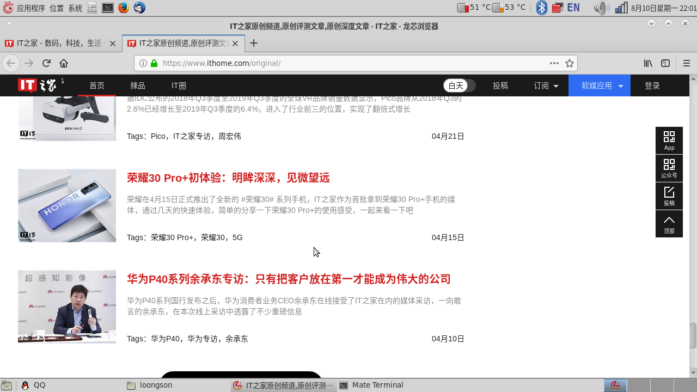

使用smplayer来播放视频。播放1080P的视频还是很流畅的。我手上没有4K视频之类的超高清视频，没有进行深入的测试。

龙芯中可以使用Linux版的QQ，虽然功能比较有限。

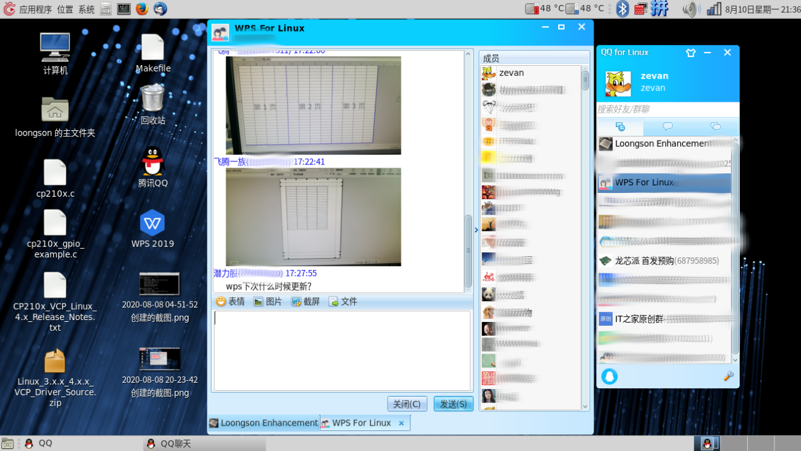

感谢金山公司开发的WPS，在龙芯3A4000下也可以使用WPS进行演示文稿制作，文字编辑。用户体验与在x86系统下没有什么区别。

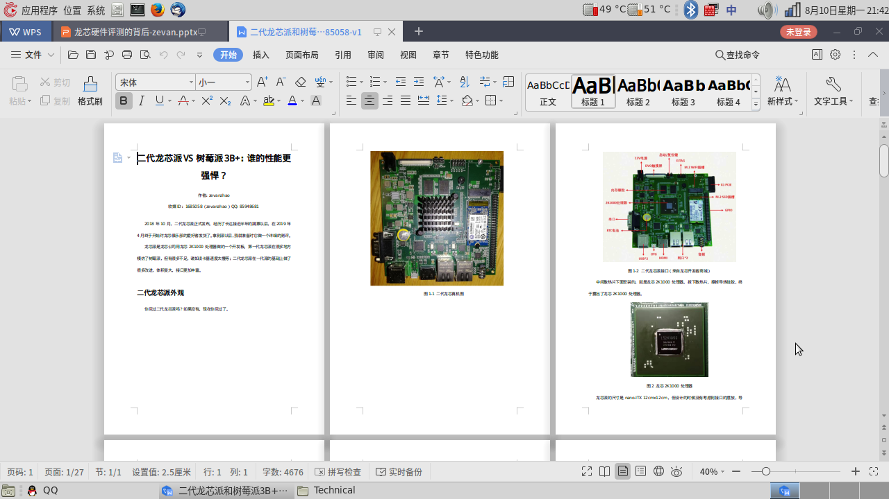

从上面的截图可以看到，处理器的温度一直在50度左右，并不高。对比之下，我的笔记本电脑处理器温度在69度左右。奇怪的是，虽然龙芯3A4000处理器的温度并不是很高，但风扇转速却很高，噪音比较大，这有些不正常。希望正式发布的福珑2.0能够对风扇转速进行调整，降低风扇噪音。

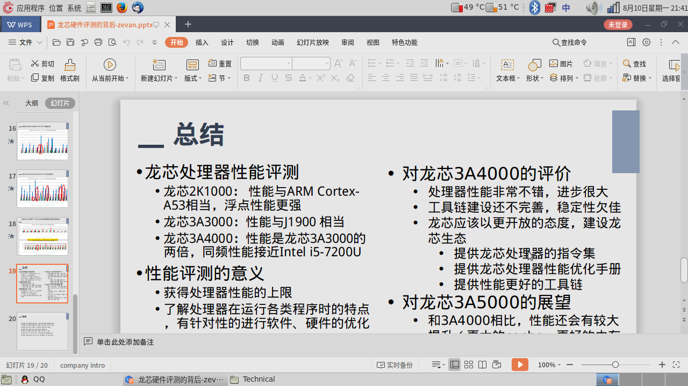

## 另外一个爱好者对福珑2.0 上各种应用有更深入的体验，可以在哔哩哔哩进行观看。

<https://www.bilibili.com/video/av584310310/>

## 性能评测

对于龙芯3A4000的性能评测，我已经在[《硬核评测：龙芯3A4000处理器的真实性能》](https://zhuanlan.zhihu.com/p/121593660) 一文中进行了详细的介绍，这里我只是简单的对机器的性能做了一点评测。

### Stream性能

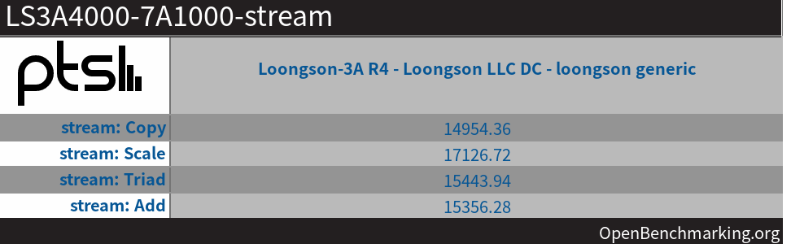

从stream性能看，配了两根内存条，组成双通道的福珑内存性能还不错。由于这台机器内存频率为2133MHz，不是2400MHz，所以内存性能并不能达到最高值。这也许可以通过固件更新而进一步优化。

https://openbenchmarking.org/result/2008107-FO-LS3A4000793

### 7zip性能

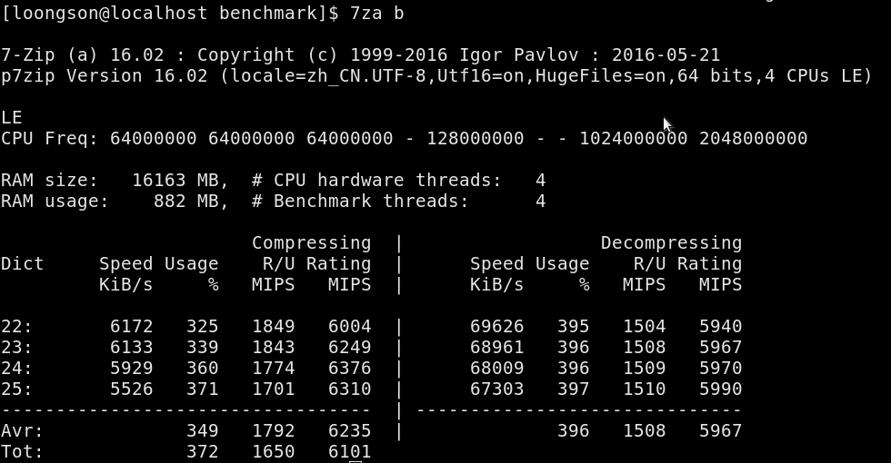

1.4GHz
3A3000处理器的7zip性能为4388分；从7zip性能来看，1.5GHz的3A4000-LL处理器性能与之相比有了42%的性能提升。

## 总结

采用龙芯3A4000处理器的福珑2.0在性能上有了明显进步，足以应对日常办公的计算需求。福珑2.0体积小巧，占地面积小，功耗小，体型类似NUC，可以作为个人桌面终端，或者作为网络服务器等轻量级服务器使用。如果对这款机器感兴趣或者是想购买的小伙伴可以关注航天龙梦公众号，后续将正式发售并预售。
