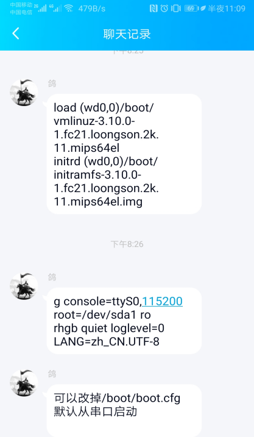

# 二代龙芯派上创建Linux From Scratch操作实录

**前言**

本文记录了在二代龙芯派上创建Linux From
Scratch（LFS）的全过程，以及在应用过程中遇到的一些问题。不保证对其他用户一定适用，仅供参考。

1.  **准备工作**

    全新的龙芯派存在一些问题，诸如每次开机随机生成一个网卡的MAC地址，导致DHCP服务器每次都会给龙芯派分配新的IP，使远程登录变得不方便；而且，龙芯派自带的SSD硬盘只有16GB，空间太小，要构建LFS得换更大的SSD硬盘。

1.1 **更新pmon（可选操作）**

小白用户请跳过这一步操作。

**警告：高危操作，有变砖风险！**

这里，使用了flygoat提供的2.3版本的pmon。

<https://github.com/FlyGoat/pmon-ls2k-pi2/releases/tag/v2.3>

放在U盘里，确保md5值准确无误，然后用load命令刷。

<table>
<colgroup>
<col style="width: 100%" />
</colgroup>
<tbody>
<tr class="odd">
<td>load -r -f 0xbfc00000 (usb0,0)/flash.bin</td>
</tr>
</tbody>
</table>

强烈建议对文件进行md5校验，确保pmon固件下载、复制都正确。

建议用最皮实可靠的U盘进行操作，一定不要用不稳定的U盘来操作！

**1.2 设置MAC地址**

用setmac设置一下网卡的MAC地址，避免每次开机就更换一个IP

<table>
<colgroup>
<col style="width: 100%" />
</colgroup>
<tbody>
<tr class="odd">
<td>
PMON&gt; setmac syn1 "f2:24:ee:e4:47:53"

set syn1 Mac address: f2:24:ee:e4:47:53

The machine should be restarted to make the mac change to take
effect!!

PMON&gt; setmac syn0 "f1:34:ee:e5:57:56"

set syn0 Mac address: f1:34:ee:e5:57:56

The machine should be restarted to make the mac change to take
effect!!
</td>
</tr>
</tbody>
</table>

<http://www.loongnix.org/index.php?title=Pmon%E5%B8%B8%E7%94%A8%E5%91%BD%E4%BB%A4&oldid=3456>

由于pmon中有bug，实际网卡的物理地址并不是此时设置的地址。不过，地址总算是可以固定下来了。

1.3 **安装Loognix操作系统**

我买了一块120GB的SSD硬盘，替换了二代龙芯派自带的16GB
SSD硬盘。接下来需要给新SSD硬盘安装系统。

首先，下载Loognix 20180930版本的iso文件。

<http://ftp.loongnix.org/os/loongnix/1.0/liveinst/old/loongnix-20180930.iso>

记得对ISO文件进行MD5校验

<http://ftp.loongnix.org/os/loongnix/1.0/liveinst/old/loongnix-20180930.iso.md5>

用dd命令制作安装U盘。安装细节不再赘述，详情可以参考鸽工的视频教程

龙芯TechLive第一期：安装Loongnix系统
<https://www.bilibili.com/video/av57802116>

安装的时候在分区的时候需要小心一点：

/boot分布必须是第一个分区。分区大小500MB左右即可，一定不能用ext4格式，建议用ext3格式。

/ 分区

/home分区, 可以让多个系统共享一个home

分别给debian和LFS的安装留出分区。我给debian和LFS都预留了20GB的分区，挂载在/DEBIAN和/LFS上。

swap分区留了2GB，和内存大小一致。

安装过程中，遇到了两个问题：

第一个问题：龙芯派比较挑HDMI线，使用绿联的HDMI线可以正常显示，使用渣渣显示器自带的线不能显示画面。如果发现龙芯派屏幕不亮，很可能是HDMI线的问题，而不是派的问题。

第二个问题：两个标准USB口，如果同时插上USB无线鼠标和USB键盘，pmon会报错，无法正常启动。建议只插一个USB键盘，等正常载入系统的时候再插鼠标等外设。

花了半个小时左右，安装成功。可以正常启动。

**配置SSH**

<table>
<colgroup>
<col style="width: 100%" />
</colgroup>
<tbody>
<tr class="odd">
<td>
systemctl enable sshd.service

systemctl start sshd.service
</td>
</tr>
</tbody>
</table>

**默认开机进入命令行界面**

<table>
<colgroup>
<col style="width: 100%" />
</colgroup>
<tbody>
<tr class="odd">
<td>systemctl set-default multi-user.target</td>
</tr>
</tbody>
</table>

**升级一些必要的软件**

yum install gcc

然而我并没有使用Loongnix来做LFS，我更喜欢debian，所以我又装了一个Debian系统。

Loongnix内有GCC
7.2，版本更高，可能更适合做LFS。在Loongnix系统下，理论上也可以用类似的流程构建LFS。

1.5 **安装Debian**

在Loognix环境中，用debootstrap方法安装debian
buster。注意，在准备安装debian的分区内进行操作。

yum install -y debootstrap

以安装 debootstrap

debootstrap --arch mips64el buster http://ftp.cn.debian.org/debian/

1.7 **更新一下内核**

Loongnix自带的内核有一个问题，开机的时候必须连上显示器，且打开显示器，否则不能开机。这个问题理论上可以自行编译新版本的内核来
解决。我采用了一个更简单的做法，做伸手党，请flygoat编译了一个龙芯派的内核，版本4.19。下载地址如下：

<table>
<colgroup>
<col style="width: 100%" />
</colgroup>
<tbody>
<tr class="odd">
<td><a
href="https://repo.flygoat.com/pub/~jiaxun/vmlinuz-2k-dvo1-1080p-wireless">https://repo.flygoat.com/pub/~jiaxun/vmlinuz-2k-dvo1-1080p-wireless</a></td>
</tr>
</tbody>
</table>

由于版权问题，该内核不完美，无法正常关机，需要长按电源键关机，请酌情使用。

1.6 **配置boot.cfg**

配置Debian使用Loongnix的内核来启动系统，串口和屏幕同时输出。注意，Loognix自带的内核中存在一点bug，启动的时候必须打开显示器，否则无法进入系统。这个bug可以通过自行编译内核解决，请参考本文中内核编译部分。

<table>
<colgroup>
<col style="width: 100%" />
</colgroup>
<tbody>
<tr class="odd">
<td>
timeout 5

default 0

showmenu 1

title 'Loongnix GNU/Linux'

kernel (wd0,0)/vmlinuz-3.10.0-1.fc21.loongson.2k.11.mips64el

initrd
(wd0,0)/initramfs-3.10.0-1.fc21.loongson.2k.11.mips64el.img

args root=/dev/sda6 ro rhgb quiet loglevel=0 LANG=zh_CN.UTF-8
<strong>console=ttyS0,115200</strong> <strong>console=tty</strong>

title 'Loongnix GNU/Linux rescue'

kernel
(wd0,0)/vmlinuz-0-rescue-9d0d90497b314a4d96c7154666c951ec.2k

initrd
(wd0,0)/initramfs-0-rescue-9d0d90497b314a4d96c7154666c951ec.2k.img

args root=/dev/sda6 ro rhgb quiet loglevel=0 LANG=zh_CN.UTF-8
console=ttyS0,115200 console=tty

title 'Debian GNU/Linux (10.0) 3.10.0-1'

kernel (wd0,0)/vmlinuz-3.10.0-1.fc21.loongson.2k.11.mips64el

initrd
(wd0,0)/initramfs-3.10.0-1.fc21.loongson.2k.11.mips64el.img

args root=/dev/sda3 ro rhgb quiet loglevel=0 LANG=zh_CN.UTF-8
console=ttyS0,115200 console=tty

title 'Debian GNU/Linux (10.0) rescue'

kernel
(wd0,0)/vmlinuz-0-rescue-9d0d90497b314a4d96c7154666c951ec.2k

initrd
(wd0,0)/initramfs-0-rescue-9d0d90497b314a4d96c7154666c951ec.2k.img

args root=/dev/sda3 ro rhgb quiet loglevel=0 LANG=zh_CN.UTF-8
console=ttyS0,115200 console=tty
</td>
</tr>
</tbody>
</table>

如果要在pmon中手动引导内核启动，需要使用的命令如下：

<table>
<colgroup>
<col style="width: 100%" />
</colgroup>
<tbody>
<tr class="odd">
<td>
load (wd0,0)/boot/vmlinuz-3.10.0-1

Initrd (wd0,0)/boot/initramfs-3.10.0-1

g console=ttyS0,115200 root=/dev/sda6 ro rhgb quiet loglevel=0
LANG=zh_CN.UTF-8
</td>
</tr>
</tbody>
</table>

1.7 **修改fstab**

为了增强系统的健壮性，避免因为断电而导致出现无法开机的情况，修改fstab文件

<https://help.ubuntu.com/community/Fstab>

<https://os.mbed.com/handbook/Mounting-with-sync>

<https://unix.stackexchange.com/questions/146620/difference-between-sync-and-async-mount-options>

加上errors=remount-ro参数，为了更安全可以加上sync选项，代价是系统响应速度可能更慢，SSD硬盘的寿命更低。

<table>
<colgroup>
<col style="width: 100%" />
</colgroup>
<tbody>
<tr class="odd">
<td>UUID=30fcb748-ad1e-4228-af2f-951e8e7b56df / ext3
defaults,errors=remount-ro,noatime，sync 0 1</td>
</tr>
</tbody>
</table>

1.8 **准备内核源码（可选）**

从loongnix的git库里下载内核源码，分支选release-1903

<http://cgit.loongnix.org/cgit/linux-3.10/>

<table>
<colgroup>
<col style="width: 100%" />
</colgroup>
<tbody>
<tr class="odd">
<td>git checkout -b release-1903</td>
</tr>
</tbody>
</table>

不过，我并没有自己编译内核，而是使用了上面提到的4.19内核。

1.  **编译LFS**

    **2.1 资料收集**

编译LFS可以参考这两位前辈的经验

<https://blog.csdn.net/Lina_ACM/article/details/79736930>

<https://blog.csdn.net/Lina_ACM/article/details/79670603>

<https://www.yhi.moe/cn/2018/12/23/lfs-on-mips64-process.html>

国内社区翻译的中文版的LFS 9.0

<https://lctt.github.io/LFS-BOOK/lfs-sysv/index.html>

以及航天龙梦孙海勇的《手把手教你构建自己的LINUX系统》

**2.2 环境设置以及文件下载**

把给LFS准备的分区挂载到/mnt/lfs。设置LFS环境变量为/mnt/lfs

<table>
<colgroup>
<col style="width: 100%" />
</colgroup>
<tbody>
<tr class="odd">
<td>export LFS=/mnt/lfs</td>
</tr>
</tbody>
</table>

参考了前辈的经验，我对LFS\_TGT变量做了一点点修改，改为

<table>
<colgroup>
<col style="width: 100%" />
</colgroup>
<tbody>
<tr class="odd">
<td>LFS_TGT=mips64el-lfs-linux-gnu</td>
</tr>
</tbody>
</table>

创建$LFS/sources文件夹

下载所有LFS需要的文件

<table>
<colgroup>
<col style="width: 100%" />
</colgroup>
<tbody>
<tr class="odd">
<td>wget --input-file=wget-list --continue
--directory-prefix=$LFS/sources</td>
</tr>
</tbody>
</table>

有一些文件不能正常下载，需要换一个镜像来下载，比如在http://www.linuxfromscratch.org/mirrors.html
中的files mirrors。

建议访问国内镜像

<https://mirrors.ustc.edu.cn/lfs/lfs-packages/9.0/>

<https://mirrors.ustc.edu.cn/lfs/lfs-packages/lfs-packages-9.0.tar>

2.3**构建临时环境**

2.3.1 编译binutils pass1

编译耗时18分钟（只看make的耗时），注意编译的时候加上-j3的参数，使make可以并行进行，能够节约一半的编译时间。

据此估算，如果加上configure的时间，编译binutils的耗时，即一个SBU，大约是19分钟。根据SBU的时间，可以估计其他程序编译的耗时。

我收集了一下各种CPU编译LFS时一个SBU的大小，以此可以估算龙芯2K
1000的性能大概相当于什么处理器。

表1 不同型号的处理器SBU时间

<table>
<colgroup>
<col style="width: 50%" />
<col style="width: 19%" />
<col style="width: 8%" />
<col style="width: 22%" />
</colgroup>
<tbody>
<tr class="odd">
<td>处理器型号</td>
<td>主频（GHz）</td>
<td>核数</td>
<td>SBU</td>
</tr>
<tr class="even">
<td>龙芯2K1000（龙芯派）</td>
<td>1.0</td>
<td>2</td>
<td>19m</td>
</tr>
<tr class="odd">
<td>BCM2711 SoC （树莓派4）</td>
<td>1.5</td>
<td>4</td>
<td>4m</td>
</tr>
<tr class="even">
<td>AMD Athlon X2</td>
<td>2.5</td>
<td>2</td>
<td>15m</td>
</tr>
<tr class="odd">
<td>Intel Celeron N2840</td>
<td>2.16</td>
<td>2</td>
<td>6m17.613s</td>
</tr>
<tr class="even">
<td>AMD FX-8350 (over clock)</td>
<td>4.4</td>
<td>8</td>
<td>1.23m</td>
</tr>
<tr class="odd">
<td>Intel Atom 330</td>
<td>1.6</td>
<td>2</td>
<td>19m</td>
</tr>
<tr class="even">
<td>BCM2835（Raspberry Pi Zero W）</td>
<td>0.7</td>
<td>1</td>
<td>58m51.823s</td>
</tr>
<tr class="odd">
<td>Intel Xeon E5-1650</td>
<td>3.2</td>
<td>6</td>
<td>2m37s(without -j)</td>
</tr>
<tr class="even">
<td>PowerPC G5</td>
<td>2.0</td>
<td>2</td>
<td>4m17.748s</td>
</tr>
<tr class="odd">
<td>Intel Core i5-3470</td>
<td>3.2</td>
<td>4</td>
<td>0m41.302s</td>
</tr>
<tr class="even">
<td>Intel Core i3-550</td>
<td>3.2</td>
<td>2</td>
<td>1m38.310s</td>
</tr>
<tr class="odd">
<td>Qualcomm Snapdragon 410 MSM8916</td>
<td>1.2</td>
<td>4</td>
<td>30m51.855s</td>
</tr>
<tr class="even">
<td>Intel Core i5-6300HQ</td>
<td>2.3</td>
<td>4</td>
<td>0m42.588s</td>
</tr>
</tbody>
</table>

数据来源：

<https://www.linuxquestions.org/questions/linux-from-scratch-13/what-cpu-are-you-using-and-what-is-your-sbu-4175634812/page2.html>

2.3.2 GCC pass 1

根据LFS手册，GCC pass 1构建需要12 SBU，大概需要耗时228分钟。

在编译之前，需要作出修改。在x86\_64下编译LFS，需要修改三个文件
gcc/config/linux.h,

gcc/config/i386/linux.h, 和gcc/config/i368/linux64.h。

对于MIPS下的编译，需要修改的是gcc/config/linux.h和gcc/config/mips/linux.h两个文件,相应的脚本为：

<table>
<colgroup>
<col style="width: 100%" />
</colgroup>
<tbody>
<tr class="odd">
<td>
for file in <strong>gcc/config/linux.h
gcc/config/mips/linux.h</strong>

do

cp -uv $file{,.orig}

sed -e 's@/lib\(64\)\?\(32\)\?/ld@/tools&amp;@g' \

-e 's@/usr@/tools@g' $file.orig &gt; $file

echo '

#undef STANDARD_STARTFILE_PREFIX_1

#undef STANDARD_STARTFILE_PREFIX_2

#define STANDARD_STARTFILE_PREFIX_1 "/tools/lib/"

#define STANDARD_STARTFILE_PREFIX_2 ""' &gt;&gt; $file

touch $file.orig

done
</td>
</tr>
</tbody>
</table>

编译的时候，需要根据龙芯的环境作出修改，参考Yhi
Junde的blog、<https://www.yhi.moe/cn/2018/12/23/lfs-on-mips64-process.html>

修改如下：

<table>
<colgroup>
<col style="width: 100%" />
</colgroup>
<tbody>
<tr class="odd">
<td>
../configure \

--target=$LFS_TGT \

--prefix=/tools \

--with-glibc-version=2.11 \

--with-sysroot=$LFS \

--with-newlib \

--without-headers \

--with-local-prefix=/tools \

--with-native-system-header-dir=/tools/include \

--disable-nls \

--disable-shared \

--disable-multilib \

--disable-decimal-float \

--disable-threads \

--disable-libatomic \

--disable-libgomp \

--disable-libquadmath \

--disable-libssp \

--disable-libvtv \

--disable-libstdcxx \

--enable-languages=c,c++ \

<strong>--with-abi=64 --with-arch=mips64r2
--with-tune=loongson3a</strong>
</td>
</tr>
</tbody>
</table>

针对龙芯2K，可能有特殊的
--with-arch和--with-tune参数。为了保险起见，先不加太多优化。

另外，并没有增加 --build选项

预计耗时228分钟，实际耗时203分钟。

后续的编译速度都比较快，最慢的就是GCC的编译。

2.3.3 Linux-3.10 API headers

这里没有用Linux 5.2的内核源码，用的是龙芯的3.10内核源码。

git clone 下release-1903版本的Linux 3.10
内核源码，然后按照LFS手册来操作。

2.3.4 Bison

Make check 的时候出错。

<table>
<colgroup>
<col style="width: 100%" />
</colgroup>
<tbody>
<tr class="odd">
<td>
make[3]: 'examples/c/calc/calc' is up to date.

LEX examples/c/lexcalc/scan.c

CC examples/c/lexcalc/lexcalc-scan.o

gcc: error: ./examples/c/lexcalc/scan.c: No such file or
directory

gcc: fatal error: no input files

compilation terminated.
</td>
</tr>
</tbody>
</table>

暂时不知道是否有影响。

2.3.5 Python

编译的时候出了点问题，不过还是结束了。

<table>
<colgroup>
<col style="width: 100%" />
</colgroup>
<tbody>
<tr class="odd">
<td>
/mnt/lfs/sources/Python-3.7.4/Modules/nismodule.c:17:10: fatal
error: rpc/rpc.h: No such file or directory

17 | #include &lt;rpc/rpc.h&gt;

| ^~~~~~~~~~~

compilation terminated.

INFO: Could not locate ffi libs and/or headers
</td>
</tr>
</tbody>
</table>

Make install的时候报错

<table>
<colgroup>
<col style="width: 100%" />
</colgroup>
<tbody>
<tr class="odd">
<td>
Traceback (most recent call last):

File "/mnt/lfs/sources/Python-3.7.4/Lib/runpy.py", line 193, in
_run_module_as_main

"__main__", mod_spec)

File "/mnt/lfs/sources/Python-3.7.4/Lib/runpy.py", line 85, in
_run_code

exec(code, run_globals)

File "/mnt/lfs/sources/Python-3.7.4/Lib/ensurepip/__main__.py", line
5, in &lt;module&gt;

sys.exit(ensurepip._main())

File "/mnt/lfs/sources/Python-3.7.4/Lib/ensurepip/__init__.py", line
204, in _main

default_pip=args.default_pip,

File "/mnt/lfs/sources/Python-3.7.4/Lib/ensurepip/__init__.py", line
117, in _bootstrap

return _run_pip(args + [p[0] for p in _PROJECTS],
additional_paths)

File "/mnt/lfs/sources/Python-3.7.4/Lib/ensurepip/__init__.py", line
27, in _run_pip

import pip._internal

zipimport.ZipImportError: can't decompress data; zlib not
available

make: *** [Makefile:1132: install] Error 1
</td>
</tr>
</tbody>
</table>

不管了，好像不影响，可以继续。

2.3.6 Stripping

跳过，不做了。

至此，LFS的临时系统已经全部完成了。每个软件包编译的耗时间在表2中列出，耗时超过1
SBU的软件包已经标红。可见，大部分的程序编译很块，最慢的是GCC的编译。

表2 临时系统软件包构建耗时统计

<table>
<colgroup>
<col style="width: 62%" />
<col style="width: 37%" />
</colgroup>
<tbody>
<tr class="odd">
<td>软件包</td>
<td>二代派make耗时</td>
</tr>
<tr class="even">
<td><strong>binutils pass 1</strong></td>
<td><strong>18m</strong></td>
</tr>
<tr class="odd">
<td><strong>gcc 9.2 pass 1</strong></td>
<td><strong>203m</strong></td>
</tr>
<tr class="even">
<td><strong>glibc-2.30</strong></td>
<td><strong>66m</strong></td>
</tr>
<tr class="odd">
<td>libstdc++</td>
<td>6m56.376s</td>
</tr>
<tr class="even">
<td>Binutils pass 2</td>
<td>18m44.005s</td>
</tr>
<tr class="odd">
<td><strong>gcc 9.2 pass 2</strong></td>
<td><strong>263m18.820s</strong></td>
</tr>
<tr class="even">
<td><strong>tcl</strong></td>
<td><strong>22m35.361s</strong></td>
</tr>
<tr class="odd">
<td>expect</td>
<td>0m37.312s</td>
</tr>
<tr class="even">
<td>Deja GNU</td>
<td>0m0.047s</td>
</tr>
<tr class="odd">
<td>M4</td>
<td>1m2.312s</td>
</tr>
<tr class="even">
<td>Ncurses</td>
<td>9m0.322s</td>
</tr>
<tr class="odd">
<td>Bash</td>
<td>5m36.454s</td>
</tr>
<tr class="even">
<td>Bison</td>
<td>2m17.604s</td>
</tr>
<tr class="odd">
<td>Bzip2</td>
<td>0m35.095s</td>
</tr>
<tr class="even">
<td>Coreutils</td>
<td>8m24.090s</td>
</tr>
<tr class="odd">
<td>Diffutils</td>
<td>1m54.362s</td>
</tr>
<tr class="even">
<td>File</td>
<td>0m46.442s</td>
</tr>
<tr class="odd">
<td>Findutils</td>
<td>1m44.260s</td>
</tr>
<tr class="even">
<td>Gawk</td>
<td>3m52.328s</td>
</tr>
<tr class="odd">
<td><strong>Gettext</strong></td>
<td><strong>34m44.299s</strong></td>
</tr>
<tr class="even">
<td>Grep</td>
<td>1m50.758s</td>
</tr>
<tr class="odd">
<td>Gzip</td>
<td>0m38.561s</td>
</tr>
<tr class="even">
<td>Make</td>
<td>0m58.789s</td>
</tr>
<tr class="odd">
<td>Patch</td>
<td>1m8.531s</td>
</tr>
<tr class="even">
<td><strong>Perl</strong></td>
<td><strong>27m47.331s</strong></td>
</tr>
<tr class="odd">
<td>Python</td>
<td></td>
</tr>
<tr class="even">
<td>Sed</td>
<td>1m21.040s</td>
</tr>
<tr class="odd">
<td>tar</td>
<td>3m6.694s</td>
</tr>
<tr class="even">
<td>texinfo</td>
<td>3m17.785s</td>
</tr>
<tr class="odd">
<td>xz</td>
<td>2m40.246s</td>
</tr>
</tbody>
</table>

**2.4 LFS正式系统的编译**

2.4.1 创建必要的文件夹，挂载必要的文件夹

**注意：Debian系统下，/dev/shm 不是/run/shm的符号链接。**

将mount和chroot命令写入一个脚本，方便出现中断时能够继续编译。

一旦chroot到临时系统，就无法用文本编辑器了。所以，提前写好一些脚本，方便后续使用。另外一个办法，就是另外开一个远程登录的终端，在里面写脚本。在chroot的系统内执行，以减少文字的输入。

**一定要注意:**

**编译的时候要在chroot环境中进行!**

**编译的时候要在chroot环境中进行!**

**编译的时候要在chroot环境中进行！**

**重要的事情说三遍，切记切记！**

2.4.2 Glibc

运行make以后，直接make check的话会报错，需要

ln -sfnv $PWD/elf/ld.so.1 /lib/

Make check，会有一些失败，不过应该是正常的。

<table>
<colgroup>
<col style="width: 100%" />
</colgroup>
<tbody>
<tr class="odd">
<td>
Summary of test results:

132 FAIL

5798 PASS

16 UNSUPPORTED

18 XFAIL

2 XPASS

make[1]: *** [Makefile:412: tests] Error 1

make[1]: Leaving directory '/sources/glibc-2.30'

make: *** [Makefile:9: check] Error 2
</td>
</tr>
</tbody>
</table>

2.4.3 Locales

调整时区，选择China/Shanghai

2.4.4调整工具链

2.4.5 Binutils

Make check的时候发现了很多错误，暂时不知道这些错误有什么影响。

<table>
<colgroup>
<col style="width: 100%" />
</colgroup>
<tbody>
<tr class="odd">
<td>
=== ld Summary ===

# of expected passes 1290

# of unexpected failures 173

# of expected failures 31

# of known failures 1

# of unresolved testcases 209

# of untested testcases 2

# of unsupported tests 43

./ld-new 2.32
</td>
</tr>
</tbody>
</table>

2.4.6 Gmp 6.1.2

注意在configure的时候增加ABI=64

2.4.7 GCC 9.2

需要注意的有两点：

首先，修改源码配置

<table>
<colgroup>
<col style="width: 100%" />
</colgroup>
<tbody>
<tr class="odd">
<td>
case $(uname -m) in

x86_64)

sed -e '/m64=/s/lib64/lib/' \

-i.orig gcc/config/i386/t-linux64

;;

esac
</td>
</tr>
</tbody>
</table>

上面这个脚本，尽管是针对x86\_64处理器，但龙芯是64位的MIPS处理器，也需要进行相应的处理。如果没有处理，那么需要做一些符号链接/usr/lib64
--&gt; /usr/lib, /lib64--&gt; /lib。然后，修改abi

在configure 参数中增加

<table>
<colgroup>
<col style="width: 100%" />
</colgroup>
<tbody>
<tr class="odd">
<td>--with-abi=64 --with-arch=mips64r2 --with-tune=loongson3a</td>
</tr>
</tbody>
</table>

预计耗时95
SBU，30个小时左右。其中，编译gcc本身耗时4个小时左右，剩下的26个小时是在运行make
check。

实际check耗时19小时30分钟。

<table>
<colgroup>
<col style="width: 100%" />
</colgroup>
<tbody>
<tr class="odd">
<td>
=== g++ Summary ===

# of expected passes 124434

# of unexpected failures 15

# of expected failures 520

# of unresolved testcases 3

# of unsupported tests 6078

/sources/gcc-9.2.0/build/gcc/xg++ version 9.2.0 (GCC)

--

=== gcc Summary ===

# of expected passes 131096

# of unexpected failures 55

# of unexpected successes 8

# of expected failures 576

# of unsupported tests 3932

/sources/gcc-9.2.0/build/gcc/xgcc version 9.2.0 (GCC)

--

=== libatomic Summary ===

# of expected passes 54

=== libgomp tests ===

Running target unix

FAIL: libgomp.c/../libgomp.c-c++-common/for-3.c execution test

--

=== libgomp Summary ===

# of expected passes 2300

# of unexpected failures 2

# of expected failures 2

# of unsupported tests 217

=== libstdc++ tests ===

--

=== libstdc++ Summary ===

# of expected passes 12642

# of unexpected failures 13

# of expected failures 78

# of unsupported tests 406

Compiler version: 9.2.0 (GCC)
</td>
</tr>
</tbody>
</table>

有部分测试失败。不过好像没有什么影响，可以继续。

2.4.8 Bison

Make check 的时候报错

<table>
<colgroup>
<col style="width: 100%" />
</colgroup>
<tbody>
<tr class="odd">
<td>
gcc: error: ./examples/c/lexcalc/scan.c: No such file or
directory

gcc: fatal error: no input files
</td>
</tr>
</tbody>
</table>

要避免报错，需要再装flex

2.4.9 Libtools

5个已知的fail，可以无视。

<table>
<colgroup>
<col style="width: 100%" />
</colgroup>
<tbody>
<tr class="odd">
<td>
ERROR: 140 tests were run,

65 failed (60 expected failures).

30 tests were skipped.
</td>
</tr>
</tbody>
</table>

2.4.10 Libelf

Make check有报错

不确定这个有多大的影响，先继续了。

<table>
<colgroup>
<col style="width: 100%" />
</colgroup>
<tbody>
<tr class="odd">
<td>
Testsuite summary for elfutils 0.177

============================================================================

# TOTAL: 213

# PASS: 196

# SKIP: 9

# XFAIL: 0

# FAIL: 8

# XPASS: 0

# ERROR: 0

============================================================================

See tests/test-suite.log

Please report to https://sourceware.org/bugzilla

============================================================================

make[3]: *** [Makefile:2319: test-suite.log] Error 1

make[2]: *** [Makefile:2427: check-TESTS] Error 2

make[1]: *** [Makefile:3985: check-am] Error 2

make: *** [Makefile:486: check-recursive] Error 1
</td>
</tr>
</tbody>
</table>

2.4.11 Grub

龙芯下直接用pmon引导就好了，没有grub也没有关系。直接跳过不装了。

2.4.12 Libffi

Configure的时候需要根据修改gcc-arch设置，不然会认错处理器类型。

--with-gcc-arch=native 改为--with-gcc-arch=loongson3a

测试情况如下：

<table>
<colgroup>
<col style="width: 100%" />
</colgroup>
<tbody>
<tr class="odd">
<td>
# of expected passes 1865

# of unexpected failures 5
</td>
</tr>
</tbody>
</table>

有5个fail。

2.4.13 Openssl

在龙芯派下编译，需要修改一下脚本，指定编译64位，不然会把mabi指定为n32，然后报错。

<table>
<colgroup>
<col style="width: 100%" />
</colgroup>
<tbody>
<tr class="odd">
<td>
./Configure linux64-mips64 --prefix=/usr \

--openssldir=/etc/ssl \

--libdir=lib \

shared \

zlib-dynamic \
</td>
</tr>
</tbody>
</table>

编辑器的编译可以在ncurses编译结束以后就进行

弄个nano出来，编辑脚本的时候就方便多了。

2.4.14 Gzip

Make check的时候报错

<table>
<colgroup>
<col style="width: 100%" />
</colgroup>
<tbody>
<tr class="odd">
<td>
estsuite summary for gzip 1.10

============================================================================

# TOTAL: 22

# PASS: 21

# SKIP: 0

# XFAIL: 0

# FAIL: 1

# XPASS: 0

# ERROR: 0

============================================================================

See tests/test-suite.log

Please report to bug-gzip@gnu.org

============================================================================

make[4]: *** [Makefile:1673: test-suite.log] Error 1

make[4]: Leaving directory '/sources/gzip-1.10/tests'

make[3]: *** [Makefile:1781: check-TESTS] Error 2

make[3]: Leaving directory '/sources/gzip-1.10/tests'

make[2]: *** [Makefile:2001: check-am] Error 2

make[2]: Leaving directory '/sources/gzip-1.10/tests'

make[1]: *** [Makefile:1768: check-recursive] Error 1

make[1]: Leaving directory '/sources/gzip-1.10'

make: *** [Makefile:2063: check] Error 2
</td>
</tr>
</tbody>
</table>

不影响，继续

2.4.15 Patch

Make check结果如下：

<table>
<colgroup>
<col style="width: 100%" />
</colgroup>
<tbody>
<tr class="odd">
<td>
Testsuite summary for GNU patch 2.7.6

============================================================================

# TOTAL: 44

# PASS: 41

# SKIP: 1

# XFAIL: 2

# FAIL: 0

# XPASS: 0

# ERROR: 0
</td>
</tr>
</tbody>
</table>

2.4.16 Tar

无法正常运行make check。

163: storing sparse files &gt; 8G 卡住了，系统死机。跳过make check。

所有的软件包编译完成，耗时统计如表3所示，耗时超过1 SBU的软件包已经标红。

表3 LFS正式系统软件包编译耗时统计

<table>
<colgroup>
<col style="width: 19%" />
<col style="width: 16%" />
<col style="width: 16%" />
<col style="width: 17%" />
<col style="width: 18%" />
<col style="width: 12%" />
</colgroup>
<tbody>
<tr class="odd">
<td></td>
<td>configure</td>
<td>make</td>
<td>make check</td>
<td>make install</td>
<td>estimated time(SBU)</td>
</tr>
<tr class="even">
<td>man-pages</td>
<td></td>
<td></td>
<td></td>
<td>0.705s</td>
<td></td>
</tr>
<tr class="odd">
<td><strong>glibc-2.30</strong></td>
<td><strong>0m30.016s</strong></td>
<td><strong>64m1.118s</strong></td>
<td><strong>396m17.584s</strong></td>
<td><strong>7m31.277s</strong></td>
<td><strong>21</strong></td>
</tr>
<tr class="even">
<td>zlib</td>
<td>0m2.925s</td>
<td>0m49.244s</td>
<td></td>
<td></td>
<td></td>
</tr>
<tr class="odd">
<td>file</td>
<td>0m50.313s</td>
<td>0m43.122s</td>
<td>0m4.382s</td>
<td></td>
<td></td>
</tr>
<tr class="even">
<td>readline</td>
<td>0m44.246s</td>
<td>0m39.118s</td>
<td></td>
<td>0m0.566s</td>
<td></td>
</tr>
<tr class="odd">
<td>m4</td>
<td>2m41.530s</td>
<td>0m55.597s</td>
<td>6m57.595s</td>
<td>0m4.355s</td>
<td>0.4</td>
</tr>
<tr class="even">
<td>bc</td>
<td>0m11.054s</td>
<td>0m33.722s</td>
<td>0m19.140s</td>
<td>0m29.928s</td>
<td></td>
</tr>
<tr class="odd">
<td><strong>binutils</strong></td>
<td><strong>0m13.748s</strong></td>
<td><strong>80m2.827s</strong></td>
<td><strong>55m41.126s</strong></td>
<td><strong>0m31.521s</strong></td>
<td><strong>7.4</strong></td>
</tr>
<tr class="even">
<td>gmp</td>
<td>1m54.931s</td>
<td>6m12.188s</td>
<td>12m56.437s</td>
<td>0m4.601s</td>
<td>1.2</td>
</tr>
<tr class="odd">
<td>mpfr</td>
<td>0m51.371s</td>
<td>4m18.668s</td>
<td>11m18.141s</td>
<td>0m3.272s</td>
<td></td>
</tr>
<tr class="even">
<td>mpc</td>
<td>0m28.798s</td>
<td>0m56.200s</td>
<td>3m29.325s</td>
<td>0m1.89s</td>
<td>0.9</td>
</tr>
<tr class="odd">
<td>shadow</td>
<td>1m15.568s</td>
<td>2m15.951s</td>
<td></td>
<td>0m7.841s</td>
<td></td>
</tr>
<tr class="even">
<td><strong>gcc</strong></td>
<td><strong>0m18.659s</strong></td>
<td><strong>~230m</strong></td>
<td><strong>15h30m</strong></td>
<td></td>
<td><strong>95</strong></td>
</tr>
<tr class="odd">
<td>bzip2</td>
<td></td>
<td>0m32.422s</td>
<td></td>
<td></td>
<td></td>
</tr>
<tr class="even">
<td>pkg-config</td>
<td>2m33.098s</td>
<td>3m58.009s</td>
<td>0m13.247s</td>
<td>0m3.022s</td>
<td></td>
</tr>
<tr class="odd">
<td>ncurses</td>
<td>1m34.208s</td>
<td>5m42.842s</td>
<td></td>
<td></td>
<td></td>
</tr>
<tr class="even">
<td>attr</td>
<td>0m22.379s</td>
<td>0m16.364s</td>
<td>0m8.016s</td>
<td>0m2.471s</td>
<td></td>
</tr>
<tr class="odd">
<td>acl</td>
<td>0m22.000s</td>
<td>0m46.798s</td>
<td></td>
<td>0m2.709s</td>
<td></td>
</tr>
<tr class="even">
<td>libcap</td>
<td></td>
<td>0m10.504s</td>
<td></td>
<td></td>
<td></td>
</tr>
<tr class="odd">
<td>sed</td>
<td>2m26.272s</td>
<td>1m6.115s</td>
<td>3m12.908s</td>
<td>0m4.361s</td>
<td></td>
</tr>
<tr class="even">
<td>psmisc</td>
<td>0m38.149s</td>
<td>0m16.121s</td>
<td></td>
<td>0m1.347s</td>
<td></td>
</tr>
<tr class="odd">
<td>lana-etc</td>
<td></td>
<td></td>
<td></td>
<td></td>
<td></td>
</tr>
<tr class="even">
<td>bison</td>
<td>5m8.140s</td>
<td>3m45.572s</td>
<td></td>
<td></td>
<td></td>
</tr>
<tr class="odd">
<td>flex</td>
<td>0m54.644s</td>
<td>1m57.688s</td>
<td>6m21.637s</td>
<td>0m3.433s</td>
<td></td>
</tr>
<tr class="even">
<td>grep</td>
<td>2m32.603s</td>
<td>1m42.442s</td>
<td>3m32.100s</td>
<td>0m5.124s</td>
<td></td>
</tr>
<tr class="odd">
<td>bash</td>
<td>2m27.135s</td>
<td>4m11.762s</td>
<td></td>
<td>0m35.122s</td>
<td>2.1</td>
</tr>
<tr class="even">
<td>libtools</td>
<td>0m44.727s</td>
<td>0m24.800s</td>
<td>49m40.306s</td>
<td>0m3.342s</td>
<td>1.9</td>
</tr>
<tr class="odd">
<td>gdbm</td>
<td>0m46.257s</td>
<td>0m48.553s</td>
<td>0m30.397s</td>
<td>0m4.324s</td>
<td></td>
</tr>
<tr class="even">
<td>gperf</td>
<td>0m17.320s</td>
<td>0m21.224s</td>
<td>0m10.695s</td>
<td>0m0.211s</td>
<td></td>
</tr>
<tr class="odd">
<td>expat</td>
<td>0m36.681s</td>
<td>0m55.862s</td>
<td>1m2.379s</td>
<td>0m2.157s</td>
<td></td>
</tr>
<tr class="even">
<td>inetutils</td>
<td>5m8.337s</td>
<td>1m50.522s</td>
<td>0m6.863s</td>
<td>0m7.372s</td>
<td></td>
</tr>
<tr class="odd">
<td><strong>Perl</strong></td>
<td><strong>7m1.604s</strong></td>
<td><strong>28m52.598s</strong></td>
<td><strong>120m46.039s</strong></td>
<td><strong>5m16.261s</strong></td>
<td><strong>9.9</strong></td>
</tr>
<tr class="even">
<td>XML::Parser</td>
<td>0m3.294s</td>
<td>0m36.050s</td>
<td>0m8.088s</td>
<td>0m2.374s</td>
<td></td>
</tr>
<tr class="odd">
<td>intltool</td>
<td>0m3.057s</td>
<td>0m0.257s</td>
<td>0m20.571s</td>
<td></td>
<td></td>
</tr>
<tr class="even">
<td>autoconf</td>
<td>0m5.231s</td>
<td>0m8.229s</td>
<td>skip</td>
<td></td>
<td></td>
</tr>
<tr class="odd">
<td>automake</td>
<td>0m11.512s</td>
<td>0m4.961s</td>
<td>skip</td>
<td></td>
<td></td>
</tr>
<tr class="even">
<td>xz</td>
<td>0m51.908s</td>
<td>1m43.972s</td>
<td>0m56.748s</td>
<td>0m6.757s</td>
<td></td>
</tr>
<tr class="odd">
<td>kmod</td>
<td>0m44.797s</td>
<td>0m41.800s</td>
<td></td>
<td>0m2.316s</td>
<td></td>
</tr>
<tr class="even">
<td><strong>gettext</strong></td>
<td><strong>8m44.025s</strong></td>
<td><strong>31m2.817s</strong></td>
<td><strong>15m2.215s</strong></td>
<td></td>
<td><strong>2.9</strong></td>
</tr>
<tr class="odd">
<td>libelf</td>
<td>0m45.006s</td>
<td>10m48.053s</td>
<td>4m19.437s</td>
<td></td>
<td>1.1</td>
</tr>
<tr class="even">
<td>libffi</td>
<td>0m36.586s</td>
<td>0m11.247s</td>
<td>8m45.260s</td>
<td>0m1.896s</td>
<td></td>
</tr>
<tr class="odd">
<td><strong>openssl</strong></td>
<td></td>
<td><strong>20m32.206s</strong></td>
<td><strong>14m53.541s</strong></td>
<td></td>
<td><strong>2.3</strong></td>
</tr>
<tr class="even">
<td><strong>python3</strong></td>
<td><strong>3m25.361s</strong></td>
<td><strong>26m57.923s</strong></td>
<td></td>
<td><strong>3m5.859s</strong></td>
<td><strong>1.3</strong></td>
</tr>
<tr class="odd">
<td>ninja</td>
<td></td>
<td>7m8.718s</td>
<td>4m38.574s</td>
<td></td>
<td></td>
</tr>
<tr class="even">
<td>meson</td>
<td>0m3.409s</td>
<td></td>
<td></td>
<td></td>
<td></td>
</tr>
<tr class="odd">
<td><strong>coreutils</strong></td>
<td><strong>6m17.050s</strong></td>
<td><strong>7m52.767s</strong></td>
<td><strong>27m47.822s</strong></td>
<td><strong>0m16.490s</strong></td>
<td><strong>2.5</strong></td>
</tr>
<tr class="even">
<td>check</td>
<td>0m54.918s</td>
<td>1m45.878s</td>
<td>3m3.321s</td>
<td>0m1s</td>
<td></td>
</tr>
<tr class="odd">
<td>diffutils</td>
<td>2m27.187s</td>
<td>1m43.648s</td>
<td>2m25.192s</td>
<td>0m4.847s</td>
<td></td>
</tr>
<tr class="even">
<td>gawk</td>
<td>1m38.274s</td>
<td>3m49.558s</td>
<td>0m38.311s</td>
<td>0m8.039s</td>
<td></td>
</tr>
<tr class="odd">
<td>findutils</td>
<td>5m26.908s</td>
<td>1m35.849s</td>
<td>5m18.871s</td>
<td>0m9.918s</td>
<td>0.7</td>
</tr>
<tr class="even">
<td>groff</td>
<td>1m41.930s</td>
<td>14m4.165s</td>
<td></td>
<td>0m6.014s</td>
<td>0.5</td>
</tr>
<tr class="odd">
<td>grub</td>
<td>skip</td>
<td>skip</td>
<td>skip</td>
<td>skip</td>
<td></td>
</tr>
<tr class="even">
<td>less</td>
<td>0m31.796s</td>
<td>0m40.193s</td>
<td></td>
<td>0m0.118s</td>
<td></td>
</tr>
<tr class="odd">
<td>gzip</td>
<td>1m54.839s</td>
<td>0m36.204s</td>
<td></td>
<td>0m14.787s</td>
<td></td>
</tr>
<tr class="even">
<td>iproute</td>
<td></td>
<td>3m58.757s</td>
<td></td>
<td>0m0.861s</td>
<td></td>
</tr>
<tr class="odd">
<td>kdb</td>
<td>0m45.642s</td>
<td>1m59.897s</td>
<td>0m5.913s</td>
<td>0m7.376s</td>
<td></td>
</tr>
<tr class="even">
<td>libpipeline</td>
<td>1m22.228s</td>
<td>0m32.005s</td>
<td>0m15.963s</td>
<td>0m2.356s</td>
<td></td>
</tr>
<tr class="odd">
<td>make</td>
<td>0m50.358s</td>
<td>0m54.207s</td>
<td>1m10.733s</td>
<td>0m1.690s</td>
<td></td>
</tr>
<tr class="even">
<td>patch</td>
<td>2m56.943s</td>
<td>1m3.018s</td>
<td>0m11.971s</td>
<td>0m1.934s</td>
<td></td>
</tr>
<tr class="odd">
<td>man-DB</td>
<td>3m30.067s</td>
<td>2m52.653s</td>
<td>0m51.207s</td>
<td>0m9.619s</td>
<td></td>
</tr>
<tr class="even">
<td>tar</td>
<td>3m34.007s</td>
<td>3m1.282s</td>
<td></td>
<td></td>
<td>2.2</td>
</tr>
<tr class="odd">
<td>texinfo</td>
<td>2m34.673s</td>
<td>3m56.241s</td>
<td>7m19.788s</td>
<td>0m7.184s</td>
<td>0.8</td>
</tr>
<tr class="even">
<td>vim</td>
<td>1m24.436s</td>
<td>12m33.625s</td>
<td>skip</td>
<td>0m6.271s</td>
<td>2.2</td>
</tr>
<tr class="odd">
<td>procps-ng</td>
<td>0m57.856s</td>
<td>1m44.800s</td>
<td>0m18.436s</td>
<td>0m5.378s</td>
<td></td>
</tr>
<tr class="even">
<td>utils-linux</td>
<td>1m56.788s</td>
<td>12m36.862s</td>
<td>skip</td>
<td>0m28.059s</td>
<td>1.2</td>
</tr>
<tr class="odd">
<td>e2fsprogs</td>
<td>1m43.943s</td>
<td>7m4.802s</td>
<td>5m24.590s</td>
<td>0m9.720s</td>
<td>3.1</td>
</tr>
<tr class="even">
<td>sysklog</td>
<td></td>
<td>0m11.004s</td>
<td></td>
<td></td>
<td></td>
</tr>
<tr class="odd">
<td>sysvinit</td>
<td></td>
<td>0m16.890s</td>
<td></td>
<td>0m0.519s</td>
<td></td>
</tr>
<tr class="even">
<td>eudev</td>
<td>1m2.548s</td>
<td>2m39.424s</td>
<td>0m12.926s</td>
<td>0m6.798s</td>
<td></td>
</tr>
<tr class="odd">
<td>nano</td>
<td>2m26.059s</td>
<td>2m44.547s</td>
<td></td>
<td></td>
<td></td>
</tr>
</tbody>
</table>

2.4.17 后续配置

网络部分

在/etc/sysconfig文件夹中，增加一个文件ifconfig.enp0s31f1：

<table>
<colgroup>
<col style="width: 100%" />
</colgroup>
<tbody>
<tr class="odd">
<td>
ONBOOT=yes

IFACE=enp0s31f1

SERVICE=ipv4-static

IP=192.168.1.2

GATEWAY=192.168.1.1

PREFIX=24

BROADCAST=192.168.1.255
</td>
</tr>
</tbody>
</table>

这个文件定义了第二个网口的设置。如果需要使用第一个网口，可以自行修改。

/etc/sysconfig/console

文件不要乱写。我犯了一个错误，把KEYMAP设置成了de-latin1，结果键盘被当成了德语键盘，键盘的Z和Y被交换了位置。

建议直接留个空文件，或者KEYMAP设置为US。

为了支持串口登录，在/etc/inittab文件中增加一行：

<table>
<colgroup>
<col style="width: 100%" />
</colgroup>
<tbody>
<tr class="odd">
<td>S1:12345:respawn:/sbin/agetty -L 115200 ttyS0 vt100</td>
</tr>
</tbody>
</table>

这样开机以后串口也有一个登录的界面。

内核编译部分直接跳过，继续用4.19内核。有必要的话，可以自行编译一个更合适的内核。

配置好了，重启，在pmon界面选择LFS系统，设置无误的话就可以正常进入系统了！

刚编译完成的LFS只包含最最基本的包，距离生产力还差得很远。比如，连ssh远程登录都没有。

2.4.18 BLFS包安装

参考BLFS手册，进行设置。

<http://linuxfromscratch.org/blfs/view/stable/>

安装Nano

文档：<http://linuxfromscratch.org/blfs/view/stable/postlfs/nano.html>

Nano依赖ncurses。编译完ncurses，就可以安装nano。

安装openssh

文档：<http://linuxfromscratch.org/blfs/view/stable/postlfs/openssh.html>

Openssh依赖openssl。

注意需要下载BLFS脚本

<http://anduin.linuxfromscratch.org/BLFS/blfs-bootscripts/blfs-bootscripts-20190609.tar.xz>

安装wget

文档：<http://linuxfromscratch.org/blfs/view/stable/basicnet/wget.html>

Dhcp（可选，我还没有安装）

用于自动获取IP。这样就不需要自己手工设置IP了。

<http://linuxfromscratch.org/blfs/view/stable/basicnet/dhcpcd.html>

1.  **LFS编译过程的个人经验和建议**

    3.1 经验

    LFS编译很繁琐，建议做好笔记，做个表格，记录一下自己做到哪一步了。龙芯派的性能比较有限，双核1GHz，整体的运行速度可能只有主流X86多核CPU的1/10,因此构建LFS耗时较多，不能在一天之内完成。

    3.2 有可能犯的错误

    1.  少敲命令，多敲命令，拼写错误。比如，make check以后忘记make
        install。没有什么好的解决办法，多注意。

    2.  忘记在chroot环境中编译。在chroot环境中，连vim都没有，编辑文件都不方便，所以，我会同时开两个终端，第一个没有chroot的终端下编辑LFS用的脚本，第二个终端在chroot下编译LFS。经常会在第一个终端下编辑完脚本以后顺手就跑了一遍，发现错误以后再重新在chroot终端下跑一遍。为了防止出现这个错误，个人建议是在chroot环境中编译完成ncurses以后就立即编译一个nano或者vim编辑器，然后直接在chroot环境中编辑必要的文件，避免犯错。
