# 在福珑2上体验多种龙芯版操作系统

本文首发IT之家：[我在福珑 2 迷你主机体验了 8种龙芯版操作系统](https://www.ithome.com/0/531/593.htm)。

最近，[江苏航天龙梦发布了搭载龙芯3A4000处理器的福珑2迷你主机](https://www.ithome.com/0/507/233.htm )。

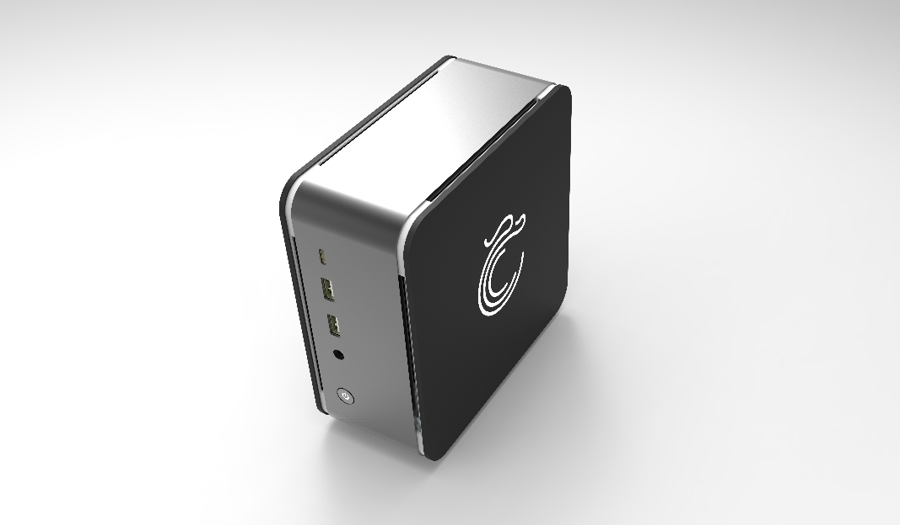

图1 福珑2主机

福珑 2 所采用的龙芯 3A4000 处理器，是龙芯中科在 2019 年年底发布的一款 4
核处理器，采用 28 nm 工艺流片，主频
1.8GHz~2.0GHz。和龙芯的上一款处理器龙芯 3A3000 相比，龙芯 3A40000
处理器性能提升了一倍。龙芯 3A4000 处理器的单核 SPEC CPU 2006 分数约为 20
分，大概是 Intel i5-7200U 处理器的 60%。

福珑2主机体积小巧，整机尺寸只有155x155x71mm。为了控制散热，主机上的3A4000处理器的主频被限制到了1.5GHz，可以睿频到1.8GHz，性能上稍显不足。福珑2也没有安装独立显卡，只有龙芯7A1000中的集成显卡。

作为龙芯爱好者，我第一时间购买了福珑2极客版。福珑2极客版带有一根8GB内存，不带有固态硬盘。为了提高福珑2的使用体验，我对福珑2的硬件进行了更新，新增致钛
PC005 1T NVME SSD 一块，增加了一根三星的8GB
DDR4内存条，并增加了一块M2接口的QCA9565无线网卡。

值得注意的是，福珑2中的3A4000处理器上面打上了“福珑电脑专用”的字样。

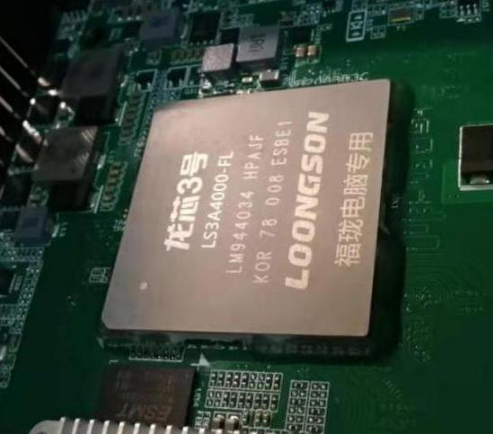

图2 “福珑电脑专用”龙芯3A4000处理器

关于福珑2的硬件细节，我已经在《[国产龙芯 3A4000 处理器，航天龙梦福珑 2.0 迷你主机开箱评测](https://tech.sina.com.cn/digi/2020-08-19/doc-iivhvpwy1899989.shtml)》一文中进行了介绍。

接下来，我在福珑2上安装体验了多款支持龙芯处理器的操作系统。最初，我想把所有能够安装的操作系统/发行版都尝试一下，但最后我只安装了8个操作系统/发行版,包括Fedora
28, Fedora 32, Loongnix，统信UOS 20, 银河麒麟V10, Debian Buster、Debian
Sid以及Linux From Scratch 10。图3是福珑2开机的grub界面。

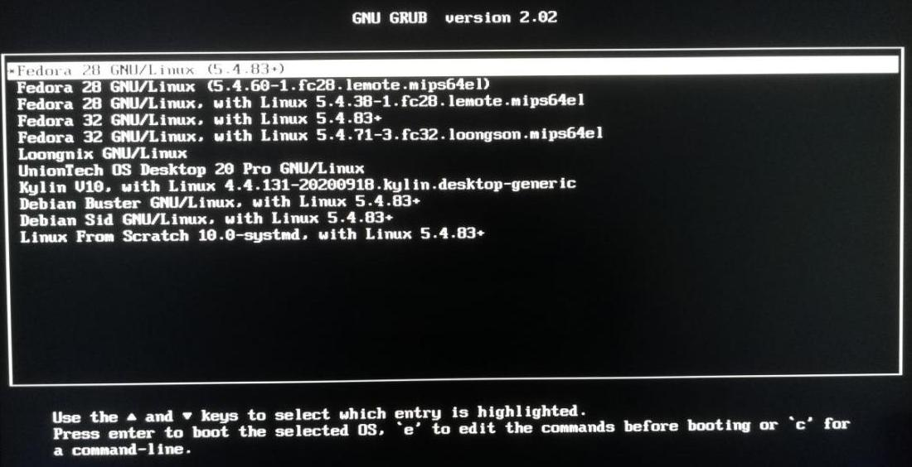

图3 福珑2的GRUB界面

在一块硬盘上同时安装多个操作系统，并不是一个简单的事情，还需要进行一些微操。在此，我对安装过程不做过于详细的说明，只对各个操作系统做简单的介绍。

## 航天龙梦版Fedora 28

第一个安装的操作系统是航天龙梦版Fedora 28,
该操作系统基于红帽子公司的Fedora 28,
并针对龙芯处理器进行了优化。在安装的时候，注意要手动进行分区。福珑2上的操作系统必须支持UEFI，所以分区的时候一定要留出EFI分区。安装的多个操作系统可以共用一个boot分区，boot分区一定要格式化为ext4格式，这是为了后续安装银河麒麟操作系统。福珑2的标准版自带了Fedora28操作系统。

下面是安装好的Fedora28操作系统的一个截图

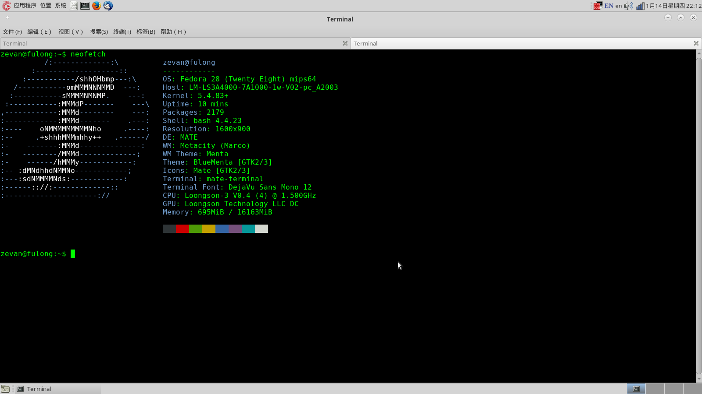

图4 航天龙梦Fedora28操作系统

## 航天龙梦版Fedora 32

航天龙梦版Fedora 32不是Fedora
28的简单升级。它和Fedora28的区别在于，它是专门针对龙芯3A4000所开发的，不能其他龙芯处理器上运行。

龙芯3A4000处理器中引入了MSA向量指令，可以极大提高某些计算密集型应用的速度。按照MIPS的官方手册，在支持MSA的同时，软件的浮点标准也应该相应的升级到IEEE-754-2008（NAN=2008）。然而，龙芯公司为了让3A4000能够兼容现有的软件生态，操作系统以及应用软件的浮点标准依然是IEEE-754-1985（NAN=legacy）,
偶尔还会因为软件浮点数标准与硬件设计的不一致而出现bug。在Fedora
32中，浮点数的标准也是IEEE-754-2008,而非其他系统所采用的IEEE-754-1985。Fedora
32的出现，提供了一个纯粹的支持IEEE-754-2008标准的平台。

注意，Fedora
32与现有的龙芯生态不兼容，诸如WPS等优秀的国产应用软件的龙芯版无法在Fedora
32上运行。

下面是Fedora 32系统的截图

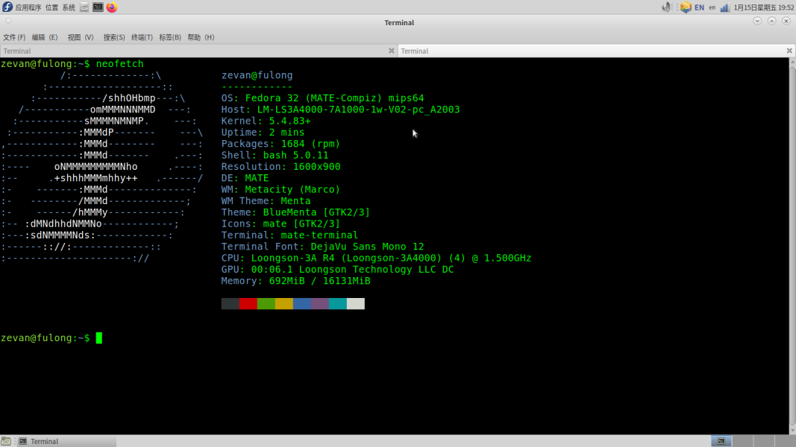

图5 航天龙梦Fedora 32操作系统

## Loongnix 1.0

Loongnix 1.0是龙芯公司基于Fedora
21开发的操作系统。从版本号也可以看出，Loongnix比较古老，软件也比较陈旧。Loongnix中的操作系统内核版本依然是3.10，默认的GCC编译器版本为4.9。虽然Loongnix
1.0的稳定性值得肯定，但实在是太老了，已经落后于时代了。根据龙芯开源社区网站上的部分文件内容，我猜测龙芯中科有计划对Loongnix进行升级，并改用Debian作为新版本Loongnix的基础。

下面是Loongnix系统的一个截图：

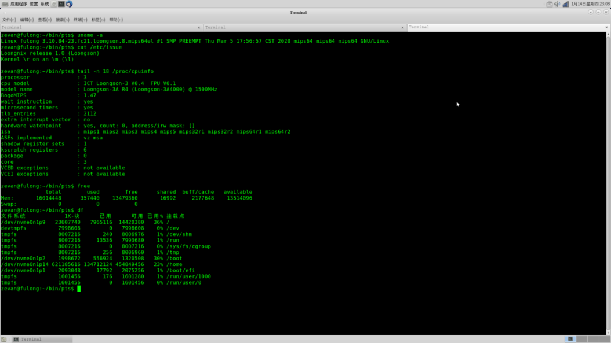

图6 Loongnix 操作系统

## Debian Buster

Debian Buster是最新发布的Debian的稳定版，其中的MIPS64EL
版本可以在龙芯处理器上运行。我采用debootstrap在Fedora
28系统中安装了Debian Buster操作系统，并使用了自行编译的5.4.83 Linux
内核。Debian Buster也是统信UOS操作系统的基础。

Debian操作系统的MIPS64EL
port并没有针对龙芯扩展指令的优化，部分应用程序性能会比较差。

下面是Debian
Buster的截图。我安装了Mate和Gnome3两个图形环境。由于福珑2的显卡性能有限，使用Mate环境会更加流畅一些。

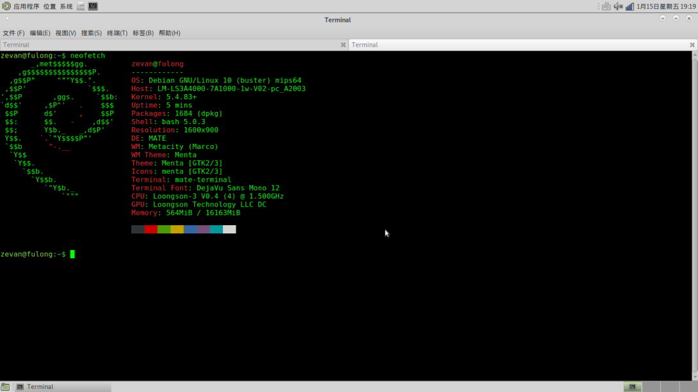

图7 Debian Buster操作系统Mate界面

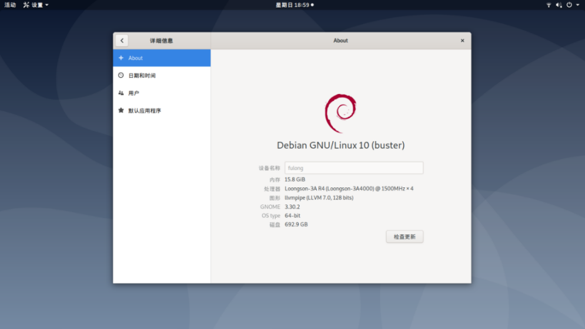

图8 Debian Buster操作系统Gnome3界面

## Debian Sid

Debian
Sid是Debian操作系统的不稳定版本。相比Buster，Sid中的软件版本非常新，也经常会有各种各样的bug。愿意尝试新软件，并且能够接受各种各样的bug的话，可试一试Debian
Sid。

这个版本也是使用debootstrap安装的。下面是Debian Sid的截图。

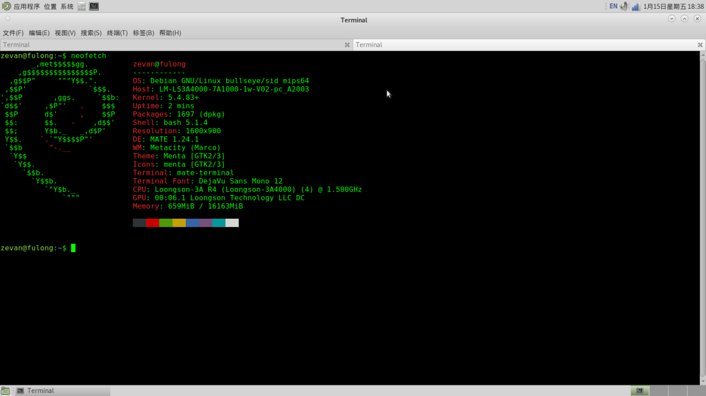

图9 Debian Sid 系统Mate界面

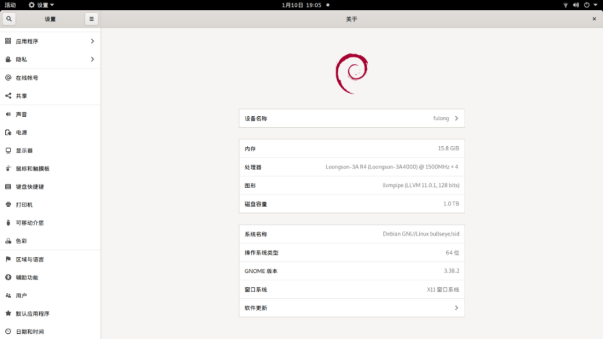

图10 Debian Sid系统Gnome3界面

## 统信UOS V20

统信UOS是目前风头最盛的国产商用操作系统之一。统信的前身，就是开发国产
Linux 发行版 Deepin
的武汉深之度。UOS支持多种国产处理器，包括龙芯、飞腾、申威、兆芯等。UOS系统的安装并不复杂，但UOS系统安装以后用户并不能获得系统的root权限。开发者需要专门申请，才能获得root权限。

总的来讲，UOS继承了 Deepin
的优秀设计，界面相当的美观，设计的非常不错。自带的应用程序商店中也有较为丰富的国产软件应用。目前，微信客户端已经可以在UOS中使用。其他软件诸如讯飞输入法、WPS、QQ、迅雷、钉钉以及360系列的软件也都可以在应用商店里直接进行安装。

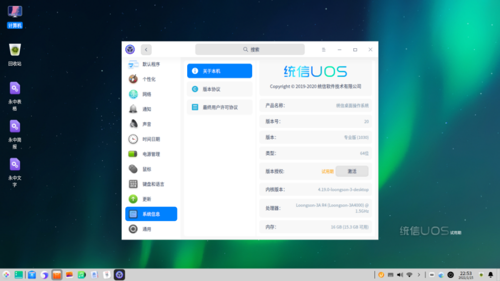

图11 统信UOS系统界面

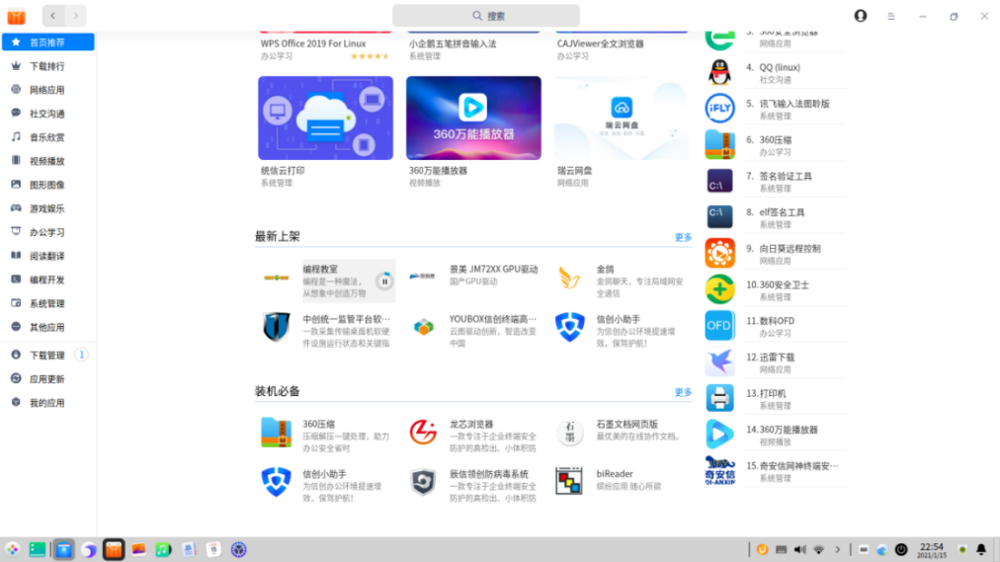

图11 统信UOS 应用商店界面

## 银河麒麟V10

2019
年底，中标麒麟和银河麒麟两个国产操作系统厂商合并，成立了新的中标麒麟公司。合并的新公司也继承了原有的中标麒麟和银河麒麟两个操作系统。

银河麒麟V10也支持龙芯3A4000，但是遗憾的是，银河麒麟不支持UEFI，因此需要手动进行一些修改才能够在福珑2上运行。在安装的时候，银河麒麟也只支持ext4这一种磁盘分区格式，其它的格式一概不支持。

银河麒麟作为商用操作系统，也有内置的应用商店，其中有大量的国产软件提供下载。

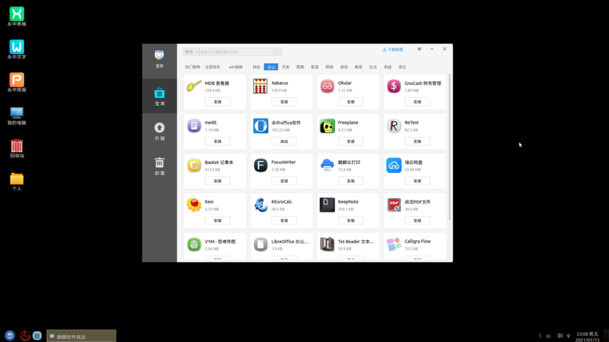

图12 银河麒麟V10 应用程序商店

值得注意的是，虽然在银河麒麟中也提供了微信客户端，但并不能使用。  
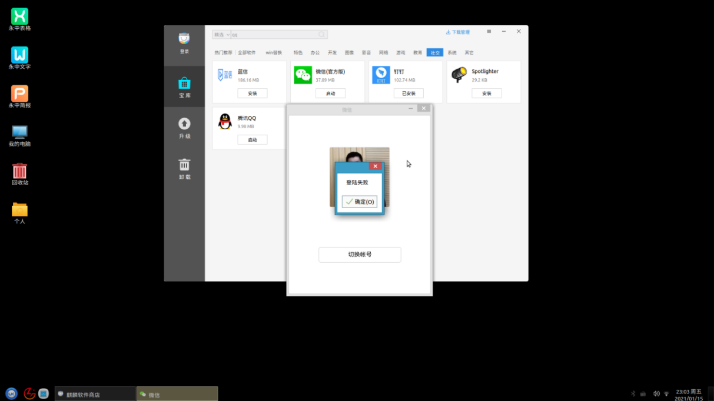

图13 银河麒麟V10 微信登录失败

## Linux From Scratch

根据 Linux From Scracth 10.0 手册，在航天龙梦孙海勇老师、龙芯社区开发者
flygoat 等的帮助和鼓励下，我在福珑 2 上成功编译运行了 Linux From Scratch
10。具体的细节我会另外写文章介绍。我没有给 LFS
编译图形界面，照片拍的不是很清晰，还望见谅。

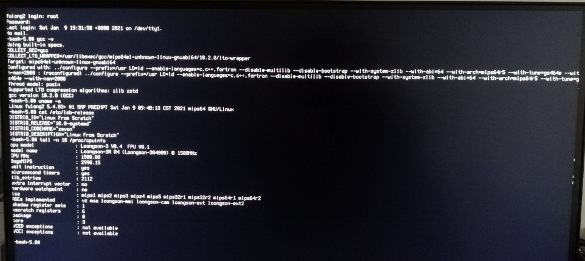

图14 Linux From Scratch

除了以上的操作系统，我还试着安装了中标麒麟操作系统。遗憾的是，中标麒麟无法在福珑2上顺利安装。

下面，我对以上8个操作系统的基础组件做一些总结。

表1 多种操作系统的基础组件版本信息

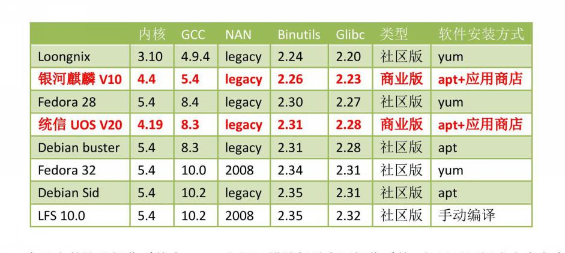

在以上的这些操作系统中，UOS和银河麒麟都是商用操作系统，如果要用福珑当生产力工具，这两个操作系统是最合适的。不过，UOS不激活的话，只能试用90天。作为开发工具的话，如果是进行商业开发，依然建议使用UOS或者银河麒麟；如果是非商业的开发，Fedora
28和Debian
Buster/Sid都是不错的选择。如果要针对旧操作系统进行开发，那么可以选择Loongnix。

下面谈一谈福珑2的给我的体验。

**优点：**福珑2最令人满意的地方，在它小巧玲珑的身姿。即使放在办公桌上，也只是占了小小的一点空间。内置的3A4000处理器性能谈不上卓越，不过还是可以满足文档编辑、网页浏览、程序开发等非计算密集型的工作。

**缺点：**福珑2最大的缺点就是它的集成显卡性能不足，而且bug多多，驱动不足，3D能力基本为0，图形显示偶尔也会卡顿。如果对系统的流畅性要求很高，或者对图形性能要求较高，那么福珑2不是一个理想的选择。

今年龙芯公司将会发布龙芯3A5000，性能上还会有大幅的提升。希望福珑系列也可以进行持续的升级，推出更高性能的产品。
