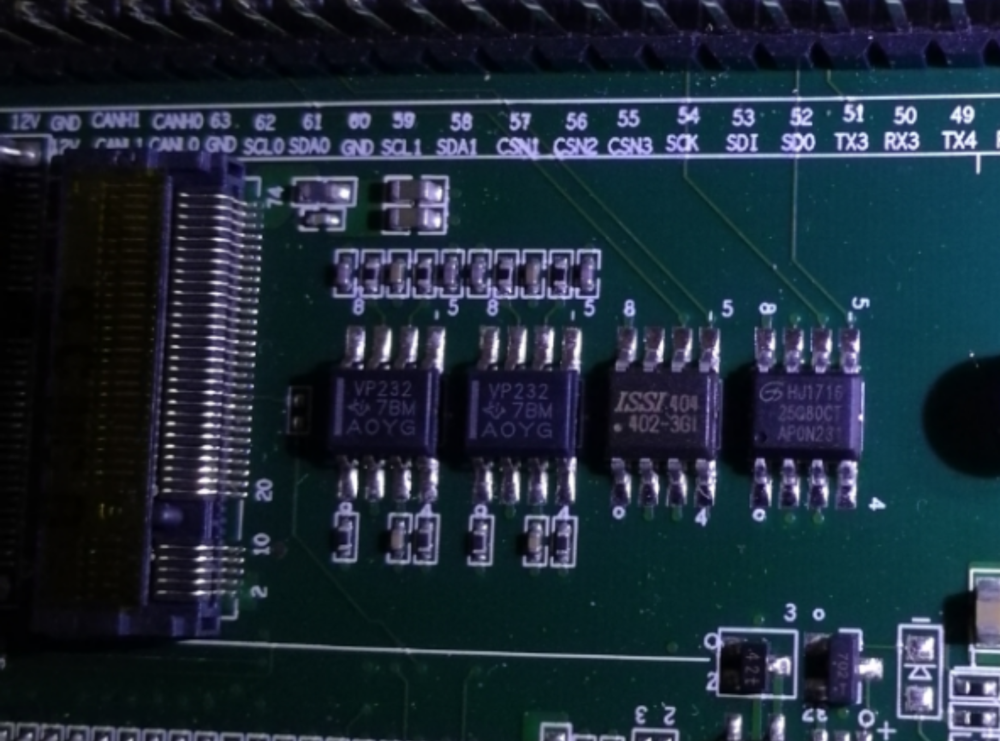

# 教程：用CH341编程器给二代龙芯派更新pmon

## **引言**

龙芯公司在2018年9月发布了第二代龙芯派，并在跳票了160余天以后终于面向爱好者发货了。

二代派出厂的pmon默认设置为CPU主频800MHz，内存频率384MHz。而龙芯2K的主频是1.0GHz，保守的出场设置阉割了龙芯2K至少20%的性能。更新pmon，将主频提升到1GHz，是快速提高二代龙芯派实际可用性能的最佳方案。

Pmon的更新方法很多，用U盘更新就是一种可行的方案。命令如下：
```
load -r -f 0xbfc00000 (usb0,0)/gzrom.bin
```
即可刷新pmon。遗憾的是，pmon没有一个校验机制，因此如果固件出现了文件损坏，刷新固件的时候是无法知道的。不幸的是，我在刷固件的时候用了一个很古老的U盘，复制文件的时候文件损坏，导致固件损坏，无法开机，二代派变砖。

还好，更新pmon的方法不止一个，还可以用编程器直接读写pmon的芯片，对其进行抢救。在龙芯派群的群友福莱和小子的帮助下，我购买了CH341A编程器，以及专门的夹子，对二代派进行了抢救。

## **方法**

首先，拆下龙芯派的SSD，露出SSD下面的四个芯片。其中，离SSD接口最远的芯片，是GD25Q80芯片。



> **图1 SSD硬盘下面的四个芯片**
>
> **红框中的芯片为存储BIOS的芯片。注意芯片上已经标注了8个引脚的顺序。**

然后，正确的连接编程器、夹子和BIOS芯片。


**第8脚**

**第1脚**

**图2 编程器引脚示意图**

**给龙芯派刷pmon，需要将转接板接到红框中的部位。左下角连接第1个引脚，左上角为第8个引脚。注意，夹子的红线连接编程器和芯片的第一脚。**

正确连接以后，接上编程器的USB口，二代派上有一个小LED灯会亮起来。如果没有亮，说明接线出错了！请尽快重新接线，以免烧坏芯片。

将pmon的flash.bin写入芯片，有两种方法。

一种方法是在Windows下，使用编程器卖家提供的编程软件，将flash.bin写入。

一种方法是在Linux下，使用flashrom程序，将flash.bin写入。

Flashrom常用的命令如下：

1.  列出已插入的闪存芯片类型：
```
flashrom -p ch341a_spi  
```
2. 擦除闪存芯片：
```
flashrom -p ch341a_spi -E  
```
3. 读取闪存芯片内容并保存为 backup.bin 文件（编程器固件）：
```
flashrom -p ch341a_spi -r backup.bin  
```
4. 把编程器固件 abc.bin 刷入闪存并校验是否刷入成功：
```
flashrom -p ch341a_spi -w abc.bin  
```
5. 手动校验编程器内容与 abc.bin 是否一致：
```
flashrom -p ch341a_spi -v abc.bin
```
实际刷机的时候，使用的是命令4和5。

刷新成功，二代派复活！刷新成功以后，再次开机将会在开机灯闪烁以后听到蜂鸣器发出“哔”的一声。听到这个声音，就表明pmon在正常工作了。

## **总结**

1.  刷新固件需谨慎，谨慎，再谨慎！文件下载、复制过程都需要用md5、sha校验等方法对文件的完整性进行校验，确保刷新的是正确且完整的固件。

2.  如果刷新失败，不要恐慌。可以用编程器刷新pmon，进行抢救。

    3\. 学习使用龙芯产品的过程中，遇到问题非常正常，不要恐慌。

    **致谢**

    再次感谢flygoat、小子两位群友在龙芯派群提供的指导！

    **参考文献**

    - [在 Linux 下用 flashrom 软件和 CH341A 编程器刷机](https://www.right.com.cn/forum/forum.php?mod=viewthread&tid=429312&page=1) 

