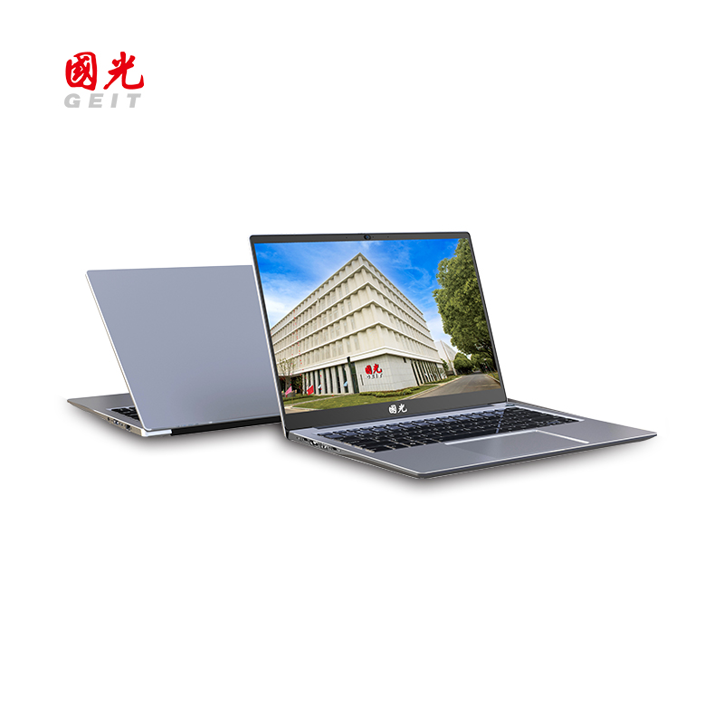
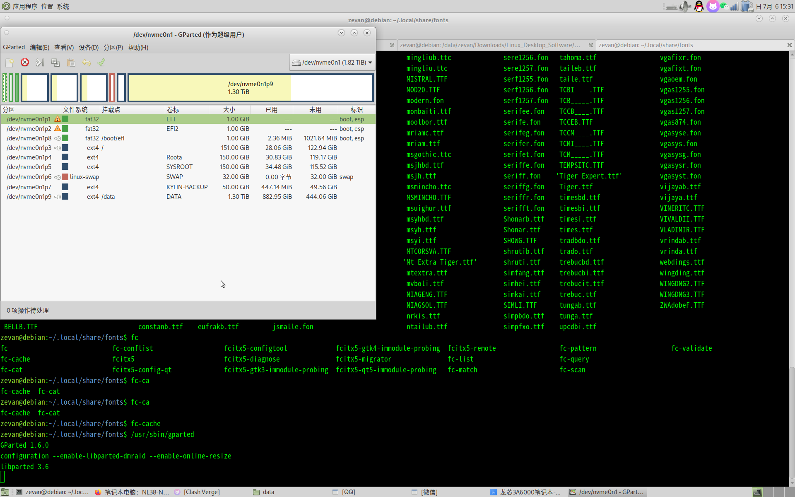

# 龙芯3A6000笔记本三操作系统安装指南

最近，我买了一台采用了龙芯3A6000处理器的笔记本电脑。电脑型号是UT6500-LA6，配置了16GB
2400MT的内存和512G
固态硬盘。这台笔记本电脑的型号还有NL38字样，而且看起来跟卓怡恒通的NL38-N11一模一样。



买到笔记本以后，第一件事就是升级内存和固态硬盘。 内存升级到32GB
3200MT,硬盘升级到2T。

完成了硬件的升级，需要重新安装操作系统。我安装了银河麒麟、统信UOS以及Loongnix
25三个操作系统。如何让这三个操作系统共存，是一个很棘手的问题。

主要的难点在于，三个操作系统共存，那么开机的时候如何引导？旧世界的EFI,能否引导新世界的操作系统？反之，新世界的EFI,能否引导旧世界操作系统？

经过探索，发现主板的BIOS只能读取第一个EFI分区，不会读取其他分区的EFI。

最终的解决方案如下：

分区的时候，设置三个EFI分区，不设置单独的boot分区。给三个操作系统准备不同的分区。

首先，安装银河麒麟操作系统。银河麒麟强制要求使用第一个EFI分区。安装时，将第一个EFI分区挂载到/boot/efi。

完成第一个系统的安装以后，将第一个EFI分区中的数据复制到第二个EFI分区中。

然后，安装统信UOS操作系统。统信也要求使用第一个EFI分区。此时，使用第一个EFI分区作为/boot/efi,覆盖掉了该分区原有的银河麒麟的EFI文件。

幸运的是，UOS的EFI和grub可以同时引导统信UOS系统和银河麒麟系统。

最后，安装Loongnix
25操作系统。Loongnix操作系统不强制要求使用第一个EFI，因此我们将Loongnix的EFI设置为第三个EFI分区。



由于笔记本电脑主板只读取第一个EFI分区中的内容，安装了Loongnix操作系统以后，这个系统是无法被BIOS引导的。这里需要使用另外一个grub的使用技巧：链式加载(chainloader)。所谓链式加载，即通过第一个分区的grub,加载其他分区的EFI,然后再跳转到其他分区的grub,完成系统引导。

链式加载的使用方式也很简单。以我的情况为例，我修改了第一个分区中的grub.cfg文件，增加了如下几行，实现了调用第三个分区EFI文件的目的，最终完成对Loongnix操作系统的引导。

```
menuentry 'Loongnix' --class uos --class gnu-linux --class gnu --class os $menuentry_id_option 'gnulinux-simple-xxxx' {
   set root=(hd0,gpt8)        
   chainloader /EFI/Loongnix-25/grubloongarch64.efi
}
```

需要注意的是，这样直接修改grub.cfg文件的做法不值得推荐。后续如果用户自行更新了操作系统内核，操作系统还会调用update-grub,自动更新grub.cfg文件。此时，用户需要再修改grub.cfg文件。

致谢：

感谢loongarch群群友 AAA猫猫侠、喵酱\_Catty、杜比的帮助！
