# 龙芯处理器家谱

本文首发于IT之家，题目为《你不曾见过的国产CPU:可能是最全的龙芯系列芯片家谱》

## 前言

2009年，美国著名杂志《连线》刊登了一篇题为《人民的处理器》的报道，报道中这样写道：
```text
“试想,一个国家需要完全依靠从一个与之有着战事冲突或经济往来不稳定的国家进口
某种珍贵商品, 而且,如果没有这种商品,其整个社会将被迫停顿。这个国家是中国,
与之有着战事冲突的国家是美国,而该商品就是CPU”。

Imagine that your nation is entirely dependent on a belligerent and
economically unstable foreign country for a precious commodity. Imagine
that without that commodity, your entire society would grind to a halt.
Got it? OK, now imagine that your nation is China, the belligerent
nation is the US, and the commodity is CPUs.
```
<https://www.wired.com/2009/12/st-essay-china/>

中国是一个大国，不能没有自己的处理器。作为国产通用处理器的代表产品,龙芯从2001年至今已经开发了18年,
开发了龙芯1号、2号、3号三个处理器系列，并且龙芯处理器在党政军办公、工业控制、军事、
航天等很多领域已经得到了广泛的应用。但和主流的X86、ARM处理器相比，龙芯仍然是不为人所熟悉。

在龙芯发展的18年里，龙芯公司都开发了哪些处理器？它们的研发历史是怎样的，性能又是怎样的？目前，不管是龙芯的白皮书、学术期刊、还是各种媒体，都没有对此有详细的介绍。在本文中,我们将试图基于公开的各种文献，对龙芯处理器家族中的处理器做一个详细的介绍。

## 简介

龙芯处理器按照其为结构，分为四类，分别是单发射32位（132），双发射32位（232），四发射64位（464）以及双发射64位（264）。按照处理器的性能、核数等分为龙芯1号小CPU，龙芯2号中CPU以及龙芯3号大CPU。

### 龙芯1号系列

龙芯1号处理器可以大致分为两类，一类是单发射的32位CPU，采用单发射顺序执行的GS132系列处理器核，主频在10MHz左右，主要当作单片机使用；一类是双发射的32位CPU，采用双发射乱序执行的GS232系列处理器核，主频在数百MHz，可以用做更高性能的嵌入式处理器，替代同等主频的ARM处理器。在2008年，龙芯一度准备砍掉GS132核，重点研发GS232和GS464处理器核。但后来，龙芯还是继续了GS132处理器核的研发，基于此CPU核开发了一系列的低端处理器。

1.  龙芯1

    龙芯1号于2000年开始研制，2001年8月19日龙芯1号逻辑设计在 FPGA
    平台上运行起来。因此，8月19日被定为龙芯的生日。龙芯1号的物理设计有三个版本，A方案由龙芯委托第三方进行设计，B方案为一个实验性流片的方案，C方案为量产方案。2002年8月10日，龙芯1号（A方案）成功点亮了操作系统，8月29日龙芯1号（C方案）成功启动操作系统。

    龙芯1号采用0.18微米CMOS工艺进行流片，主频266MHz，单发射32位，片内400万晶体管。采用类MIPS III的RISC指令集，具有七级动态流水线、32位整数单元和64位浮点单元。整体的性能低于Intel Pentium II。为了纪念胡伟武的导师夏培肃先生从事计算机事业50周年，“龙芯一号”被命名为“夏50”。

    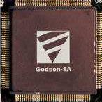

    图1 龙芯1号

2.  龙芯1A

    龙芯1A是2011年左右，龙芯根据市场调研，研发的一款面向嵌入式市场的处理器。龙芯1A处理器，从其设计思路看来，可以视为是对龙芯2H做减法的一个产物。

    龙芯 1A芯片主频 266MHz，采用32位超标量GS232处理器核，双发射乱序执行，与MIPS 32 指令集兼容;一级指令缓存16KB ，一级数据缓存16KB。采用130nm CMOS 工艺制造，采用
    23mm\*23mm BGA 封装, 有448 个引脚，功耗小于1W。

    龙芯1A于2012年提供产品。龙芯1A可以作为龙芯其他处理器的桥片。

    注意，龙芯1A与早期的龙芯1号是完全不同的产品，与龙芯1号的A方案也毫无关系。

    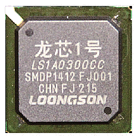

    图2 龙芯1A

3.  龙芯1B

    龙芯1B是龙芯根据市场调研，研发的一款面向嵌入式市场的处理器。龙芯1B可以被视为是龙芯1A的简化版，是龙芯在嵌入式处理器研发上继续做减法的产物。龙芯1B于2011年流片成功，先于龙芯1A。

    龙芯1B主频 200MHz，集成 32 位超标量处理器核（GS232）,双发射乱序执行结构，支持 MIPS 32 指令集，5级流水线，具有一级指令缓存8KB和一级数据缓存8KB。 采用130nm
    CMOS工艺制造，17mm\*17mm BGA 封装, 有256 个引脚，功耗 &lt; 0.5W。

    最大的特点之一是有12 个 UART （串口）接口。

    龙芯1B是龙芯历史上第一次从全系统的角度来考虑降低成本的芯片。

    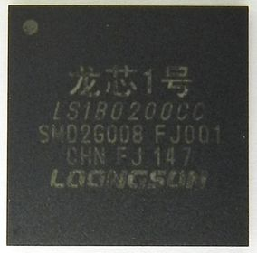

    图3 龙芯1B

4.  龙芯1C101/1C300

    2013 年推出的龙芯 1C 针对指纹生物识别应用。

    龙芯 1C101主频 8MHz，采用单发射按序执行32位处理器核（GS132R），采用130nm工艺制造，封装大小12mm x 12mm，引脚数 64，封装方式 QFP64。功耗 16.5mW/16.5μW。

    龙芯1C300主频300MHz，采用双发射乱序执行32 位超标量处理器核(GS232),
    与MIPS 32 指令集兼容;一级指令缓存16KB，一级数据缓存16KB。采用130nm
    CMOS 工艺制造，封装方式 20mm\*20mm QFP176，功耗 &lt;0.5W。

    为了纪念胡伟武的导师夏培肃院士90岁寿辰，龙芯1C的代号为XPS90。

    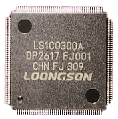

    图4 龙芯1C300A芯片

    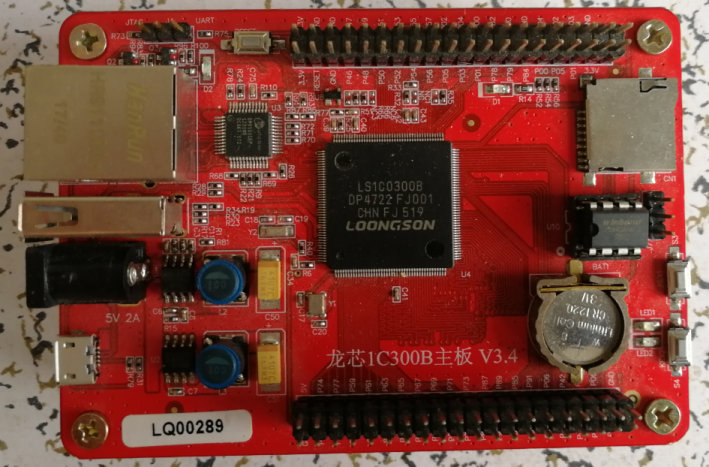

    图5 搭载龙芯1C300B的智龙开发板

5.  龙芯1D

    2014 年推出的龙芯1D是龙芯根据用户需求，与三川智慧合作，为智能水表、气表、量热表定制的一款超声波计量专用芯片。

    龙芯 1D主频 8MHz，采用单发射按序执行32 位处理器核（GS132），与MIPS
    32 指令集兼容;片上存储为4KB+1KB SRAM和64KB Flash。

    含有1 个超声脉冲发生器，1 个模拟比较器，1 个时间数字转换器。

    采用130nm EFlash 工艺制造，封装大小为 12mm\*12mm QFP80，功耗 100uW。

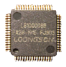

图6 龙芯1D

1.  龙芯1G

    龙芯根据客户需求定制的一款音响专用芯片, 用于苏州上声音响。

    龙芯1G 芯片具有以下关键特性:

    集成一个 GS232 双发射龙芯处理器核,指令和数据 Cache 各 8KB

    其他接口包括LCD控制器，两个自适应MAC、DDR2控制器、USB 2.0接口、SPI控制器、AC97控制器、I2C控制器、RTC接口、PWM控制器、GPIO端口等。

2.  龙芯1H

    2015 年新研的龙芯 1H 芯片针对石油钻探领域随钻测井应用设计,
    设计目标是 175 摄氏度超高温工作条件下的长时间可靠运行。

    龙芯 1H主频 8MHz，采用单发射按序执行，GS132处理器核，MIPS 32
    指令集兼容，3 级流水线，集成 单精浮点协处理器、片上 RAM/Flash/EEPROM、24 位
    ADC、比较器、电源管理等模块,以及定时器、SPI、UART、I2C、CAN
    等接口。该芯片目前已完成设计流片和应用验证,正在进行产品化。

    制造工艺采用130nm EFlash 工艺，封装 14mm\*14mm QFP100，功耗 50mW。

    龙芯1H于2017年4月发布。目前，龙芯1H已经在长庆油田得到了应用。

    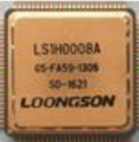

    图10 龙芯1H

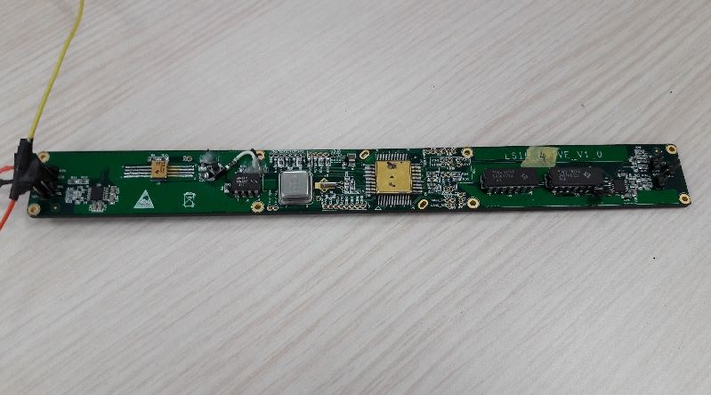

**图11 提供给中石油渤海钻的探搭载龙芯1H的高温板**

1.  龙芯1I

    未知处理器，没有任何公开的信息。

### 龙芯2号系列

龙芯2号处理器都是64位处理器，早期的型号是4发射乱序执行的64位GS464系列处理器核，后来新出的处理器升级为采用GS464E处理器核。龙芯2K处理器是双发射乱序执行的GS264处理器核的64位双核处理器。龙芯2GQ则是一款4核处理器。

1.  龙芯2A/2B

龙芯2号的设计从2002年7月开始，采用4发射和乱序执行结构的设计，64位设计，7～10级流水线。

龙芯2号的寄存器堆设计有两个方案，A方案采用商用寄存器堆，在台积电流片；B方案采用微电子中心设计的寄存器堆，在中芯国际流片。

A方案采用的商用寄存器堆设计出错,
导致流片失败。B方案流片成功，2003年10月17日成功启动操作系统，最高频率为300MHz，功耗1W—2W。相同主频下，龙芯2B的性能已经超过了Pentium
II，是龙芯1号的3～5倍。

为了纪念毛主席诞辰110周年，龙芯2B代号MZD110。
龙芯2号的性能是之前研制成功的龙芯1号的3倍，超过了相同主频的奔腾II的性能。

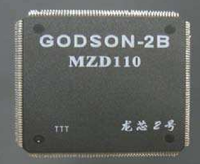

图12 龙芯2B

1.  龙芯2C

    龙芯2C是龙芯2B的优化版本。在上海中芯国际(SMIC)利用 0.18微米 CMOS
    工艺进行了多次成功流片,2004年9月28日流片成功，定型芯片主频为
    500MHz。龙芯2C的性能是之前研制成功的龙芯2B性能的3倍，达到了相同主频的奔腾III的性能。为了纪念邓小平诞辰100年，龙芯2C的代号为DXP-100
    。

    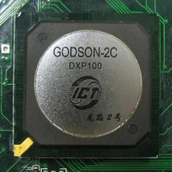

    图13 龙芯2C，代号DXP-100

2.  龙芯2D

    根据龙芯处理器的早期发展历史，基本上每年有一款处理器流片。由于龙芯2C在2004年流片，而龙芯2E于2006年流片，可以推测龙芯2D应该是在2005年流片的产品。在中科院微电子所的黄令仪研究员的回忆文章中，提到了她参与了龙芯2D的物理设计。

    在《龙芯的足迹》中《2006年回顾及2007年展望》一文中，胡伟武说“2005年我们面临的严峻形势赋予龙芯2E背水一战的悲壮色彩”，因此可以推测龙芯2D极有可能是一个流片失败的型号，或者是一个中途被放弃的型号。

3.  龙芯2E

龙芯2E在2005年11月底交付流片，2006年3月18日流片成功。

2006年9月13日，以长征胜利70周年命名为CZ70的龙芯2E通过科技部组织、时任科技部部长徐冠华亲自参加的验收。龙芯2E是中国大陆首款采用90纳米技术设计的处理器，晶体管数目4700万，主频最高可以达到1GHz。龙芯2E的芯片面积6.8mm\*5.2mm,只有Intel
奔腾4的1/4。龙芯2E样机实测SPEC
CPU2000分值为定点503分，浮点503分，最高双精度浮点运算速度为3.99GFlops。龙芯2E的性能是龙芯2C的三倍，达到中低档Intel
奔腾IV处理器的水平。在龙芯2E
的优化设计过程中，意法半导体与龙芯进行了合作。

基于龙芯2E的成功，意法半导体还花三百多万美元授权费购买了龙芯2E/2F的生产和销售授权，开创了我国计算机核心技术对外授权的先例。

由于龙芯2E的北桥使用FPGA实现，成本较高，该处理器没有大规模量产。

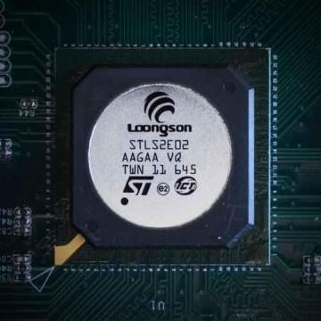

图14 龙芯2E

1.  龙芯2F/2F-1000

    龙芯2F于2007年7月31日流片成功。龙芯2F是龙芯第一款成功的商用处理器。

为了纪念建军80周年，龙芯2F代号为PLA80。龙芯2F包含5100万晶体管，主频800MHz，采用意法半导体
90纳米工艺流片。在指令集上，完全兼容64位MIPS III。

采用龙芯2F处理器的福珑迷你电脑，以及8089A/D笔记本电脑，曾经大量面向爱好者销售。至今，仍有大量的龙芯爱好者持有这两种产品。

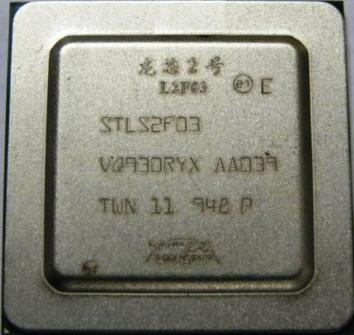

图15 龙芯2F

1.  龙芯2G/2G+/2GQ/2G-2000

    龙芯2G是在“龙芯安全适用计算机CPU研制与应用”核高基重大专项课题支持下研发的，2008年开始投入设计，但由于龙芯当时2G项目和3A项目同时进行，存在重叠，影响了研发进度。2010年研制成功。龙芯2G采用65纳米工艺，主频1.0GHz，晶体管数目1亿，指令集兼容MIPS64，且增加了X86二进制翻译加速指令，以及龙芯媒体扩展指令，有64KB的指令和64KB数据的L1缓存，以及1MB的L2缓存，功耗3W。

    在该处理器上，使用了X86二进制翻译技术，提出了在MIPS平台上实现X86动态二进制翻译的方法。

    龙芯2G相当于龙芯3A1000的单核版本。

    龙芯2GQ是龙芯2G的量产版,是一款四核处理器。龙芯2GQ与龙芯3A1000的区别在于龙芯2GQ不支持多路互联。

    龙芯2GP后来更名为龙芯2I。

    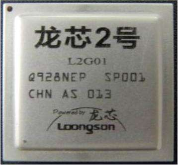

    图16 龙芯2G

    

    图17 搭载龙芯2GQ的笔记本电脑

2.  龙芯2H

    龙芯 2H 是龙芯 2G 处理器与龙芯 1A(2F
    南桥)的后继产品，其目标是为安全适用计算机提供单片解决方案。龙芯 2H
    采用 65nm 工艺实现，主频达 1GHz
    以上。主要用于网络设备等。兼容MIPS64指令集，支持X86二进制翻译指令集。有64KB的指令L1
    cache和64KB的数据L1 cache，512KB的L2 cache。集成了GS232V媒体处理IP。

    龙芯2H最初设想的应用是上网本，但随着上网本市场的消失，并没有在该领域应用。龙芯2H主要用在工控领域，以及包括防火墙在内的网络安全领域。

    龙芯2H于2012年流片，2013年提供样片，2014年提供产品。龙芯2H的流片标志着龙芯全面掌握了复杂SOC的设计能力。龙芯2H的特点是大而全，集成了很多的功能，芯片设计很复杂，但缺少对特定应用的优化。

    龙芯2H既可以作为独立SOC，还可以作为HT接口的南桥芯片。

    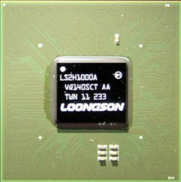

    图18 龙芯2H

    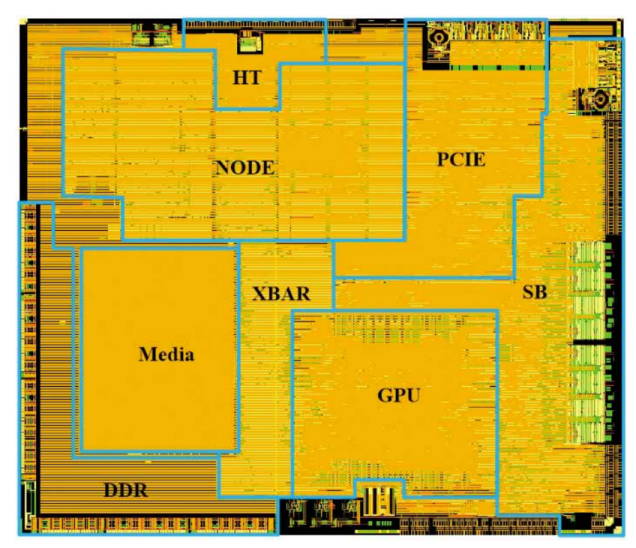

    图19 龙芯2H版图

3.  龙芯2I

    根据龙芯内核资深维护者flygoat的分析，龙芯2I是龙芯2GP0800D的另外一个代号。关于龙芯2I的资料很少，下图为《中国正在说：芯芯之火可以燎原》节目中的截图，其中提到了龙芯2I。

    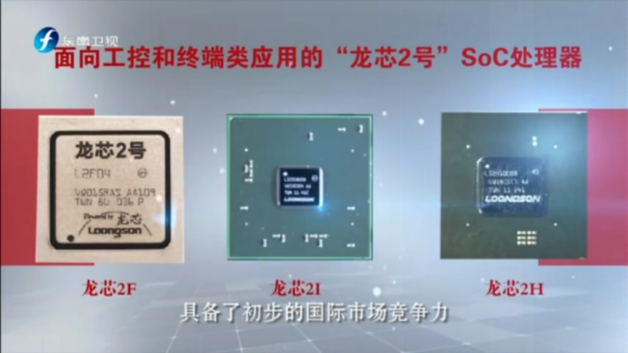

    图20 龙芯2I

4.  龙芯2K1000

    龙芯2K1000是一款双核处理器，采用了双发射64位的GS264微结构，40nm工艺生产，商业级芯片主频1GHz，工业级芯片主频800MHz。龙芯2K1000处理器是龙芯2H的升级芯片，其计算性能和IO带宽比龙芯2H都大幅提高。龙芯2K1000主要面向网络通信应用，兼顾平板及工业控制领域。

    集成了64位DDR3控制器，2个GMAC控制器，2个X4
    PCIE控制器，可以配置为6个X1模式。

    集成共享的1MB二级cache；集成GPU，显示控制器，支持双路DVI显示。集成64位533MHz以上的DDR2/3控制器，1个SATA
    2.0接口，4个USB
    2.0接口，2个RGMII千兆网接口，集成HDA/AC97/I2S接口，集成RTC/HPET模块。集成最多4个UART控制器，1个NAND控制器，2个CAN控制器，1个SDIO控制器。

    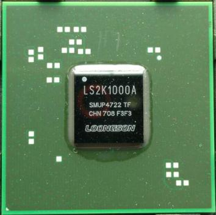
    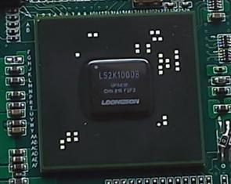

    图24 龙芯2K1000

    左侧为LS2K1000A，右侧为改进版本的LS2K1000B

5.  龙芯2K2000

    龙芯2K2000是计划中龙芯2K1000的升级版，预计采用28纳米工艺生产，主频将达到2GHz。

### 龙芯3号系列

龙芯3号处理器均为4发射64位多核处理器。目前，除了龙芯3B1500处理器为8核，其他的龙芯3号处理器均为4核。龙芯3C5000处理器会将处理器核数提高到16。

龙芯3号处理器的微结构分为GS464, GS464E，GS464V以及GS464EV。

1.  龙芯3A1000

龙芯3A1000于2008年底交付流片,采用意法半导体的65nm工艺流片.
2009年5月20日龙芯3A1000晶圆生产下线，9月28日样片回来，成功启动操作系统，主频800MHz-1GHz。由于2009年是建国60周年，龙芯3A1000代号PRC60。

龙芯3A1000进行了第一次改版并于2010年5月中旬流片，10月底第一次改版流片成功。3A1000的第二次改版于2012年2月下旬流片，2012年8月中旬流片成功。

龙芯3A1000集成了4个四发射乱序执行的GS464核，9级流水线，有64KB一级数据cache和64KB一级指令cache，4MB共享二级cache，最高主频1GHz，功耗15w（支持动态降频），芯片面积174mm<sup>2</sup>，晶体管数目4.25亿。每个CPU核包含两个浮点乘加部件，双精度浮点性能峰值为16GFlops。在龙芯3A1000处理器中，实现了x86二进制翻译加速指令。

3A100集成了HT1.0\*2，PCI控制器、LPC、SPI、UART、GPIO。集成72位DDR2/3控制器，引脚1121个，封装方式40mmx40mm
FCBGA。

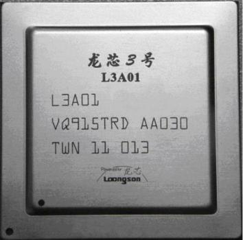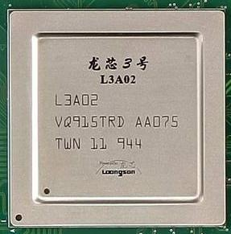

图25 龙芯3A1000

左侧为01版本,右侧为02版本

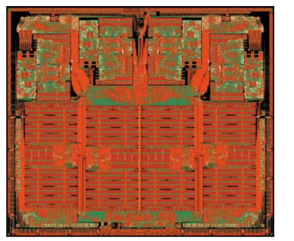

图26 龙芯3A芯片版图

图片来源：中科院计算所2009年成果年报

1.  龙芯3B1000

龙芯3B1000于2010年6月20日左右流片，2010年11月底回来第一批芯片

3B1000的第一次改版2011年2月初流片，7月初回来。龙芯3B1000进行了第二次改版，于2011年12月初流片，2012年4月底回来。

龙芯3B由核高基项目课题“高性能多核CPU研发与应用”支持，采用意法半导体65纳米工艺设计，主频1GHz，功耗25W，片内集成8个64位四发射乱序执行龙芯向量处理器核GS464V，4MB的二级cache，每个核包含两个256位向量部件，峰值浮点性能达到128GFLOPS。。

龙芯3B的最大特色是龙芯向量处理器核的设计，该处理器核将GS464核的的浮点部件和浮点寄存器堆替换为2个256位的向量处理部件和1个128x256位的向量寄存器堆，使龙芯3B在1GHz下的峰值双精度浮点计算能力达到128GFlops。在龙芯3B处理器中，实现了300多条专用的向量处理指令。

龙芯3B芯片面积300mm<sup>2</sup>, 晶体管数目接近6亿。

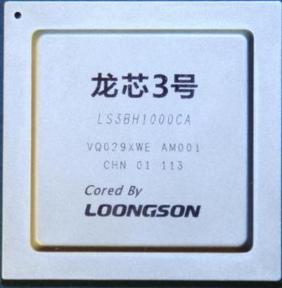

图27 龙芯3B1000

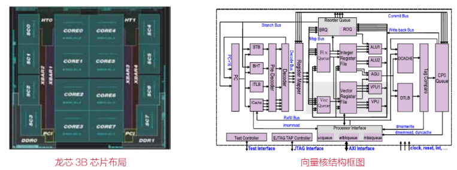

图28 龙芯3B1000芯片布局和向量核结构框图

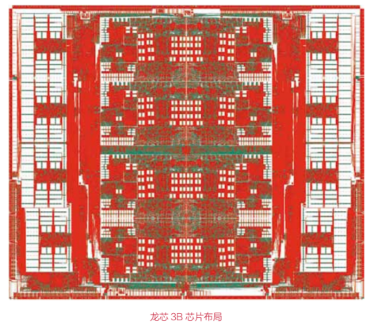

图29 龙芯3B芯片布局

1.  龙芯3B1500

龙芯3B1500在2012年1月中旬完成设计并交付流片。2012年8月底拿到样片。后来，工艺从32nm迁移到28nm，于2013年4月底流片，10月底收到样片，但流片并不成功，后来又恢复到32nm工艺流片，并以某种方式补偿此次流片费用，于是又再次改版，于2015年1月底流片，2015年6月下旬收到样片。

龙芯原本计划推出一款16核的龙芯3C处理器，后来由于战略调整，取消了原龙芯3C的研发，缩水成8核的龙芯3B1500。龙芯3B1500集成了8个四发射乱序执行的64位GS464V处理器核，9级流水线，每个处理器核有64KB的私有一级指令cache和64KB的私有一级数据cache，128KB私有二级cache，有8MB三级共享cache，采用中芯国际32纳米工艺生产，芯片面积180mm2,晶体管数11亿，主频1.5GHz，采用倒装焊球栅阵列(Flip-Chip
BGA)封装，芯片引脚数1121,封装大小40mm×40mm。单芯片双精度浮点计算能力达到192GFlops。功耗30w（典型）/60w（向量）。

在接口上，有HT2.0\*2，PCI、LPC、SPI、UART、GPIO，72位DDR2/3控制器。

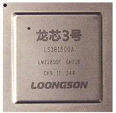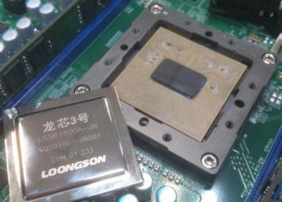

图30 龙芯3B1500

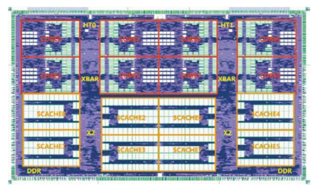

图31 龙芯3B1500版图

1.  龙芯3A2000/3B2000

龙芯3A2000于2014年11月初交付流片；2015年4月10日，拿到盲封样片。2015年8月18日,龙芯召开发布会,正式发布新产品。2015年9月和2016年3月分别进行了第一次改版设计和第二次的改版设计。

龙芯3A2000处理器集成了4个四发射乱序执行64位GS464E处理器核，也是首款采用GS464E微结构的处理器。
采用中芯国际40纳米CMOS工艺生产，主频800～1000MHz，在1GHz下SPEC CPU2006
分数为6.9分。封装方式FCBGA，1121引脚，封装大小40mm×40mm。

GS464E处理器核是GS464的改进版，集成了64KB一级指令cache，64KB一级数据cache，256KB二级cache和4MB三级cache。特别需要指出的是，GS464E处理器核的stream性能有了大幅提升，单核STREAM性能达到6.3GB/s,是龙芯3A1000的20倍。流水线从GS464的9级提高到了12级。峰值浮点性能16GFlops。

在接口上，龙芯3A200集成了两个HT3.0接口，PCI控制器、LPC、SPI、UART、GPIO，72位DDR2/3-1333×2控制器。

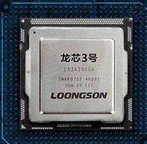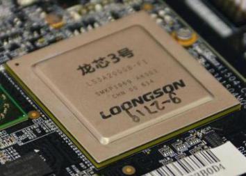

图32 龙芯3A2000

左侧为3A2000A，右侧为3A2000B

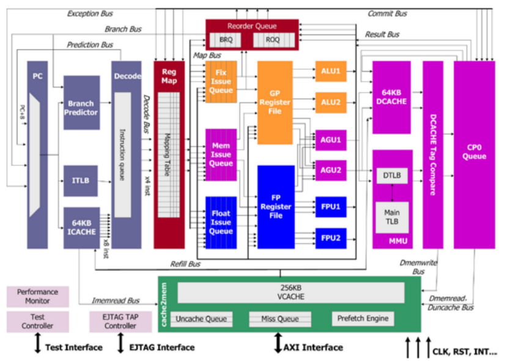

图33 GS464E微结构图

1.  龙芯3A3000/3B3000

龙芯3A3000于2016年2月中旬交付流片,
6月中旬拿到盲封芯片.2016年10月17日，龙芯3A3000可以进入批量生产状态.

2017年4月26日,龙芯公司召开发布会,正式发布龙芯3A3000处理器。

龙芯 3A3000/3B3000主频
1.2Hz–1.5GHz，为4核处理器，采用4个四发射乱序执行的64
位超标量处理器核（GS464E)，支持 MIPS64
指令集，支持龙芯扩展指令集，采用12 级超标量流水线; 每核有2 个定点单元、2
个浮点单元和 2 个访存单元。每个处理器核包含 64KB 私有一级指令缓存和 64KB
私有一级数据缓存;每个处理器包含 256KB 私有二级缓存;所有处理器核共享 8MB
三级缓存。

和龙芯3A2000相比，除了流片工艺从中芯国际的40纳米提升到意法半导体的28纳米CMOS
工艺，处理器的三级cache也从4MB提高到8MB。峰值浮点性能24GFlops。封装
40mm\*40mm BGA 封装,1121 个引脚，典型功耗 &lt;40W@1.5GHz。

集成的接口有HT3.0\*2，PCI控制器、LPC、SPI、UART、GPIO，72位DDR2/3-1600\*2，支持ECC。

龙芯3A3000的综合性能相当于Intel J1900处理器。

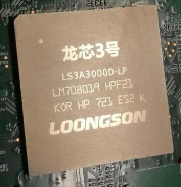

图34 龙芯3A3000处理器

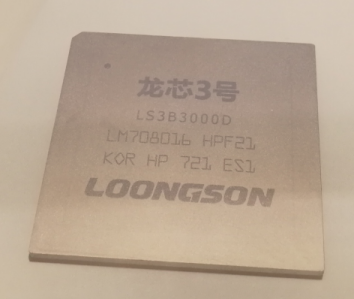

图35 龙芯3B3000处理器

1.  龙芯3A4000/3B4000

    龙芯下一代高性能处理器,
    采用龙芯最新研发的GS464EV微结构。尽管龙芯3A4000仍然采用28nm工艺,
    但主频提高到2.0GHz,
    综合性能是上一代3A3000的两倍。目前已经流片成功,正在进行测试。据小道消息，龙芯3A4000进展顺利。

    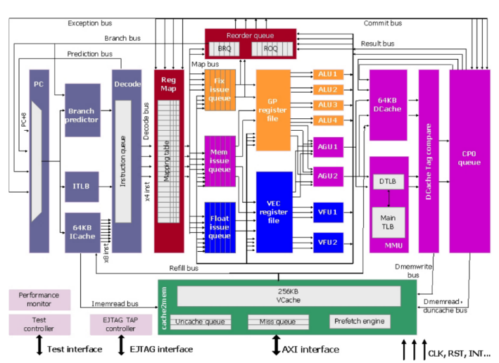

    图36 龙芯3A4000采用的GS464EV微结构

    3.8 龙芯3A5000/3C5000

    龙芯下一代高性能, 预计2019年年底或2020年年初流片.
    采用3A4000的处理器微结构GS464EV, 采用14/12nm工艺流片,
    主频提升到2.5GHz。3A5000依然是4核处理器，而3C5000将是一款16核处理器。

### 龙芯桥片

1.  龙芯7A1000

    龙芯7A1000型桥片是龙芯3号处理器的第一款芯片组产品，目标是替代AMD
    RS780+SB710芯片组，为龙芯处理器提供南北桥功能。主要特点为：

    16位HT 3.0接口，2D/3D
    GPU，显示控制器，支持双路DVO显示，16位DDR3显存控制器，3个X8 PCIE
    2.0接口，每个X8接口都可以拆分为2个独立的X4接口。2个X4 PCIE
    2.0接口，可以拆分为6个独立X1接口。3个SATA 2.0, 6个USB 2.0,
    2个RGMII千兆网接口，HDA/AC97，
    RTC/HPET模块，1个全功能UART控制器，6个I2C控制器，1个LPC控制器，1个SPI控制器，多个GPIO引脚。

    即将发布的龙芯3A4000将不再采用AMD的RS780芯片组，而采用龙芯7A作为桥片，避免在桥片的选择上受制于AMD。

    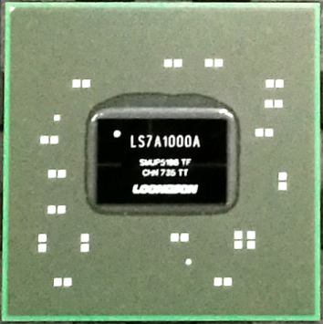

    图37 龙芯7A1000桥片

### 龙芯从未公布的隐藏处理器

除了龙芯1号、2号、3号三个系列的处理器，在龙芯的发展过程中还开发了一些实验型的处理器，并没有量产，有些甚至没有流片。我们找到了几个这样的处理器。

1.  Godson-T

    龙芯处理器在发展过程中，一度想要用做超算处理器，希望开发一款64核的众核处理器，命名为Godson-T。Godson-T由计算所先进微系统研究组研发，2008年已经在进行RTL验证在2008年12月开始RTL代码编写。2010年5月，GodSon-T的原型芯片16核
    GodSon-TI 交付流片，采用130纳米工艺。2010年10月17日，调试成功。

    由于龙芯将研发重点重新转向提高处理器单核性能，Godson-T处理器研发中止。

    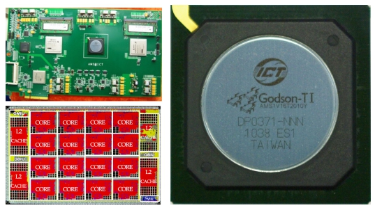

    图38 Godson-T 处理器

2.  Godson-X

    龙芯所有量产的处理器，均采用的是MIPS指令集。但是，由于主流桌面处理器市场上使用的是x86指令集，基于知识产权和专利等原因，龙芯无法使用x86指令集。为了实现对现有生态的兼容，龙芯3A系列实现了针对x86指令和arm指令的二进制翻译指令。在研发过程中，龙芯开发了使用x86指令集的处理器原型Godson-X。。

    这个项目从2005年7月开始。
    Godson-X处理器的设计初步目标是与x86指令兼容的FPGA原型处理器，并能在FPGA原型处理器中启动Windows
    XP。因此第一步，先进微系统研究组精心设计了微架构的Godson-X
    。Godson-X是一款基于Godson-2设计的4发射超标量X86处理器。它与x86兼容，并支持英特尔MMX指令，SSE指令集和x87浮点指令。第二步，通过
    Cycle级的模拟程序实现，模拟了处理器中每一拍运行的状态。在此之后，先进微系统研究组用模拟器尝试启动Windows
    XP
    。最后，先进微系统研究组的RTL调整和FPGA仿真完成时间为2006年7月。该处理器只有FPGA原型，从未流片。

3.  龙梦一号

    中科龙梦(现更名为航天龙梦)使用早期的龙芯1号的IP核，开发了龙梦一号SOC，用于税控机(Fiscal
    controller register)。
    该税控SoC专用芯片以“龙芯1”处理器核作为MCU，采用AHB(the Advanced High
    performance Bus)＋APB(the Advanced Peripheral Bus)为片上总线。

集成的其余IP模块如表所示。

<table style="width:100%;">
<colgroup>
<col style="width: 7%" />
<col style="width: 26%" />
<col style="width: 54%" />
<col style="width: 11%" />
</colgroup>
<tbody>
<tr class="odd">
<td>序号</td>
<td>IP名称</td>
<td>功能</td>
<td>总线接口</td>
</tr>
<tr class="even">
<td>1</td>
<td>SDRAM控制器</td>
<td>支持SDRAM作为系统主存</td>
<td rowspan="5"><p> </p>
<p>AHB</p></td>
</tr>
<tr class="odd">
<td>2</td>
<td>ROM/Flash控制器</td>
<td>支持Flash作为电子盘</td>
</tr>
<tr class="even">
<td>3</td>
<td>LCD Driver</td>
<td>驱动营业员的液晶显示屏</td>
</tr>
<tr class="odd">
<td>4</td>
<td>10/100Mbps MAC</td>
<td>支持网络报税</td>
</tr>
<tr class="even">
<td>5</td>
<td>USB 1.1</td>
<td>支持USB的电子扫描枪与电子秤（2个端口）</td>
</tr>
<tr class="odd">
<td>6</td>
<td>SPI</td>
<td>支持客户VFD屏</td>
<td rowspan="9"><p> </p>
<p> </p>
<p>APB</p></td>
</tr>
<tr class="even">
<td>7</td>
<td>PS/2</td>
<td>支持PS/2的键盘与鼠标</td>
</tr>
<tr class="odd">
<td>8</td>
<td>UART</td>
<td>支持串口设备（3个端口），如外接Modem</td>
</tr>
<tr class="even">
<td>9</td>
<td>ISO 7816</td>
<td>支持税控/用户/税务管理IC卡</td>
</tr>
<tr class="odd">
<td>10</td>
<td>I2C</td>
<td>支持实时时钟RTC</td>
</tr>
<tr class="even">
<td>11</td>
<td>Timer</td>
<td>作为系统资源的定时器</td>
</tr>
<tr class="odd">
<td>12</td>
<td>Watchdog</td>
<td>支持系统死机时自动复位</td>
</tr>
<tr class="even">
<td>13</td>
<td>中断控制器</td>
<td>支持外部与内部中断</td>
</tr>
<tr class="odd">
<td>14</td>
<td>GPIO</td>
<td>支持扩展外设</td>
</tr>
</tbody>
</table>

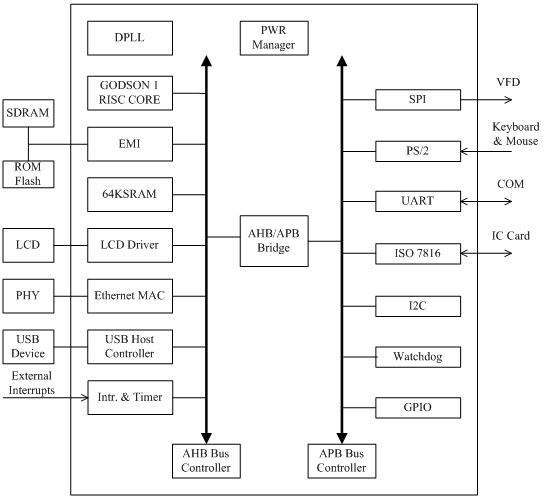

图39 税控SoC体系结构

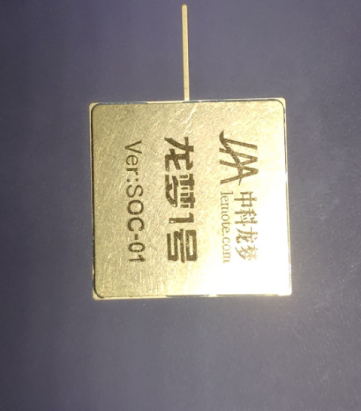

图40 龙梦1号

1.  GS32I-400 SOC

GS32I是根据龙芯2号设计的一款SOC芯片，主频400MHz，集成16K数据缓存和16K指令缓存，封装大小19mmx19mm，424针BGA封装。内部接口上，集成了PCI控制器，两个百兆网控制器，USB，AC97控制器，PCMCIA控制器，SDRAM控制器和EPROM控制器。

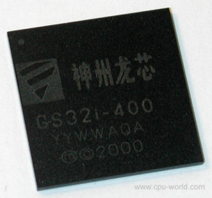

图41 GS32i-400 处理器

### 总结

综上所述，龙芯在其18年发展历程中，形成了一个相对完整的处理器家族，龙芯处理器可以应用于智能水表、智能门锁、航天应用、石油钻探、工业控制、网络安全、桌面办公等各种领域，为我国军工、航天、石油勘探等领域提供了重要的技术支持。期待下一代龙芯的高性能处理器龙芯3A4000早日发布，期待更高性能的3A5000和3C5000处理器早日流片。

**致谢**

由于二代龙芯派长达160天的跳票，导致我无派可玩，才有时间写下这个文章。对此，要感谢龙芯嵌入式部门的鸽工。

感谢龙芯员工Jonas提供了《龙芯的足迹》第三册的扫描版本。

本文部分资料来自于Flygoat
的个人博客，flygoat对本文部分内容提供了资料，对此一并表示感谢。
